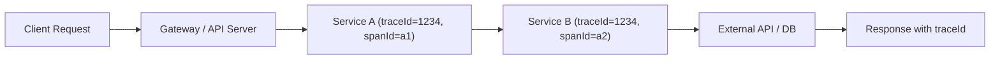
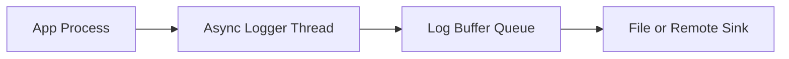

#### 요약

- 모든 백엔드 서비스는 **일관된 로그 구조(Structured Logging)** 를 가져야 한다.  
- JSON 기반 로그 포맷, Trace ID 전파, 로그 레벨 정의, 민감정보 마스킹 규칙을  
  명확히 표준화함으로써, **디버깅·모니터링·보안 관리의 효율성**을 높인다.  
- 이 장에서는 로깅의 핵심 구성요소와 설계 원칙을 설명한다.


> 로그는 단순한 디버깅 도구가 아니라,  
> **운영 신뢰성과 테스트 자동화의 근간**이다.  
> 다음 장에서는 각 프레임워크별로 이러한 표준을  
> 코드로 어떻게 구현하는지 구체적으로 다룬다.

**핵심 요약**
1. **형식 통일** — 모든 로그는 JSON 구조로 출력  
2. **컨텍스트 유지** — Trace ID / Span ID로 요청 단위 추적  
3. **보안 보장** — 민감정보 마스킹 및 로그 제외 정책  
4. **환경별 제어** — DEV·STAGE·PROD 환경별 로그 레벨 차등  
5. **비동기 처리** — 성능 저하 없는 비차단(non-blocking) 로깅

---


#### 1. 로그 구조 표준 (JSON 기반)

**권장 JSON 로그 구조**

```json
{
  "timestamp": "2025-10-26T03:12:45.876Z",
  "level": "INFO",
  "service": "order-service",
  "env": "prod",
  "traceId": "bfae39c1",
  "spanId": "4e912f3b",
  "method": "POST",
  "path": "/api/orders",
  "status": 201,
  "latency_ms": 123,
  "userId": "u_1032",
  "message": "Order created successfully",
  "meta": {
    "orderId": "O20251026-004",
    "amount": 12900
  }
}
```

| 필드 | 설명 | 예시 |
|------|------|------|
| **timestamp** | 로그 발생 시각 (UTC ISO8601) | `2025-10-26T03:12:45.876Z` |
| **level** | 로그 레벨 | `INFO`, `ERROR`, `DEBUG` |
| **service** | 서비스명 | `order-service` |
| **traceId / spanId** | 요청 단위 추적 ID | `bfae39c1` / `4e912f3b` |
| **method / path** | HTTP 요청 정보 | `POST /api/orders` |
| **status** | HTTP 응답 상태 | `201` |
| **latency_ms** | 응답까지의 시간(ms) | `123` |
| **message** | 로그 메시지 | `"Order created successfully"` |
| **meta** | 부가 정보(JSON 객체) | `{"orderId": "O20251026-004"}` |

---

#### 2. 로그 레벨(Level) 정의

| 레벨 | 사용 목적 | 예시 |
|------|------------|------|
| **TRACE** | 상세한 내부 실행 흐름 (개발용) | 함수 호출, DB 파라미터 |
| **DEBUG** | 상태 점검용 상세 로그 | 변수값, 조건분기 결과 |
| **INFO** | 일반 비즈니스 이벤트 | 주문 생성, 로그인 성공 |
| **WARN** | 비정상적이지만 치명적이지 않은 상황 | 재시도, 지연, fallback 발생 |
| **ERROR** | 요청 실패, 예외 발생 | DB 연결 오류, NPE, Validation 실패 |
| **FATAL** | 시스템 중단 수준의 치명적 오류 | OutOfMemory, 프로세스 종료 |

**환경별 권장 레벨 설정**
| 환경 | 출력 레벨 | 비고 |
|------|------------|------|
| **DEV** | DEBUG 이상 | 상세 디버깅 목적 |
| **STAGE** | INFO 이상 | 운영 전 점검 단계 |
| **PROD** | WARN 이상 | 최소 출력, 성능 우선 |

---

#### 3. Trace ID / Span ID 전파 구조



**원칙**
- 모든 요청의 루트에서 **Trace ID**를 생성하고,  
  하위 서비스로 전파한다 (`X-Trace-Id` HTTP Header 사용).
- 내부 호출(Service → Service) 간에는 **Span ID**를 추가 생성하여  
  트랜잭션 단위로 구분한다.
- 예외 발생 시에도 동일한 Trace ID로 묶여야  
  전체 흐름을 단일 트랜잭션으로 분석할 수 있다.

---

#### 4. 민감정보 마스킹 규칙

| 유형 | 패턴 예시 | 처리 방식 |
|------|-----------|-----------|
| **비밀번호** | `password`, `pwd`, `passwd` | `"****"` 대체 |
| **인증 토큰** | `Authorization: Bearer ...` | `"Bearer ****"` |
| **개인정보** | 주민번호, 이메일, 전화번호 | 일부 문자 마스킹 (`abc@****.com`) |
| **비밀키 / 환경변수** | `SECRET_KEY`, `API_KEY`, `.env` 내용 | 로그 출력 금지 |

**정규식 기반 마스킹 예시 (JavaScript)**
```js
const maskSensitive = (str) => {
  return str
    .replace(/(password|pwd|token)["']?\s*:\s*["'][^"']+/gi, '$1: "****"')
    .replace(/Bearer\s+[A-Za-z0-9\-_.]+/gi, 'Bearer ****');
};
```

---

#### 5. 환경별 로깅 정책

| 항목 | DEV | STAGE | PROD |
|------|------|-------|------|
| **로그 포맷** | 컬러 콘솔 출력 | JSON 구조 | JSON 구조 |
| **저장 위치** | 로컬 파일, 콘솔 | 파일 + Remote Aggregator | 중앙 수집기 (Fluentd, Loki 등) |
| **민감정보 필터링** | 비활성화 가능 | 부분 활성화 | 완전 활성화 |
| **로그 샘플링** | 1:1 출력 | 1:5 (20%) | 1:10 (10%) |

> **Note:**  
> 운영 환경(PROD)에서는 비즈니스 이벤트 중 일부만 로깅하고,  
> 요청 단위 로그는 Trace 기반 추적 시스템(Sleuth, Zipkin 등)과 연동한다.

---

#### 6. 비동기 로깅 고려사항

- **비차단(non-blocking)** 로깅 라이브러리 사용  
  (예: pino, async_loggers, Logback AsyncAppender)
- **I/O 병목 방지** — 로그 파일 쓰기 시 버퍼링 적용
- **큐 기반 전송** — 로그를 MQ(Kafka 등)로 전송하는 경우 전송 스레드 분리
- **Fallback 전략** — 로그 전송 실패 시 로컬 저장 또는 재시도 로직 필요



