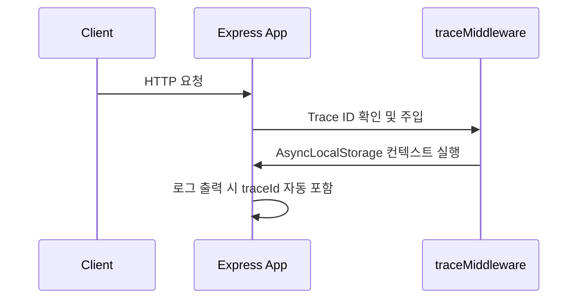
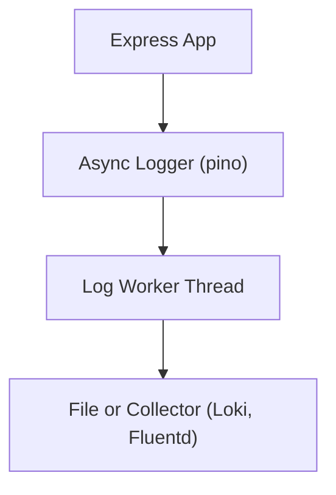

#### 요약

- Express 애플리케이션에서는 **미들웨어 기반 구조적 로깅(Structured Logging)** 으로  
  요청(Request), 응답(Response), 예외(Error)를 체계적으로 관리해야 한다.  
- `pino` 또는 `winston`과 같은 비동기 로거를 사용하고,  
  `AsyncLocalStorage`를 통해 Trace ID를 요청 단위로 전파하는 구조가 권장된다.  
- 본 장에서는 **Trace 관리 → 로거 설정 → 요청/응답 로깅 → 예외 처리 로깅 → 테스트 검증** 순으로 다룬다.

> Express 환경의 로깅은 단순한 `console.log` 수준을 넘어,  
> **요청 단위 추적 + 성능 측정 + 오류 원인 분석**이 가능한 형태로 발전해야 한다.  
> 다음 장에서는 NestJS 환경에서의 고급 로깅 구조(Interceptor, Filter, Context)를 다룬다.

**핵심 요약**
1. `pino` 로거를 기반으로 JSON 구조 로그 생성  
2. `AsyncLocalStorage`를 이용한 Trace ID 전파  
3. 요청/응답 로깅 미들웨어 구현  
4. 예외(에러) 로깅 처리  
5. Jest / Supertest 기반 로그 검증

---

#### 1. 로깅 기본 구성 (pino 기반)

**1.1 설치**

```bash
npm install pino pino-pretty
```

**1.2 로거 설정 파일 (`src/logger.js`)**

```js
import pino from 'pino';

export const logger = pino({
  level: process.env.LOG_LEVEL || 'info',
  transport:
    process.env.NODE_ENV === 'dev'
      ? { target: 'pino-pretty', options: { colorize: true } }
      : undefined,
  base: { service: 'express-api' },
  timestamp: pino.stdTimeFunctions.isoTime,
});
```

| 항목 | 설명 |
|------|------|
| **pino-pretty** | 개발 환경용 컬러 로그 출력 |
| **base.service** | 서비스 식별자 필드 |
| **timestamp** | ISO 형식 타임스탬프 자동 추가 |
| **level** | `debug`, `info`, `warn`, `error` 지정 가능 |

---

#### 2. Trace ID 전파 (AsyncLocalStorage)

**2.1 Trace Context 구성 (`src/trace.js`)**

```js
import { AsyncLocalStorage } from 'node:async_hooks';
export const als = new AsyncLocalStorage();

export const runWithTrace = (traceId, fn) => {
  const store = new Map();
  store.set('traceId', traceId);
  return als.run(store, fn);
};

export const getTraceId = () => als.getStore()?.get('traceId');
```

**2.2 Trace 미들웨어 (`src/middleware/trace.js`)**

```js
import { randomUUID } from 'crypto';
import { runWithTrace } from '../trace.js';

export const traceMiddleware = (req, res, next) => {
  const incomingTrace = req.headers['x-trace-id'];
  const traceId = incomingTrace || randomUUID();
  res.setHeader('x-trace-id', traceId);
  runWithTrace(traceId, next);
};
```

**요청 흐름**



---

#### 3. 요청/응답 로깅 미들웨어

**3.1 구현 (`src/middleware/logger.js`)**

```js
import { logger } from '../logger.js';
import { getTraceId } from '../trace.js';

export const requestLogger = (req, res, next) => {
  const start = Date.now();
  res.on('finish', () => {
    const latency = Date.now() - start;
    logger.info({
      traceId: getTraceId(),
      method: req.method,
      path: req.originalUrl,
      status: res.statusCode,
      latency_ms: latency,
      message: 'Request completed',
    });
  });
  next();
};
```

| 필드 | 설명 |
|------|------|
| **traceId** | 요청 단위 추적 ID |
| **latency_ms** | 요청부터 응답까지의 처리 시간 |
| **status** | 응답 코드 |
| **message** | 이벤트 설명 메시지 |

---

#### 4. 예외 처리 로깅

**4.1 에러 핸들러 미들웨어 (`src/middleware/errorHandler.js`)**

```js
import { logger } from '../logger.js';
import { getTraceId } from '../trace.js';

export const errorHandler = (err, req, res, next) => {
  logger.error({
    traceId: getTraceId(),
    path: req.originalUrl,
    error: {
      message: err.message,
      stack: err.stack?.split('\n').slice(0, 3),
    },
  });
  res.status(500).json({ message: 'Internal Server Error' });
};
```

**4.2 등록 순서 (중요)**

```js
app.use(traceMiddleware);
app.use(requestLogger);
app.use(router);
app.use(errorHandler);
```

> **Tip:**  
> 에러 핸들러는 반드시 **라우터 등록 이후**,  
> 가장 마지막에 선언해야 정상적으로 예외를 처리한다.

---

#### 5. 테스트를 위한 로그 캡처 (Jest + Supertest)

**5.1 샘플 테스트 (`tests/logging.test.js`)**

```js
import request from 'supertest';
import app from '../src/app.js';
import { logger } from '../src/logger.js';

describe('Logging Middleware', () => {
  it('요청 시 traceId 포함 로그를 출력해야 한다.', async () => {
    const spy = jest.spyOn(logger, 'info');
    await request(app).get('/health').expect(200);
    expect(spy).toHaveBeenCalledWith(
      expect.objectContaining({
        traceId: expect.any(String),
        method: 'GET',
      })
    );
  });
});
```

**5.2 테스트 검증 항목**
| 항목 | 설명 |
|------|------|
| **traceId 존재 여부** | 요청 단위 로깅 검증 |
| **latency_ms 출력 여부** | 성능 지표 포함 확인 |
| **에러 핸들러 작동 확인** | `logger.error()` 호출 검증 |
| **JSON 구조 유효성** | 로그 파서에서 오류 없는지 확인 |

---

#### 6. 성능 및 운영 팁

- `pino`는 동기 파일 쓰기 대신 **비차단 방식**으로 로그를 처리한다.  
- 요청량이 많은 환경에서는 `pino.transport` 옵션을 통해  
  **별도 워커 프로세스(log worker)** 로 로그를 전달하도록 구성한다.  
- 운영 환경에서는 로그 샘플링(예: 1:10) 및 로그 회전(rotation)을 설정한다.  



---

