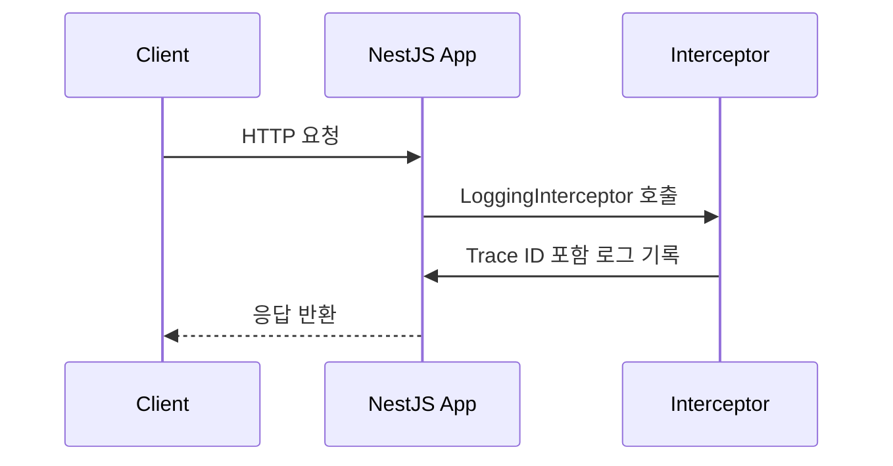

#### 요약

- NestJS는 자체 `LoggerService`와 `Interceptor`, `ExceptionFilter`를 제공하여  
  **요청 단위 로깅**, **예외 처리**, **Trace ID 전파**를 체계적으로 관리할 수 있다.  
- 본 문서에서는 NestJS 환경에서의 로깅 아키텍처를  
  **Interceptor 기반 구조적 로깅(Structured Logging)** 중심으로 설명한다.  
- 핵심은 `LoggerService` 커스터마이징 + `AsyncLocalStorage`로 Trace Context를 유지하는 것이다.

> NestJS 로깅은 프레임워크의 강점을 활용해  
> **Interceptor + Filter + AsyncLocalStorage** 조합으로 완전한 추적 로그를 구현할 수 있다.  
> 다음 장에서는 Flask 환경의 로깅 구조와 Python 표준 모듈 기반 처리 방식을 다룬다.


**핵심 요약**
1. `LoggerService`를 확장해 공통 로깅 포맷 구현  
2. `Interceptor`로 요청/응답 시간 측정 및 Trace ID 포함  
3. `ExceptionFilter`로 에러 로깅 통합 처리  
4. `AsyncLocalStorage`를 통해 요청 단위 Trace Context 전파  
5. Jest 기반 단위 테스트로 로깅 검증

##### 테스트 포인트 요약

| 구분 | 테스트 항목 | 검증 기준 |
|------|--------------|-----------|
| **로깅** | 요청/응답 로그 생성 여부 | Trace ID 포함 확인 |
| **에러 처리** | ExceptionFilter 호출 여부 | statusCode + traceId 응답 |
| **비즈니스 로직** | Interceptor 타이밍 검증 | latency_ms 출력 확인 |
| **보안** | 민감정보 노출 금지 | password/token 필드 미출력 |

---

#### 1. LoggerService 커스터마이징

NestJS 기본 로거는 단순 콘솔 출력이므로,  
`pino` 또는 `winston` 기반 커스텀 로거로 확장해야 한다.

**1.1 로거 서비스 구현 (`logger.service.ts`)**

```ts
import { Injectable, LoggerService } from '@nestjs/common';
import pino from 'pino';

@Injectable()
export class AppLogger implements LoggerService {
  private readonly logger = pino({
    level: process.env.LOG_LEVEL || 'info',
    base: { service: 'nestjs-api' },
    timestamp: pino.stdTimeFunctions.isoTime,
  });

  log(message: string, context?: string) {
    this.logger.info({ message, context });
  }

  error(message: string, trace?: string, context?: string) {
    this.logger.error({ message, trace, context });
  }

  warn(message: string, context?: string) {
    this.logger.warn({ message, context });
  }

  debug(message: string, context?: string) {
    this.logger.debug({ message, context });
  }
}
```

| 메서드 | 설명 |
|--------|------|
| **log()** | 일반 정보 로그 (INFO) |
| **error()** | 예외/에러 로그 (ERROR) |
| **warn()** | 경고 로그 (WARN) |
| **debug()** | 디버그용 로그 (DEBUG) |

---

#### 2. 요청/응답 로깅 Interceptor

**2.1 인터셉터 구현 (`logging.interceptor.ts`)**

```ts
import {
  Injectable,
  NestInterceptor,
  ExecutionContext,
  CallHandler,
} from '@nestjs/common';
import { Observable, tap } from 'rxjs';
import { AppLogger } from './logger.service';
import { getTraceId } from './trace.context';

@Injectable()
export class LoggingInterceptor implements NestInterceptor {
  constructor(private readonly logger: AppLogger) {}

  intercept(context: ExecutionContext, next: CallHandler): Observable<any> {
    const req = context.switchToHttp().getRequest();
    const { method, url } = req;
    const traceId = getTraceId();
    const start = Date.now();

    this.logger.log(`➡️ ${method} ${url} 요청 수신`, 'Request');

    return next.handle().pipe(
      tap(() => {
        const latency = Date.now() - start;
        this.logger.log(
          {
            traceId,
            method,
            url,
            latency_ms: latency,
            message: 'Request completed',
          },
          'Response',
        );
      }),
    );
  }
}
```



---

#### 3. 예외 처리 로깅 (ExceptionFilter)

**3.1 구현 (`exception.filter.ts`)**

```ts
import {
  ExceptionFilter,
  Catch,
  ArgumentsHost,
  HttpException,
} from '@nestjs/common';
import { AppLogger } from './logger.service';
import { getTraceId } from './trace.context';

@Catch()
export class AllExceptionsFilter implements ExceptionFilter {
  constructor(private readonly logger: AppLogger) {}

  catch(exception: unknown, host: ArgumentsHost) {
    const ctx = host.switchToHttp();
    const response = ctx.getResponse();
    const request = ctx.getRequest();
    const traceId = getTraceId();

    const status =
      exception instanceof HttpException
        ? exception.getStatus()
        : 500;

    const message =
      exception instanceof HttpException
        ? exception.getResponse()
        : (exception as Error).message;

    this.logger.error('❌ 요청 처리 중 예외 발생', (exception as Error).stack);

    response.status(status).json({
      traceId,
      statusCode: status,
      path: request.url,
      error: message,
    });
  }
}
```

> **Tip:**  
> NestJS에서는 예외 필터(ExceptionFilter)가  
> `LoggerService`보다 **나중에 실행**되므로,  
> `traceId`를 필터 내부에서도 수동으로 주입해야 한다.

---

#### 4. Trace Context 관리 (AsyncLocalStorage)

**4.1 컨텍스트 구성 (`trace.context.ts`)**

```ts
import { AsyncLocalStorage } from 'node:async_hooks';
const als = new AsyncLocalStorage<Map<string, string>>();

export const runWithTrace = <T>(traceId: string, fn: () => T): T => {
  const store = new Map<string, string>();
  store.set('traceId', traceId);
  return als.run(store, fn);
};

export const getTraceId = (): string | undefined => {
  return als.getStore()?.get('traceId');
};
```

**4.2 미들웨어 등록 (`trace.middleware.ts`)**

```ts
import { Injectable, NestMiddleware } from '@nestjs/common';
import { randomUUID } from 'crypto';
import { runWithTrace } from './trace.context';

@Injectable()
export class TraceMiddleware implements NestMiddleware {
  use(req: any, res: any, next: () => void) {
    const traceId = req.headers['x-trace-id'] || randomUUID();
    res.setHeader('x-trace-id', traceId);
    runWithTrace(traceId, next);
  }
}
```

**4.3 등록 (`app.module.ts`)**

```ts
import { MiddlewareConsumer, Module } from '@nestjs/common';
import { TraceMiddleware } from './trace.middleware';
import { AppLogger } from './logger.service';

@Module({
  providers: [AppLogger],
})
export class AppModule {
  configure(consumer: MiddlewareConsumer) {
    consumer.apply(TraceMiddleware).forRoutes('*');
  }
}
```

---

#### 5. 로그 출력 예시

**요청 성공 로그**
```json
{
  "timestamp": "2025-10-26T02:40:45.923Z",
  "level": "INFO",
  "service": "nestjs-api",
  "traceId": "bb2f4a3a",
  "method": "GET",
  "path": "/health",
  "latency_ms": 37,
  "message": "Request completed"
}
```

**예외 발생 로그**
```json
{
  "timestamp": "2025-10-26T02:41:02.138Z",
  "level": "ERROR",
  "traceId": "bb2f4a3a",
  "message": "❌ 요청 처리 중 예외 발생",
  "stack": "Error: Invalid parameter\n    at UsersService..."
}
```

---

