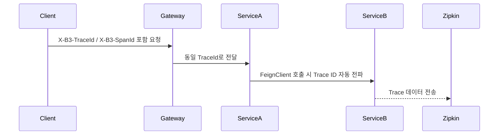
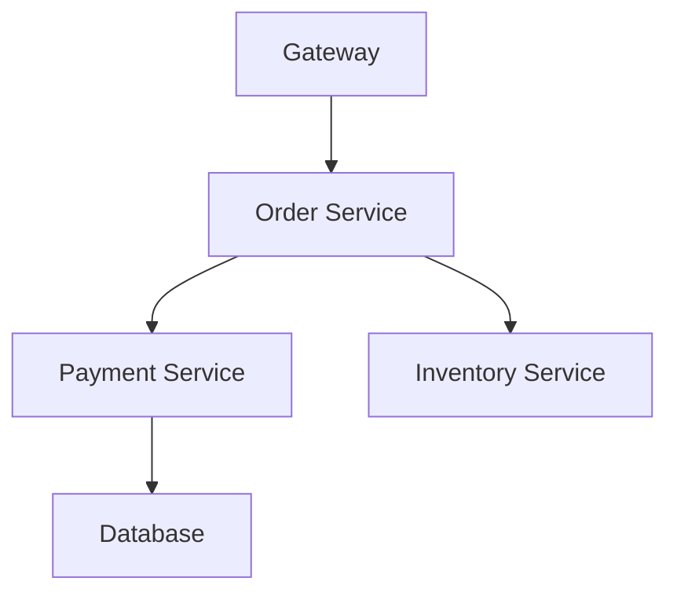

#### 요약

- Spring Cloud는 **Sleuth**와 **Zipkin**을 이용해  
  마이크로서비스 간의 요청 흐름을 **Trace ID / Span ID 기반으로 추적**할 수 있다.  
- 본 장에서는 **Sleuth 설정**, **FeignClient/RestTemplate 전파 구조**,  
  **Gateway와 Config Server 로깅 전략**, **Zipkin 연동 예시**,  
  **통합 테스트 검증 방법**을 다룬다.

> Spring Cloud의 분산 로깅은 **Sleuth + Zipkin + MDC** 구조를 기반으로  
> 마이크로서비스 간 요청 흐름을 명확하게 시각화할 수 있다.  
> 다음 장에서는 모든 환경에서 공통적으로 적용 가능한  
> **테스트 전략 (Unit / Integration / E2E / CI-CD 로그 검증)** 을 다룬다.

**핵심 요약**
1. Sleuth를 통한 자동 Trace ID 생성 및 전파  
2. FeignClient, RestTemplate 호출 간 Trace 정보 자동 연결  
3. Zipkin으로 중앙화된 분산 Trace 시각화  
4. Gateway, Config Server 환경별 로깅 전략  
5. 통합 테스트에서 Trace Chain 검증  

---


#### 1. Sleuth & Zipkin 설정

**1.1 Gradle 의존성**

```gradle
dependencies {
    implementation 'org.springframework.cloud:spring-cloud-starter-sleuth'
    implementation 'org.springframework.cloud:spring-cloud-starter-zipkin'
}
```

**1.2 application.yml 설정**

```yaml
spring:
  application:
    name: order-service
  sleuth:
    sampler:
      probability: 1.0    # 100% 샘플링 (운영에서는 0.1~0.3 권장)
    trace-id128: true     # 128-bit Trace ID 활성화
  zipkin:
    base-url: http://zipkin:9411
    sender:
      type: web
```

| 항목 | 설명 |
|------|------|
| **probability** | Trace 샘플링 비율 |
| **trace-id128** | 긴 Trace ID 지원 |
| **base-url** | Zipkin 서버 주소 |
| **sender.type** | HTTP로 Trace 데이터 전송 |

---

#### 2. Trace ID / Span ID 전파 구조

Spring Cloud Sleuth는 내부적으로 **MDC**와 **TraceContext**를 이용하여  
HTTP 요청마다 고유한 Trace ID, Span ID를 자동 관리한다.



**주요 Header**
| Header | 역할 |
|--------|------|
| **X-B3-TraceId** | 요청 전체를 식별하는 ID |
| **X-B3-SpanId** | 현재 서비스의 호출 단위 ID |
| **X-B3-ParentSpanId** | 상위 호출자의 Span ID |
| **X-B3-Sampled** | Trace 샘플링 여부 |
| **X-Span-Export** | Zipkin 전송 여부 |

---

#### 3. FeignClient / RestTemplate Trace 전파

**3.1 FeignClient 호출 예시**

```java
@FeignClient(name = "payment-service")
public interface PaymentClient {
    @GetMapping("/payments/{id}")
    PaymentResponse getPayment(@PathVariable String id);
}
```

**3.2 RestTemplate 호출 예시**

```java
@Bean
@LoadBalanced
public RestTemplate restTemplate() {
    return new RestTemplate();
}
```

> **Note:**  
> Sleuth가 자동으로 RestTemplate, FeignClient, WebClient에 Trace 정보를 삽입하므로  
> 별도의 코드 수정 없이 Trace 전파가 가능하다.

---

#### 4. Gateway / Config Server 로깅 전략

| 구성 요소 | 로깅 포인트 | 예시 로그 필드 |
|------------|--------------|----------------|
| **Spring Cloud Gateway** | 요청/응답 필터 | method, uri, traceId, routeId, latency |
| **Config Server** | 설정 조회 로그 | traceId, profile, configName |
| **Eureka Server** | 서비스 등록 로그 | instanceId, traceId |
| **FeignClient** | 외부 호출 로그 | traceId, targetService, latency |

**예시 (Gateway 로그 포맷)**

```json
{
  "timestamp": "2025-10-26T05:14:23.455Z",
  "level": "INFO",
  "traceId": "8a6b-219f",
  "service": "gateway",
  "method": "GET",
  "path": "/api/orders",
  "routeId": "order-service",
  "latency_ms": 87,
  "message": "Request routed successfully"
}
```

---

#### 5. Zipkin 연동 (분산 추적 시각화)

**5.1 Docker Compose 예시**

```yaml
version: '3.8'
services:
  zipkin:
    image: openzipkin/zipkin:latest
    container_name: zipkin
    ports:
      - "9411:9411"
```

**5.2 대시보드**
- 접속 주소: `http://localhost:9411`
- Trace ID 기준으로 서비스 간 호출 관계 확인 가능
- Latency, Error 비율, Path별 Trace Tree 시각화

**예시**


---

#### 6. 통합 테스트 (Trace Chain 검증)

**6.1 Testcontainers 기반 통합 테스트**

```java
@SpringBootTest(webEnvironment = WebEnvironment.RANDOM_PORT)
@Testcontainers
class SleuthTraceIntegrationTest {

    @Autowired
    private TestRestTemplate restTemplate;

    @Container
    static GenericContainer<?> zipkin =
        new GenericContainer<>("openzipkin/zipkin:latest").withExposedPorts(9411);

    @Test
    void traceIdShouldPropagateAcrossServices() {
        ResponseEntity<String> res = restTemplate.getForEntity("/api/orders/1", String.class);
        assertThat(res.getStatusCode()).isEqualTo(HttpStatus.OK);
        assertThat(res.getHeaders()).containsKey("X-B3-TraceId");
    }
}
```

| 테스트 항목 | 검증 내용 |
|--------------|------------|
| **Trace 전파** | X-B3 헤더가 서비스 간 유지되는지 확인 |
| **Zipkin 기록** | Trace 데이터가 Zipkin에 수집되는지 검증 |
| **Latency 측정** | 서비스 간 호출 시간 검증 |
| **Error Trace** | 예외 발생 시 Trace Tree 연결 여부 확인 |

---

#### 7. 운영 환경 최적화

| 항목 | 권장 설정 |
|------|------------|
| **샘플링 비율** | 10~30% (운영 부하 최소화) |
| **Zipkin 수집기** | 별도 컨테이너 또는 서버 분리 |
| **로그 포맷** | JSON + traceId, spanId, latency 포함 |
| **로그 보관 주기** | 7~14일 |
| **보안** | 내부망 한정 접근, Trace 데이터 암호화 |

---

