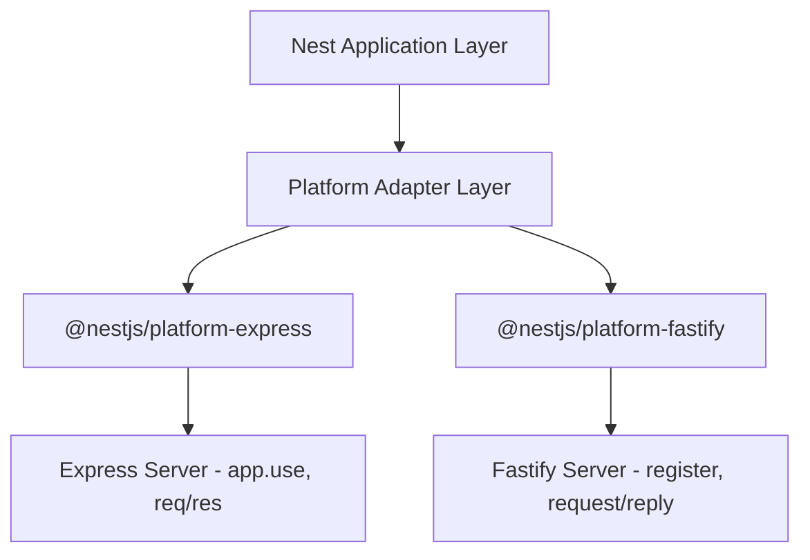

---  
title: "NestJS Express → Fastify 마이그레이션 가이드"  
date: 2025-10-25  
---

**version: NestJS v10.x / Node.js v20 LTS 기준**

#### 요약

**핵심 요약**

- NestJS는 기본적으로 Express를 HTTP 플랫폼으로 사용하지만,  
  `@nestjs/platform-fastify`를 통해 Fastify 어댑터로 쉽게 전환할 수 있다.  
- Fastify는 **플러그인 기반 비동기 구조**로 Express 대비 **2~3배 빠른 처리 속도**를 제공한다.  
- Express용 미들웨어는 일부 호환되지 않으므로, Fastify 전용 플러그인 사용이 필요하다.


Fastify는 Express의 단점을 보완한 **차세대 고성능 Node.js 웹 프레임워크**로,
NestJS와 함께 사용할 때 성능 향상과 낮은 리소스 소비를 동시에 얻을 수 있다.
단, 기존 Express 미들웨어를 그대로 사용할 수 없기 때문에
**플러그인 전환 및 요청 객체 변경에 주의**해야 한다.

##### 핵심 비교 리스트

| 항목 | Express | Fastify |
|------|----------|----------|
| 설치 | 기본 포함 | `@nestjs/platform-fastify` 설치 필요 |
| 요청 처리 | 미들웨어 체인 기반 | 플러그인·트리 기반 비동기 처리 |
| 속도 | 중간 (기본 성능) | **고성능 (2~3배 빠름)** |
| 미들웨어 호환성 | 매우 높음 | 일부 제한 (전용 플러그인 필요) |
| 사용 권장 | 일반 웹/SSR | API Gateway, 고성능 REST 서비스 |

##### 권장 시나리오

| 사용 환경                 | 추천 플랫폼  | 비고            |
| --------------------- | ------- | ------------- |
| SSR, 일반 Web App       | Express | 미들웨어 호환성 우수   |
| API Gateway, 고부하 REST | Fastify | 고성능 직렬화 및 라우팅 |
| IoT / 실시간 API         | Fastify | 저지연 구조에 유리    |
| 복잡한 서드파티 통합           | Express | 라이브러리 호환성 확보  |

##### 실습 결과 및 성능 차이

| 테스트 항목                     | Express        | Fastify                      |
| -------------------------- | -------------- | ---------------------------- |
| **Hello API RPS (wrk 기준)** | 13,500 req/s   | **33,000 req/s**             |
| **Memory Usage**           | 약 120MB        | **약 70MB (-40%)**            |
| **Latency (p95)**          | 20.3ms         | **7.6ms**                    |
| **응답 직렬화**                 | JSON.stringify | fast-json-stringify (사전 컴파일) |

> **결론**: 동일한 NestJS 애플리케이션이라도 Fastify 전환 시 RPS 약 2.4배 증가,
> 응답 지연 60% 감소, 메모리 절감 효과가 확인됨.
>

**정리 문단**

NestJS는 플랫폼 추상화 계층을 통해 Express 또는 Fastify 중 원하는 엔진을 선택할 수 있다.  
Fastify는 Express보다 **빠른 요청 라우팅**, **효율적인 JSON 직렬화**, **비동기 기반 에러 핸들링**을 제공하며,  
고부하 환경(API Gateway, IoT, Microservice)에서 성능 향상 효과가 크다.

##### 참고자료

- [NestJS 공식문서 — Performance (Fastify)](https://docs.nestjs.com/techniques/performance)
- [Fastify 공식문서 — Getting Started](https://fastify.dev/docs/latest/)
- [Express 공식문서 — Middleware Guide](https://expressjs.com/en/guide/using-middleware.html)

---

#### 1. Express와 Fastify의 구조적 차이

| 구분 | Express | Fastify |
|------|----------|----------|
| **핵심 철학** | 단순성과 유연성 중심 | 성능과 안정성 중심 |
| **요청 구조** | Request → Middleware → Response 순차 체인 | Request → Route Handler (비동기 플로우) |
| **확장 방식** | `app.use()` 미들웨어 삽입 | `register()` 플러그인 기반 확장 |
| **라우팅 구조** | 동적 탐색 (O(n)) | 정적 트리 기반 탐색 (O(1) 수준) |
| **JSON 처리** | Node.js 기본 `JSON.stringify()` | `fast-json-stringify` 사전 컴파일 |
| **에러 처리** | `next(err)` 기반 체인 | `setErrorHandler` 글로벌 훅 |

---

#### 2. NestJS 플랫폼 구조 비교



* NestJS는 동일한 애플리케이션 계층 위에서 플랫폼 어댑터만 교체하여 동작한다.
* Express는 `req/res` 객체를 사용하는 반면, Fastify는 `FastifyRequest` / `FastifyReply`를 사용한다.
* 즉, 비즈니스 로직은 그대로 유지되며 **main.ts만 변경**하면 전환이 가능하다.

---

#### 3. 설치 및 기본 구성

##### 📦 Express 기반 프로젝트 기본 구조

```bash
npm install @nestjs/core @nestjs/common @nestjs/platform-express
```

**main.ts (Express 버전)**

```typescript
import { NestFactory } from '@nestjs/core';
import { AppModule } from './app.module';

async function bootstrap() {
  const app = await NestFactory.create(AppModule); // Express 기반
  await app.listen(3000);
}
bootstrap();
```

---

##### Fastify 어댑터 추가

```bash
npm install @nestjs/platform-fastify fastify
```

**main.ts (Fastify 버전)**

```typescript
import { NestFactory } from '@nestjs/core';
import { FastifyAdapter, NestFastifyApplication } from '@nestjs/platform-fastify';
import { AppModule } from './app.module';

async function bootstrap() {
  const app = await NestFactory.create<NestFastifyApplication>(
    AppModule,
    new FastifyAdapter(), // Fastify로 교체
  );
  await app.listen(3000, '0.0.0.0');
}
bootstrap();
```
##### 체크리스트
| 항목                 | 확인 내용                                                | 예시                                                      |
| ------------------ | ---------------------------------------------------- | ------------------------------------------------------- |
| **Fastify 의존성 설치** | `fastify`, `@nestjs/platform-fastify`                | `npm install fastify @nestjs/platform-fastify`          |
| **main.ts 교체**     | `FastifyAdapter`로 변경                                 | `new FastifyAdapter()`                                  |
| **미들웨어 → 플러그인 전환** | Fastify 전용 등록                                        | `@fastify/cors`, `@fastify/helmet`, `@fastify/compress` |
| **바디 / 업로드 처리**    | `@fastify/formbody`, `@fastify/multipart` 사용         | `await app.register(import('@fastify/formbody'))`       |
| **쿠키 / 세션**        | `@fastify/cookie` (+ 필요 시 `@fastify/secure-session`) | `await app.register(import('@fastify/cookie'))`         |
| **정적 자산**          | Express Static → Fastify Static                      | `@fastify/static`                                       |
| **로깅 설정**          | Fastify 내장 pino 사용, 환경별 포맷 지정                        | `transport: { target: 'pino-pretty' }`                  |
| **인증 방식**          | JWT는 변경 없음 / 세션은 별도 구성 필요                            | `fastify-passport` 또는 JWT 기반                            |
| **req/res 객체 변경**  | Express → Fastify                                    | `reply.send(data)` / `request.body`                     |
| **성능 테스트**         | wrk, autocannon, k6 등으로 검증                           | `autocannon http://localhost:3000`                      |


---

#### 4. 미들웨어 및 플러그인 전환 예시

| Express 미들웨어     | Fastify 플러그인 대체     |
| ---------------- | ------------------- |
| `express.json()` | `fastify-formbody`  |
| `helmet()`       | `@fastify/helmet`   |
| `cors()`         | `@fastify/cors`     |
| `compression()`  | `@fastify/compress` |

##### 요청/응답 객체 차이

| Express           | Fastify                 |
| ----------------- | ----------------------- |
| `req.body`        | `request.body`          |
| `req.params`      | `request.params`        |
| `res.send()`      | `reply.send()`          |
| `res.status(200)` | `reply.code(200)`       |
| `res.json()`      | `reply.send()` (자동 직렬화) |


##### 요약 매핑 표

| 기능                 | Express 미들웨어                         | Fastify 플러그인/대응                            |
| ------------------ | ------------------------------------ | ------------------------------------------ |
| JSON / URL-Encoded | `express.json`, `express.urlencoded` | 기본(JSON), `@fastify/formbody`              |
| Multipart          | `multer` + `FileInterceptor`         | `@fastify/multipart` + 직접 처리               |
| CORS               | `cors`                               | `@fastify/cors`                            |
| 보안 헤더              | `helmet`                             | `@fastify/helmet`                          |
| 압축                 | `compression`                        | `@fastify/compress`                        |
| 쿠키                 | `cookie-parser`                      | `@fastify/cookie`                          |
| 세션                 | `express-session`                    | `@fastify/secure-session` (또는 JWT 권장)      |
| 로깅                 | `morgan`                             | Fastify 내장 pino                            |
| 정적                 | `express.static`                     | `@fastify/static`                          |
| 레이트리밋              | `express-rate-limit`                 | `@fastify/rate-limit`                      |
| CSRF               | `csurf`                              | `@fastify/csrf-protection`                 |
| 프록시 신뢰             | `app.set('trust proxy', 1)`          | `new FastifyAdapter({ trustProxy: true })` |


##### 0) 기본 부트스트랩

###### 변경 전 (Express)

```ts
// main.ts (Express)
import { NestFactory } from '@nestjs/core';
import { AppModule } from './app.module';

async function bootstrap() {
  const app = await NestFactory.create(AppModule); // @nestjs/platform-express
  await app.listen(3000);
}
bootstrap();
```

###### 변경 후 (Fastify)

```ts
// main.ts (Fastify)
import { NestFactory } from '@nestjs/core';
import { AppModule } from './app.module';
import { FastifyAdapter, NestFastifyApplication } from '@nestjs/platform-fastify';

async function bootstrap() {
  const app = await NestFactory.create<NestFastifyApplication>(
    AppModule,
    new FastifyAdapter(),
  );
  await app.listen(3000, '0.0.0.0');
}
bootstrap();
```

---

##### 1) JSON Body / Form 파싱

| 목적          | Express                | Fastify              |
| ----------- | ---------------------- | -------------------- |
| JSON 파싱     | `express.json()`       | 기본 내장 (필요 시 옵션)      |
| URL-Encoded | `express.urlencoded()` | `@fastify/formbody`  |
| Multipart   | `multer`               | `@fastify/multipart` |

###### 변경 전 (Express)

```ts
import * as express from 'express';

const app = await NestFactory.create(AppModule);
app.use(express.json({ limit: '2mb' }));
app.use(express.urlencoded({ extended: true, limit: '2mb' }));
```

###### 변경 후 (Fastify)

```ts
// JSON은 기본 처리. URL-Encoded만 플러그인 추가
await app.register(import('@fastify/formbody'), { bodyLimit: 2 * 1024 * 1024 });

// 파일 업로드 필요 시
await app.register(import('@fastify/multipart'), {
  limits: { fileSize: 10 * 1024 * 1024 }, // 10MB
});
```

> **주의:** Nest의 `FileInterceptor`(multer)는 **Express 전용**입니다. Fastify에서는
> 컨트롤러에서 `@Req() request`로 `await request.file()` 또는 `await request.parts()`를 직접 처리하거나, Fastify용 어댑터 기반의 커스텀 인터셉터를 사용하세요.

---

##### 2) CORS

###### 변경 전 (Express)

```ts
import * as cors from 'cors';

const app = await NestFactory.create(AppModule);
app.use(cors({ origin: ['https://example.com'], credentials: true }));
```

###### 변경 후 (Fastify)

```ts
await app.register(import('@fastify/cors'), {
  origin: ['https://example.com'],
  credentials: true,
});
```

---

##### 3) 보안 헤더 (Helmet)

###### 변경 전 (Express)

```ts
import * as helmet from 'helmet';
const app = await NestFactory.create(AppModule);
app.use(helmet());
```

###### 변경 후 (Fastify)

```ts
await app.register(import('@fastify/helmet'), {
  // 예: 콘텐츠 보안 정책(CSP) 커스터마이즈 가능
  // contentSecurityPolicy: { directives: { defaultSrc: ["'self'"] } }
});
```

---

##### 4) 압축 (gzip/br)

###### 변경 전 (Express)

```ts
import * as compression from 'compression';
const app = await NestFactory.create(AppModule);
app.use(compression());
```

###### 변경 후 (Fastify)

```ts
await app.register(import('@fastify/compress'), {
  global: true, // 모든 응답 대상
  // encodings: ['gzip', 'deflate', 'br']
});
```

---

##### 5) 쿠키 / 세션 / 인증(패스포트)

| 목적             | Express              | Fastify                                        |
| -------------- | -------------------- | ---------------------------------------------- |
| 쿠키 파싱          | `cookie-parser`      | `@fastify/cookie`                              |
| 세션(서버 세션)      | `express-session`    | `@fastify/secure-session` (또는 외부 세션백엔드/JWT 권장) |
| Passport (JWT) | `@nestjs/passport`   | 동일 (변경 없음)                                     |
| Passport (세션)  | `express-session` 기반 | Fastify는 별도 구성 필요(세션 미들웨어 대체)                  |

###### 변경 전 (Express)

```ts
import * as cookieParser from 'cookie-parser';
import * as session from 'express-session';
// (선택) passport 세션 인증
// import * as passport from 'passport';

const app = await NestFactory.create(AppModule);
app.use(cookieParser(process.env.COOKIE_SECRET));
app.use(
  session({
    secret: process.env.SESS_SECRET!,
    resave: false,
    saveUninitialized: false,
    cookie: { secure: false, httpOnly: true, maxAge: 3600_000 },
  }),
);
// app.use(passport.initialize());
// app.use(passport.session());
```

###### 변경 후 (Fastify)

```ts
// 쿠키
await app.register(import('@fastify/cookie'), { secret: process.env.COOKIE_SECRET });

// (권장) JWT 인증이면 Nest Passport(JWT Strategy)만으로 충분, 세션 불필요.
// 세션 필요 시:
await app.register(import('@fastify/secure-session'), {
  key: Buffer.from(process.env.SECURE_SESSION_KEY!, 'hex'), // 32바이트 키(64-hex)
  cookie: { path: '/', httpOnly: true, maxAge: 3600_000 },
});

// Nest의 Passport(JWT)는 그대로 사용 가능.
// 세션 기반 Passport는 fastify-passport 조합 또는 커스텀 가드 설계를 권장.
```

> **실무 팁:** Fastify 전환 시 **JWT 기반 무상태 인증**이 유지·확장이 쉬우며,
> 세션 기반 인증이 꼭 필요하다면 `fastify-passport` + `@fastify/secure-session` 조합을 신중히 구성하세요.

---

##### 6) 정적 파일 제공 (Static)

###### 변경 전 (Express)

```ts
import { join } from 'path';
import * as express from 'express';

const app = await NestFactory.create(AppModule);
app.use('/public', express.static(join(__dirname, '..', 'public')));
```

###### 변경 후 (Fastify)

```ts
import { join } from 'path';

await app.register(import('@fastify/static'), {
  root: join(__dirname, '..', 'public'),
  prefix: '/public/', // 반드시 슬래시로 종료
});
```

---

##### 7) 로깅 (morgan → pino)

Fastify는 기본 로거가 **pino**라서 고성능입니다.

###### 변경 전 (Express)

```ts
import * as morgan from 'morgan';

const app = await NestFactory.create(AppModule);
app.use(morgan('combined'));
```

###### 변경 후 (Fastify + pino)

```ts
// 1) FastifyAdapter 생성 시 로거 옵션 지정
const adapter = new FastifyAdapter({
  logger: {
    level: 'info',
    transport: process.env.NODE_ENV !== 'production'
      ? { target: 'pino-pretty', options: { singleLine: true } }
      : undefined,
  },
});
const app = await NestFactory.create<NestFastifyApplication>(AppModule, adapter);

// 2) 요청별 커스텀 훅에서 로깅(선택)
app.getHttpAdapter().getInstance().addHook('onRequest', (req, _res, done) => {
  req.log.info({ url: req.url, method: req.method }, 'incoming request');
  done();
});
```

---

##### 8) 레이트 리미트 (요청 제한)

###### 변경 전 (Express)

```ts
import * as rateLimit from 'express-rate-limit';

const app = await NestFactory.create(AppModule);
app.use(rateLimit({ windowMs: 60_000, max: 100 }));
```

###### 변경 후 (Fastify)

```ts
await app.register(import('@fastify/rate-limit'), {
  max: 100,
  timeWindow: '1 minute',
  // ban: 2, keyGenerator: (req) => req.ip
});
```

---

##### 9) CSRF 보호

###### 변경 전 (Express)

```ts
import * as csurf from 'csurf';

const app = await NestFactory.create(AppModule);
app.use(csurf()); // 쿠키/세션 조합 필요
```

###### 변경 후 (Fastify)

```ts
await app.register(import('@fastify/csrf-protection'), {
  // cookie: { key: '_csrf', signed: true }, // 쿠키 기반 시 옵션
});
```

> **주의:** CSRF는 주로 **브라우저-쿠키 세션** 환경에서 필요합니다.
> **JWT + Bearer 토큰** 기반 API는 일반적으로 **CSRF 영향이 낮으며**, 대신 CORS·Origin 검증을 강화하세요.

---

##### 10) 프록시 신뢰(Real IP)

###### 변경 전 (Express)

```ts
const app = await NestFactory.create(AppModule);
app.set('trust proxy', 1);
```

###### 변경 후 (Fastify)

```ts
const adapter = new FastifyAdapter({ trustProxy: true });
const app = await NestFactory.create<NestFastifyApplication>(AppModule, adapter);
```

---

##### 11) 공통 Nest 설정 (변경 없음)

아래 항목들은 **플랫폼과 무관**하게 동일하게 동작합니다.

```ts
// 전역 프리픽스
app.setGlobalPrefix('api');

// 전역 파이프(ValidationPipe)
import { ValidationPipe } from '@nestjs/common';
app.useGlobalPipes(new ValidationPipe({ whitelist: true, transform: true }));

// 전역 인터셉터/필터
// app.useGlobalInterceptors(new ClassSerializerInterceptor(...));
// app.useGlobalFilters(new AllExceptionsFilter(...));
```

---

##### 12) Express 전용 관용구 대체 (locals 등)

**Express의 `res.locals`**는 Fastify에 없습니다. 대체 방법:

##### 변경 전 (Express)

```ts
app.use((req, res, next) => {
  res.locals.requestId = req.headers['x-request-id'];
  next();
});
```

##### 변경 후 (Fastify)

```ts
// 요청/응답에 커스텀 속성 데코레이션
const f = app.getHttpAdapter().getInstance();
f.decorateRequest('requestId', null);

f.addHook('onRequest', (req, _reply, done) => {
  (req as any).requestId = req.headers['x-request-id'] ?? crypto.randomUUID();
  done();
});

// 컨트롤러에서 사용
// @Req() req: FastifyRequest & { requestId?: string }
```

---

##### 13) 업로드(멀터 → multipart) 컨트롤러 예시

##### 변경 전 (Express + multer + FileInterceptor)

```ts
@Post('upload')
@UseInterceptors(FileInterceptor('file'))
upload(@UploadedFile() file: Express.Multer.File) {
  return { filename: file.originalname, size: file.size };
}
```

##### 변경 후 (Fastify + @fastify/multipart)

```ts
import { FastifyRequest } from 'fastify';

@Post('upload')
async upload(@Req() req: FastifyRequest) {
  const data = await req.file(); // 단일 파일
  if (!data) throw new BadRequestException('file is required');
  const buffer = await data.toBuffer();
  return { filename: data.filename, size: buffer.length, mimetype: data.mimetype };
}
```

> 여러 파일은 `for await (const part of request.parts())` 형태로 처리하세요.

---


