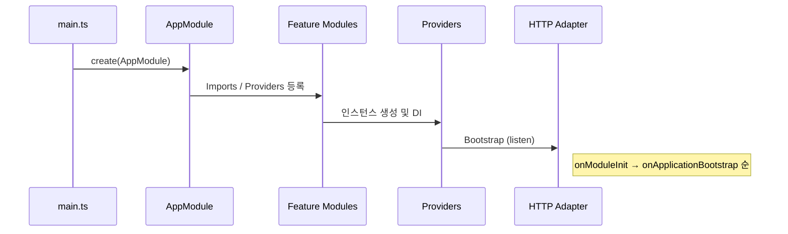

**version: NestJS v10.x / Node.js v20 LTS 기준**

#### 요약

NestJS는 앱이 시작되고 종료될 때 명확한 생명주기(Lifecycle)를 제공한다.  
각 단계별 Hook을 통해 **모듈 초기화, 자원 연결, 종료 처리**를 제어할 수 있다.

NestJS의 Lifecycle은 단순한 부트스트랩 과정을 넘어
**애플리케이션 전 생애주기를 통합 제어**하는 메커니즘이다.
Hook을 활용하면 초기화, 로깅, 종료 등 모든 시점을 세밀하게 관리할 수 있다.

---

##### 참고자료
- [Lifecycle Events — NestJS Docs](https://docs.nestjs.com/fundamentals/lifecycle-events)
- [Application Lifecycle Management](https://docs.nestjs.com/)

---

### 1️⃣ Lifecycle 개요



---

### 2. 주요 Hook 목록

| Hook                          | 시점           | 역할                   |
| ----------------------------- | ------------ | -------------------- |
| `onModuleInit()`              | 모듈 초기화 시     | DB, Cache 연결 등       |
| `onApplicationBootstrap()`    | 앱 전체 초기화 후   | 외부 API 연동, 이벤트 등록    |
| `beforeApplicationShutdown()` | SIGTERM 감지 시 | Graceful Shutdown 처리 |
| `onModuleDestroy()`           | 종료 시점        | 리소스 해제, 세션 정리        |

**예시**

```typescript
@Injectable()
export class UserService implements OnModuleInit, OnModuleDestroy {
  onModuleInit() {
    console.log('UserModule 초기화 완료');
  }
  onModuleDestroy() {
    console.log('UserModule 종료');
  }
}
```

---

### 3. TestingModule & Mock Lifecycle

Nest TestingModule은 DI 컨테이너를 동일하게 생성하므로,
테스트 환경에서도 Hook이 동일하게 실행된다.

```typescript
beforeEach(async () => {
  const module = await Test.createTestingModule({
    providers: [UserService, UserRepository],
  }).compile();

  service = module.get<UserService>(UserService);
});
```

---

### 4. DynamicModule과 초기화 연계

```typescript
@Module({})
export class ConfigModule {
  static register(env: string): DynamicModule {
    const providers = [
      {
        provide: 'CONFIG_PATH',
        useValue: env === 'prod' ? '/etc/app/config' : './.env',
      },
    ];
    return { module: ConfigModule, providers, exports: providers };
  }
}
```

> 환경별 설정·API Key·Feature Flag를 부팅 시점에 주입 가능

---

### 5. Lifecycle 핵심 요약

| 단계                 | 이벤트                                  | 주요 역할        |
| ------------------ | ------------------------------------ | ------------ |
| **Initialization** | onModuleInit                         | 캐시, DB 연결    |
| **Bootstrap**      | onApplicationBootstrap               | 외부 시스템 초기화   |
| **Runtime**        | 애플리케이션 동작                            | 요청/응답 처리     |
| **Shutdown**       | beforeApplicationShutdown, onDestroy | 자원 해제, 로그 저장 |

---