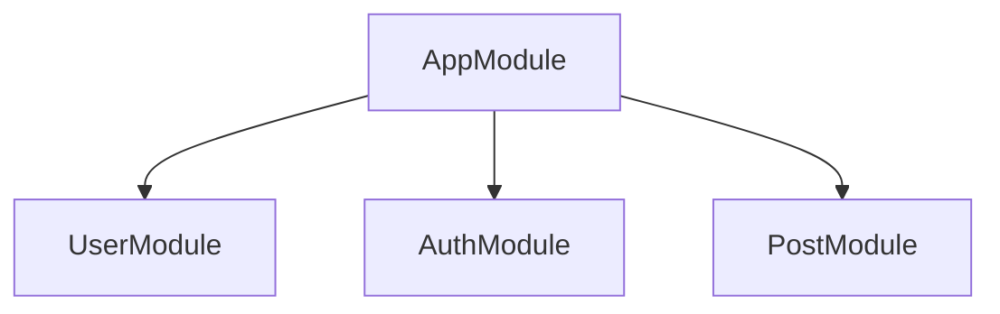

**version: NestJS v10.x / Node.js v20 LTS 기준**

Controller–Service–Repository, Lifecycle, 전역 정책

#### 요약

NestJS는 단순한 웹 프레임워크가 아니라, **아키텍처적 사고를 강제하는 프레임워크**이다.  
“구조가 곧 품질이다(Structure is Quality)”라는 철학 아래,  
모듈화(Modularity), 의존성 주입(DI), 데코레이터 기반 선언적 코드,  
그리고 테스트 가능성(Testability)을 중시한다.

NestJS는 “**구조화된 자유(Structured Freedom)**”를 제공한다.
코드 규칙이 많지만, 그 규칙 덕분에 팀 단위 개발과 테스트가 쉬워진다.

> “NestJS는 Node.js의 Spring Boot이다 — 하지만 더 유연하고 현대적이다.”

---

##### 참고자료
- [NestJS Fundamentals](https://docs.nestjs.com/)
- [SOLID Principles](https://en.wikipedia.org/wiki/SOLID)
- [Angular Design Influence](https://angular.io/guide/architecture)

---

#### 1. NestJS의 철학 4원칙

| 철학 | 설명 |
|------|------|
| **Modular** | 모든 기능을 독립 모듈로 나눠 유지보수성과 재사용성을 확보 |
| **Declarative** | 데코레이터 기반으로 동작을 선언적으로 표현 (`@Controller`, `@Injectable`) |
| **Scalable** | 서비스 간 책임 분리로 수평 확장 구조 용이 |
| **Testable** | DI 컨테이너 기반 구조로 단위/통합 테스트 용이 |

---

#### 2. 설계 사상 (Design Paradigm)

- **OOP (객체 지향 프로그래밍)**: 클래스 기반 구조, 상속·캡슐화·인터페이스  
- **FP (함수형 프로그래밍)**: 순수 함수 기반 로직 분리 가능  
- **FRP (Reactive 프로그래밍)**: `RxJS`를 통한 비동기 이벤트 스트림 처리 지원  

NestJS는 위 세 가지 철학을 결합하여  
“**현대적 Node.js 애플리케이션의 표준 아키텍처**”를 제공한다.

---

#### 3. 모듈화 철학 (Modularity)



* 각 모듈은 **독립적으로 개발·테스트 가능**
* `imports`, `providers`, `exports` 를 통해 **의존성 명시적 관리**
* 모듈은 도메인 또는 기능 단위로 나누는 것이 이상적

---

#### 4. 의존성 주입 (Dependency Injection)

```typescript
@Injectable()
export class UserService {
  constructor(private readonly repo: UserRepository) {}
}
```

* NestJS는 자체 DI 컨테이너를 제공
* 런타임 시점에 Provider 인스턴스를 자동 주입
* 의존성 주입을 통해 **느슨한 결합(loose coupling)** 구현

---

#### 5. 선언적 프로그래밍 (Declarative Programming)

```typescript
@Controller('users')
export class UserController {
  @Get() findAll() { return 'List of users'; }
}
```

* 명령형 코드 대신 **의미(what)** 중심으로 선언
* 데코레이터를 통한 선언적 구조는 유지보수성 향상

---


