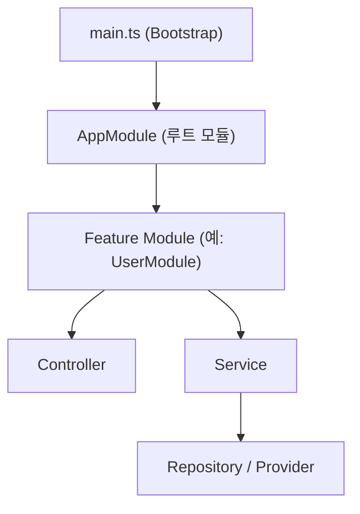

**version: NestJS v10.x / Node.js v20 LTS 기준**

#### 요약

NestJS는 **모듈화(Modular)** 와 **계층형 아키텍처(Controller–Service–Repository)** 를 기반으로 한다.  
각 기능 단위는 `Module`로 묶이며, 의존성과 설정을 명확히 관리하여 **확장성과 테스트 용이성**을 제공한다.

> NestJS의 철학은 **“구조적 일관성과 선언적 프로그래밍”**이다.  
> 개발자는 기능 중심 코드에 집중하고, 프레임워크가 의존성과 생명주기를 관리한다.

NestJS는 단순한 서버 프레임워크가 아닌 **구조적 아키텍처 프레임워크**이다.
모듈·DI·전역 정책을 중심으로 한 이 구조는 **유지보수성, 일관성, 확장성**을 극대화한다.

---

##### 참고자료
- [NestJS Architecture Overview](https://docs.nestjs.com/)
- [Modules and Dependency Graph](https://docs.nestjs.com/modules)

---

### 1. NestJS 계층 구조 개요



| 계층             | 역할            | 주요 파일                | 설명                          |
| -------------- | ------------- | -------------------- | --------------------------- |
| **Controller** | 요청 수신 및 응답 반환 | `user.controller.ts` | API 엔드포인트 정의                |
| **Service**    | 비즈니스 로직 수행    | `user.service.ts`    | 핵심 도메인 로직 처리                |
| **Repository** | 데이터 접근 계층     | `user.repository.ts` | ORM, Prisma, Query 처리       |
| **Module**     | 의존성 등록 및 묶음   | `user.module.ts`     | imports/providers/export 관리 |

---

### 2. 모듈 시스템 (Modular Architecture)

각 기능 단위(예: User, Auth, Product)는 독립적인 모듈로 구성되며
전역 루트(AppModule)에 연결된다.

```typescript
@Module({
  imports: [UserModule, AuthModule],
  controllers: [AppController],
  providers: [AppService],
})
export class AppModule {}
```

**장점**

* 코드 분리도 향상
* 단위 테스트 및 모듈 독립 배포 용이
* Feature 단위 의존성 명시적 관리

---

### 3. Controller–Service–Repository 계층 역할

| 계층             | 역할         | 설명                           |
| -------------- | ---------- | ---------------------------- |
| **Controller** | HTTP 요청 처리 | `@Get()`, `@Post()`로 라우팅 처리  |
| **Service**    | 도메인 로직 담당  | 비즈니스 규칙 수행 및 외부 모듈 호출        |
| **Repository** | 데이터 접근     | Prisma/TypeORM으로 DB 인터페이스 담당 |

**Controller 예시**

```typescript
@Controller('user')
export class UserController {
  constructor(private readonly userService: UserService) {}

  @Get()
  async findAll() {
    return this.userService.findAll();
  }
}
```

---

### 4. 전역 정책(Global Policy)

```typescript
app.useGlobalPipes(new ValidationPipe({ whitelist: true }));
app.useGlobalFilters(new AllExceptionsFilter());
app.useGlobalInterceptors(new LoggingInterceptor());
```

| 정책              | 역할         | 주요 기능                 |
| --------------- | ---------- | --------------------- |
| **Pipe**        | DTO 검증, 변환 | `ValidationPipe`      |
| **Filter**      | 예외 처리      | `HttpExceptionFilter` |
| **Interceptor** | 응답 포맷, 로깅  | `LoggingInterceptor`  |

---

### 5. 구조적 특징 요약

| 항목              | 설명                            |
| --------------- | ----------------------------- |
| **계층 구조**       | Controller–Service–Repository |
| **모듈 기반 구성**    | 기능 단위로 분리·독립                  |
| **전역 정책 시스템**   | 일관된 요청·응답·검증 구조               |
| **DI 및 스코프 관리** | 의존성은 자동 주입, 스코프 명시적 관리        |

---
