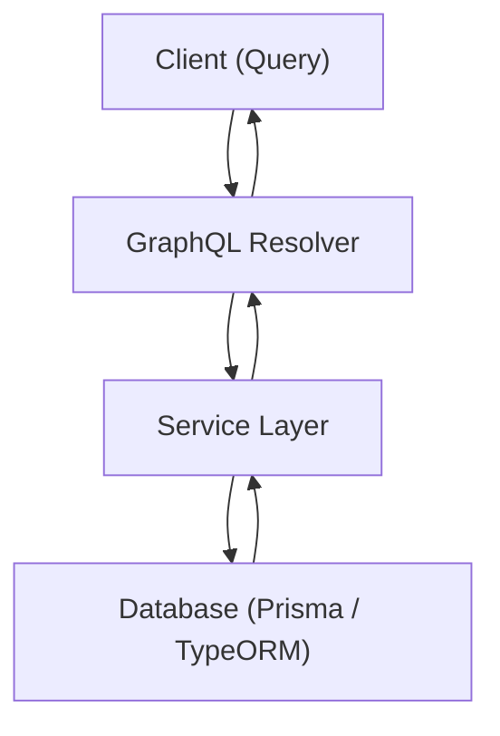

**version: NestJS v10.x / @nestjs/graphql v12.x / Node.js v20 LTS 기준**

---

#### 요약

GraphQL은 **클라이언트가 필요한 데이터만 선택적으로 요청할 수 있는 질의 언어(Query Language)** 이다.  
NestJS는 `@nestjs/graphql` 패키지를 통해 GraphQL 서버를 쉽게 구성할 수 있으며,  
**Schema-first** 또는 **Code-first** 접근을 모두 지원한다.  

**핵심 포인트**
- Schema-first vs Code-first 접근 방식 비교  
- Resolver / Mutation / Subscription 구조  
- GraphQLModule 설정  
- DTO / Decorator 기반 타입 관리  

GraphQL은 **명시적 스키마 기반 API 설계 방식**으로,
NestJS와 결합 시 타입 안전성과 유지보수성을 극대화할 수 있다.
Code-first 방식은 TypeScript 기반 팀 개발에 가장 효율적이다.

> *“GraphQL은 선언적 API의 완성형 — 클라이언트가 필요한 데이터만 가져간다.”*

---

##### 참고자료
- [GraphQL 공식 문서](https://graphql.org/learn/)
- [NestJS GraphQL 공식 문서](https://docs.nestjs.com/graphql/quick-start)
- [Apollo Server](https://www.apollographql.com/docs/apollo-server/)

---

#### 1. 개요 (Overview)



> GraphQL은 단일 Endpoint(`/graphql`)에서 Query, Mutation, Subscription을 모두 처리한다.

---

#### 2. 설치 및 기본 구성

```bash
pnpm add @nestjs/graphql @nestjs/apollo graphql apollo-server-express
```

`app.module.ts`

```ts
@Module({
  imports: [
    GraphQLModule.forRoot({
      autoSchemaFile: true, // Code-first 방식 (자동 생성)
      playground: true,
    }),
  ],
})
export class AppModule {}
```

---

#### 3. Schema-first vs Code-first 비교

| 구분     | Schema-first        | Code-first               |
| ------ | ------------------- | ------------------------ |
| 정의 방식  | `.graphql` 파일 직접 작성 | TypeScript Decorator 기반  |
| 스키마 관리 | 수동 관리               | 자동 생성 (`autoSchemaFile`) |
| 타입 안정성 | 중간 (스키마 기반)         | 높음 (TS 타입 기반)            |
| 유지보수   | 명시적                 | 코드와 일체화                  |
| 추천 상황  | 팀 간 명세 공유가 중요할 때    | TS 기반 프로젝트 (NestJS 표준)   |

---

#### 4. Code-first 예시

`user.model.ts`

```ts
@ObjectType()
export class User {
  @Field(() => Int) id: number;
  @Field() name: string;
}
```

`user.resolver.ts`

```ts
@Resolver(() => User)
export class UserResolver {
  constructor(private readonly userService: UserService) {}

  @Query(() => [User])
  users() {
    return this.userService.findAll();
  }

  @Mutation(() => User)
  createUser(@Args('name') name: string) {
    return this.userService.create({ name });
  }
}
```

---

#### 5. Schema-first 예시

`user.graphql`

```graphql
type User {
  id: Int!
  name: String!
}

type Query {
  users: [User!]!
}

type Mutation {
  createUser(name: String!): User!
}
```

`app.module.ts`

```ts
GraphQLModule.forRoot({
  typePaths: ['./**/*.graphql'],
});
```

---

#### 6. Resolver 구성 요소

| 타입             | 역할      | 예시                             |
| -------------- | ------- | ------------------------------ |
| `Query`        | 데이터 조회  | `@Query(() => [User])`         |
| `Mutation`     | 데이터 변경  | `@Mutation(() => User)`        |
| `Subscription` | 실시간 이벤트 | `@Subscription(() => Message)` |

---

#### 7. DTO와 타입 매핑

`create-user.input.ts`

```ts
@InputType()
export class CreateUserInput {
  @Field() name: string;
}
```

> `@InputType()`은 Mutation 입력용 DTO를 정의한다.

---

#### 8. 실행

```bash
pnpm start:dev
```

이후 `http://localhost:3000/graphql` 접속 시
Apollo Playground를 통해 Query / Mutation 실행 가능.

```graphql
query {
  users {
    id
    name
  }
}
```

---
