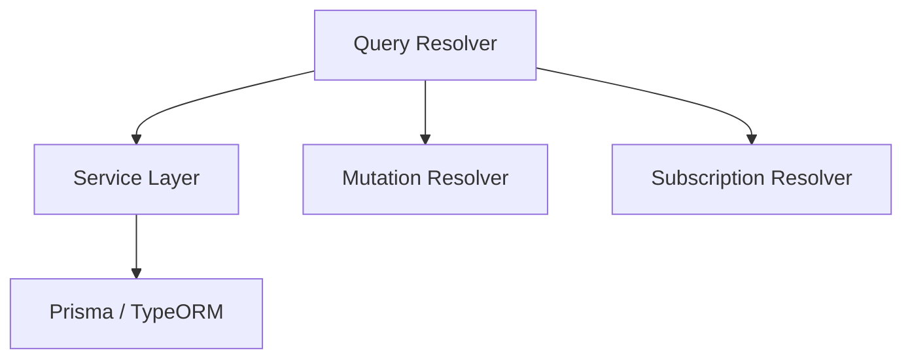

**version: NestJS v10.x / @nestjs/graphql v12.x / Apollo Server v4 기준**

---

#### 요약

이 문서는 NestJS GraphQL을 실무 환경에서 적용하기 위한 심화 가이드이다.  
**N+1 문제 해결, DataLoader 최적화, Federation 구조, Subscription 기반 실시간 처리**까지 다룬다.

**핵심 포인트**
- Resolver 계층 설계 전략
- DataLoader 기반 N+1 최적화
- GraphQL Federation / Gateway 구조
- Subscriptions 기반 실시간 데이터 처리
- Schema 버전 관리 및 CI 자동화

GraphQL은 단순 API 통신 이상의 **데이터 질의 언어**이다.
NestJS 환경에서는 Resolver 구조화, DataLoader 최적화, Federation 게이트웨이 도입을 통해
**고성능·대규모 분산 GraphQL 플랫폼**을 구현할 수 있다.

> *“GraphQL은 데이터의 계약서이며, NestJS는 그 계약을 시스템으로 만든다.”*

---

##### 참고자료
- [Apollo Federation Docs](https://www.apollographql.com/docs/federation/)
- [DataLoader by Facebook](https://github.com/graphql/dataloader)
- [NestJS GraphQL Subscriptions](https://docs.nestjs.com/graphql/subscriptions)

---

#### 1. Resolver 계층 분리 전략



**전략 요약**

* Query / Mutation / Subscription 별로 파일 분리
* Resolver는 반드시 Service 의존성만 가짐 (Repository 접근 금지)
* DTO(`@InputType`)와 모델(`@ObjectType`)을 명확히 구분

---

#### 2. DataLoader로 N+1 문제 해결

**문제 예시**

```ts
@ResolveField(() => [Post])
posts(@Parent() user: User) {
  return this.postService.findByUserId(user.id); // N+1 발생
}
```

**해결 코드**

```ts
@Injectable()
export class UserLoader {
  constructor(private readonly postService: PostService) {}
  readonly batchPosts = new DataLoader(async (userIds: number[]) => {
    const posts = await this.postService.findByUserIds(userIds);
    return userIds.map(id => posts.filter(p => p.userId === id));
  });
}
```

`user.resolver.ts`

```ts
@ResolveField(() => [Post])
async posts(@Parent() user: User, @Loader(UserLoader) loader: UserLoader) {
  return loader.batchPosts.load(user.id);
}
```

---

#### 3. Subscriptions (실시간 데이터)

```ts
@Subscription(() => Message, {
  filter: (payload, variables) => payload.roomId === variables.roomId,
})
messageAdded(@Args('roomId') roomId: string) {
  return pubSub.asyncIterator('messageAdded');
}

@Mutation(() => Message)
async addMessage(@Args('input') input: MessageInput) {
  const message = await this.messageService.create(input);
  pubSub.publish('messageAdded', { messageAdded: message });
  return message;
}
```

> PubSub 기반 메시지 브로커로 실시간 데이터 송수신 가능.

---

#### 4. Federation (다중 서비스 GraphQL 통합)

**서비스별 구성**

* `user-service`: 사용자 관련 스키마
* `post-service`: 게시글 관련 스키마
* `gateway-service`: Apollo Federation Gateway

`gateway.module.ts`

```ts
GraphQLModule.forRoot<ApolloGatewayDriverConfig>({
  driver: ApolloGatewayDriver,
  server: { cors: true },
  gateway: {
    serviceList: [
      { name: 'users', url: 'http://localhost:3001/graphql' },
      { name: 'posts', url: 'http://localhost:3002/graphql' },
    ],
  },
});
```

> Federation은 MSA 구조에서 GraphQL을 통합 API Gateway로 활용할 수 있게 한다.

---

#### 5. CI/CD 및 Schema 버전 관리

* `schema.gql` 자동 생성 → Git 저장
* 배포 전 스키마 변경 감지 및 테스트
* Apollo Rover CLI로 Federation 스키마 병합

```bash
rover subgraph publish service@current \
  --name users \
  --schema ./src/schema.gql \
  --routing-url http://localhost:3001/graphql
```

---

#### 6. 보안 및 에러 처리

| 항목         | 전략                                    |
| ---------- | ------------------------------------- |
| 요청 제한      | Apollo Server Plugin으로 Query Depth 제한 |
| Validation | GraphQL Scalars + ClassValidator      |
| 에러 핸들링     | `formatError` 커스터마이징                  |
| 인증 처리      | `@UseGuards(GqlAuthGuard)`            |

---

#### 7. 성능 및 운영 팁

| 항목         | 전략                                         |
| ---------- | ------------------------------------------ |
| 캐싱         | Apollo Cache / Redis Cache Integration     |
| Logging    | `formatResponse` 후킹                        |
| Metrics    | Prometheus Exporter로 Query 시간 측정           |
| Gateway 확장 | Apollo Federation Gateway Horizontal Scale |

---

