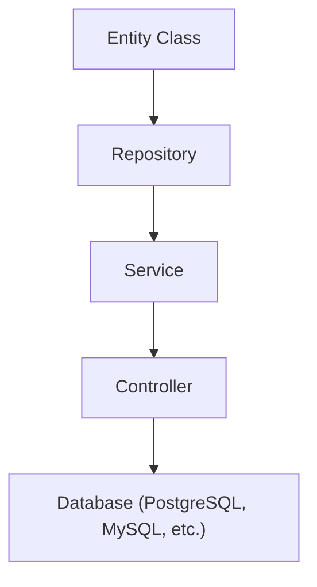

**version: NestJS v10.x / TypeORM v0.3.x / Node.js v20 LTS 기준**

---

#### 요약

TypeORM은 **Entity-first** 기반의 객체 관계 매핑(ORM) 라이브러리로,  
엔티티 클래스와 데코레이터를 사용하여 관계형 데이터베이스 구조를 정의한다.  
NestJS에서는 `@nestjs/typeorm` 모듈을 통해 통합하며, **Repository 주입, 트랜잭션 제어, 마이그레이션 관리**를 지원한다.

**핵심 포인트**
- Entity 기반 스키마 설계
- Repository / QueryBuilder 통한 세밀한 제어
- Transaction / Migration 관리
- Lazy / Eager 관계 로딩

TypeORM은 **정교한 관계형 모델링과 쿼리 제어**가 필요한 환경에 적합하다.
NestJS와 결합 시 `Repository` 기반 계층 구조를 통해
엔터프라이즈 수준의 데이터 제어력을 확보할 수 있다.

> *“Prisma가 선언이라면, TypeORM은 제어다.”*

##### 장점 및 한계

| 항목     | TypeORM            | 설명                         |
| ------ | ------------------ | -------------------------- |
| 복잡 쿼리  | ✅ 강력한 QueryBuilder | 조건, join, groupby 지원       |
| 관계 매핑  | ✅ 풍부한 Relation 옵션  | OneToMany, ManyToOne, etc. |
| 타입 안정성 | ⚪ 중간 수준            | Decorator 기반               |
| 성능     | ⚪ 보통               | 쿼리 오버헤드 가능                 |
| 생산성    | ⚪ 중간               | 수동 마이그레이션 필요               |


##### 참고자료
- [TypeORM 공식 문서](https://typeorm.io/)
- [NestJS TypeORM 가이드](https://docs.nestjs.com/techniques/database)

---

#### 1. 개요 (Overview)



> TypeORM은 Entity 클래스 정의를 기반으로 데이터베이스 스키마를 자동 생성하고 관리한다.

---

#### 2. 설치 및 기본 설정

```bash
pnpm add typeorm @nestjs/typeorm pg
```

`app.module.ts`

```ts
@Module({
  imports: [
    TypeOrmModule.forRoot({
      type: 'postgres',
      host: 'localhost',
      port: 5432,
      username: 'user',
      password: 'pw',
      database: 'mydb',
      autoLoadEntities: true,
      synchronize: false, // 운영환경에서는 절대 true 금지
      logging: ['error'],
    }),
  ],
})
export class AppModule {}
```

---

#### 3. 엔티티(Entity) 정의

`user.entity.ts`

```ts
import { Entity, PrimaryGeneratedColumn, Column, OneToMany } from 'typeorm';
import { Post } from './post.entity';

@Entity()
export class User {
  @PrimaryGeneratedColumn() id: number;

  @Column({ length: 50 })
  name: string;

  @OneToMany(() => Post, (post) => post.user)
  posts: Post[];
}
```

`post.entity.ts`

```ts
import { Entity, PrimaryGeneratedColumn, Column, ManyToOne } from 'typeorm';
import { User } from './user.entity';

@Entity()
export class Post {
  @PrimaryGeneratedColumn() id: number;

  @Column() title: string;

  @ManyToOne(() => User, (user) => user.posts)
  user: User;
}
```

---

#### 4. Repository 주입 및 서비스 구조

`user.module.ts`

```ts
@Module({
  imports: [TypeOrmModule.forFeature([User, Post])],
  providers: [UserService],
  controllers: [UserController],
})
export class UserModule {}
```

`user.service.ts`

```ts
@Injectable()
export class UserService {
  constructor(
    @InjectRepository(User) private readonly userRepo: Repository<User>,
  ) {}

  findAll() {
    return this.userRepo.find({ relations: { posts: true } });
  }

  create(dto: { name: string }) {
    return this.userRepo.save(dto);
  }
}
```

---

#### 5. 마이그레이션 관리

명령어:

```bash
pnpx typeorm migration:generate -d src/migrations -n init
pnpx typeorm migration:run
```

운영 원칙:

* `synchronize: false` 필수
* 마이그레이션 파일을 Git으로 관리
* CI/CD 단계에서 자동 실행

---

#### 6. 관계 및 로딩 전략

| 전략           | 설명                | 예시                                     |
| ------------ | ----------------- | -------------------------------------- |
| **Eager**    | 자동 로드             | `@ManyToOne(..., { eager: true })`     |
| **Lazy**     | 필요 시 로드 (Promise) | `user.posts.then(...)`                 |
| **Explicit** | 명시적 로드            | `find({ relations: { posts: true } })` |

---

