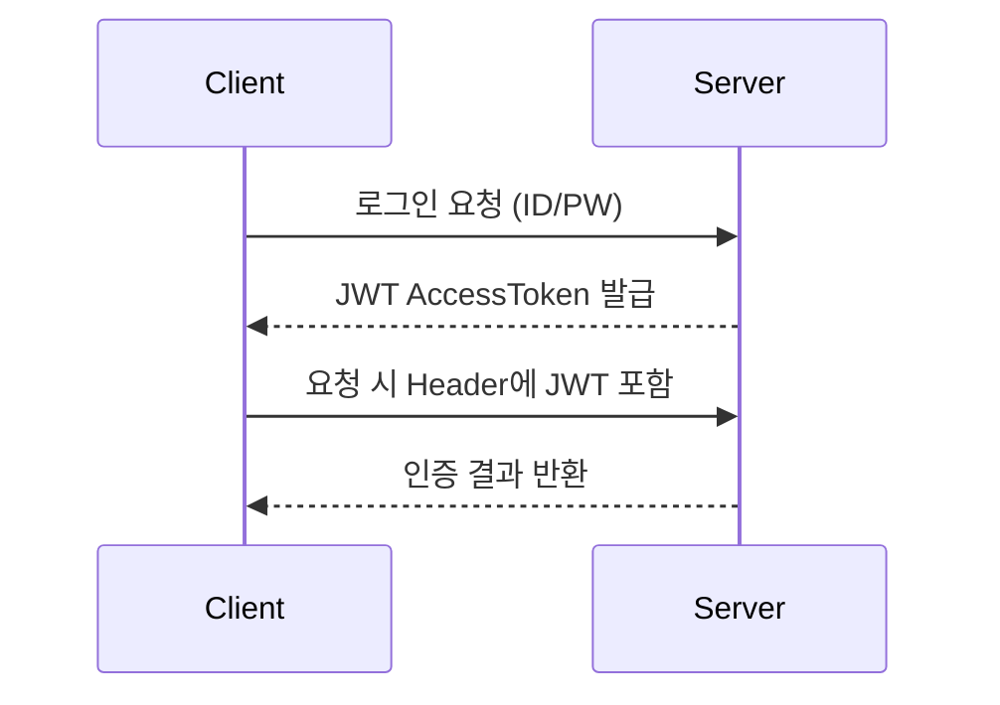

**version: NestJS v10.x / Passport v0.7.x / JWT v9.x 기준**


#### 요약

인증(Authentication)은 사용자의 **신원을 확인**하는 절차이다.  
NestJS는 Passport 모듈과 Strategy 기반 구조를 통해  
**JWT, OAuth2, Session** 등 다양한 인증 방식을 손쉽게 통합할 수 있다.

JWT는 **무상태(Stateless)** 인증, OAuth2는 **위임(Delegated)** 인증,
Session은 **상태 기반(Stateful)** 인증이다.
NestJS는 세 가지를 동시에 구성할 수 있는 유연한 구조를 제공한다.

> *“인증은 신원을 증명하는 일, 인가는 권한을 부여하는 일이다.”*

---

##### 참고자료
- [NestJS 공식 인증 문서](https://docs.nestjs.com/security/authentication)
- [Passport.js Docs](http://www.passportjs.org/)
- [JWT RFC 7519](https://www.rfc-editor.org/rfc/rfc7519)

---

#### 1. 인증 방식 개요

| 방식 | 설명 | 특징 |
|------|------|------|
| **JWT** | 토큰 기반 인증 | Stateless, 클라이언트 저장 |
| **OAuth2** | 외부 인증 서버 기반 | Google, GitHub 등 연동 |
| **Session** | 서버 세션 관리 기반 | Stateful, 전통적 로그인 구조 |

---

#### 2. JWT 인증 구조



#### 예시 코드

`auth.module.ts`

```ts
@Module({
  imports: [
    JwtModule.register({
      secret: process.env.JWT_SECRET,
      signOptions: { expiresIn: '1h' },
    }),
  ],
  providers: [AuthService, JwtStrategy],
})
export class AuthModule {}
```

`jwt.strategy.ts`

```ts
@Injectable()
export class JwtStrategy extends PassportStrategy(Strategy) {
  constructor() {
    super({
      jwtFromRequest: ExtractJwt.fromAuthHeaderAsBearerToken(),
      secretOrKey: process.env.JWT_SECRET,
    });
  }
  validate(payload: any) {
    return { userId: payload.sub, username: payload.username };
  }
}
```

---

#### 3. OAuth2 인증 구조

```bash
pnpm add @nestjs/passport passport passport-google-oauth20
```

`google.strategy.ts`

```ts
@Injectable()
export class GoogleStrategy extends PassportStrategy(GoogleStrategy, 'google') {
  constructor() {
    super({
      clientID: process.env.GOOGLE_CLIENT_ID,
      clientSecret: process.env.GOOGLE_SECRET,
      callbackURL: '/auth/google/callback',
      scope: ['email', 'profile'],
    });
  }

  async validate(_: string, __: string, profile: any) {
    return { email: profile.emails[0].value, name: profile.displayName };
  }
}
```

> 외부 OAuth2 제공자(Google, GitHub, Kakao 등)를 통한 소셜 로그인 구조.

---


