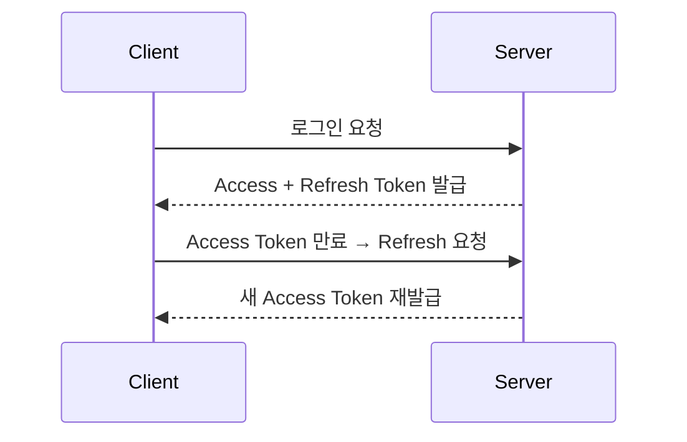

**version: NestJS v10.x / Passport v0.7.x / JWT v9.x 기준**

#### 요약

이 문서는 JWT 인증의 **갱신(Refresh), 회전(Rotation), 멀티로그인 관리**를 다룬다.  
실무 환경에서 토큰 만료, 재사용 공격, 동시 세션 제한 등을 해결하기 위한 전략이다.

Refresh / Rotation / Multi-login 구조를 통해
토큰 기반 인증 시스템의 **안정성, 확장성, 보안성**을 확보할 수 있다.

> *“JWT는 단순하지만, 운용은 전략이다.”*
---

##### 참고자료
- [OAuth2 Refresh Token RFC 6749](https://www.rfc-editor.org/rfc/rfc6749)
- [JWT Rotation Security Best Practices](https://auth0.com/docs/secure/tokens/refresh-tokens/refresh-token-rotation)

---

#### 1. Refresh Token 구조



#### 예시 코드

`auth.service.ts`

```ts
async refresh(refreshToken: string) {
  const payload = this.jwtService.verify(refreshToken, { secret: process.env.REFRESH_SECRET });
  const accessToken = this.jwtService.sign({ sub: payload.sub }, { expiresIn: '1h' });
  return { accessToken };
}
```

---

#### 2. Token Rotation (회전 토큰)

* 매 Refresh 요청 시 새 Refresh Token 발급
* 기존 Token은 즉시 폐기
* DB나 Redis에 Refresh Token 블랙리스트 관리

```ts
await this.tokenRepo.update({ userId }, { refreshToken: newToken })
```

---

#### 3. Multi-login 관리 (기기별 세션)

| 항목    | 설명                            |
| ----- | ----------------------------- |
| 사용자 A | 동시에 로그인 가능                    |
| 정책    | 기기당 1개 세션 제한                  |
| 구현    | Redis에 `userId → deviceId` 매핑 |

```ts
await redis.set(`session:${userId}`, deviceId);
```

---

#### 4. 보안 강화 전략

| 항목               | 권장 설정                  |
| ---------------- | ---------------------- |
| Token Expiration | Access 1h / Refresh 7d |
| Secret 관리        | .env or Vault          |
| HTTPS            | 필수                     |
| Rotation         | 모든 Refresh 마다 갱신       |

---
