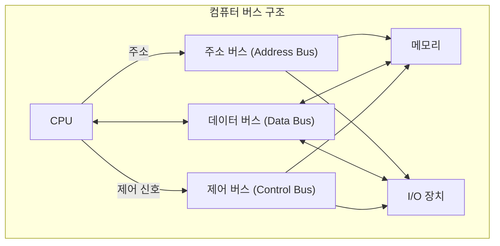
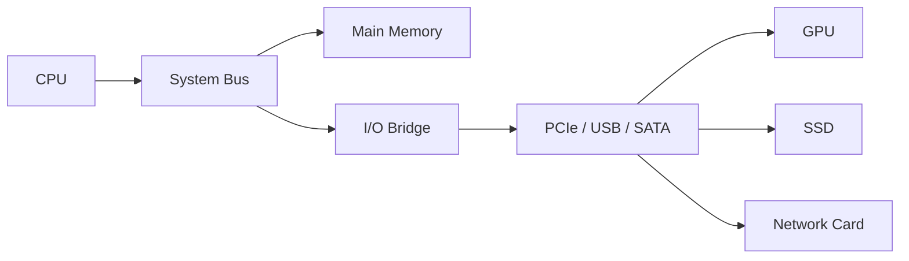
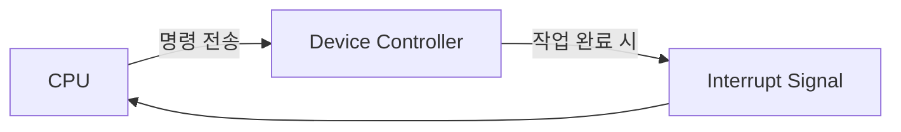
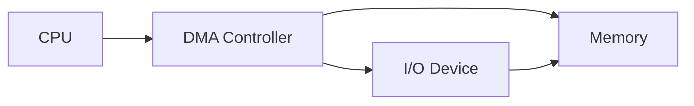
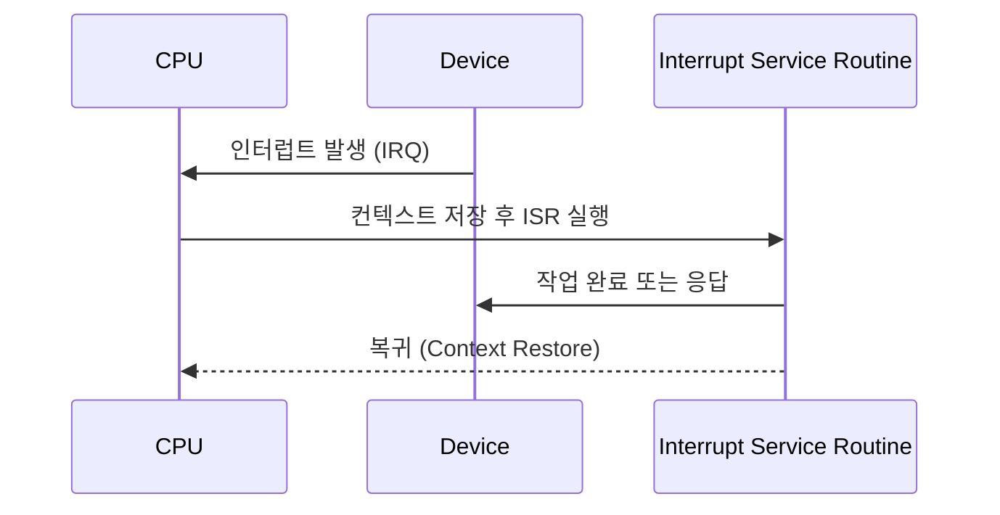

(버스 구조, I/O 장치, 인터럽트 처리 흐름) 
CPU, 메모리, I/O 장치 간 데이터 이동 흐름, 버스 구조(주소·데이터·제어),
I/O 방식 (Polling, Interrupt, DMA)

#### 정리

* 버스는 CPU, 메모리, I/O 장치를 연결하는 데이터 통로이다.
* 주소 버스, 데이터 버스, 제어 버스로 나뉘며 각각의 역할이 다르다.
* I/O 장치는 Programmed I/O, Interrupt, DMA 방식으로 데이터를 주고받는다.
* 현대 시스템은 PCIe, NVMe, RDMA 등의 고속 I/O 기술을 통해 병렬성과 효율성을 극대화한다.

---
##### 참고 자료

* [CS50 Lecture – Hardware, Bus & I/O](https://cs50.harvard.edu/x/2024/notes/3/)
* [GeeksforGeeks – Bus Structure and Types of I/O](https://www.geeksforgeeks.org/types-of-buses-in-computer-architecture/)
* [Wikipedia – Direct Memory Access (DMA)](https://en.wikipedia.org/wiki/Direct_memory_access)


#  버스와 입출력 장치 (Bus & I/O System)

## 1️ 개요
컴퓨터 내부에서는 CPU, 메모리, 주변장치가 서로 데이터를 주고받는다.  
이때 각 부품을 연결하는 통신 통로를 **버스(Bus)** 라고 하며,  
입출력 장치(I/O Device)는 이 버스를 통해 CPU와 데이터를 교환한다.  
버스 구조와 입출력 방식은 시스템의 성능과 확장성에 직접적인 영향을 준다.

---

## 2️ 버스의 기본 개념

버스는 여러 장치를 하나의 공통 회선으로 연결하여 데이터와 제어 신호를 전달한다.  
버스는 크게 **주소 버스(Address Bus)**, **데이터 버스(Data Bus)**,  
**제어 버스(Control Bus)** 로 나뉜다.



| 버스 종류                   | 역할                          | 방향             |
| ----------------------- | --------------------------- | -------------- |
| **주소 버스 (Address Bus)** | CPU가 접근할 메모리나 장치의 주소를 지정    | 단방향 (CPU → 장치) |
| **데이터 버스 (Data Bus)**   | 실제 데이터 전송 경로                | 양방향            |
| **제어 버스 (Control Bus)** | 읽기/쓰기 신호, 인터럽트, 클럭 등 제어용 신호 | 양방향            |

---

## 3️ 버스의 종류와 연결 구조

현대 컴퓨터에서는 다양한 버스가 조합되어 사용된다.

| 구분                       | 설명                 | 예시                         |
| ------------------------ | ------------------ | -------------------------- |
| **시스템 버스(System Bus)**   | CPU와 메모리를 직접 연결    | 내부 시스템 버스                  |
| **I/O 버스**               | 주변장치와 연결, 상대적으로 느림 | PCIe, USB, SATA            |
| **백플레인 버스(Backplane)**   | 여러 보드를 연결하는 고속 통신선 | 서버, 라우터                    |
| **전용 버스(Dedicated Bus)** | 특정 장치 전용 연결        | GPU Direct Memory Access 등 |



---

## 4️ 입출력 장치의 역할

입출력 장치(I/O Device)는 CPU가 외부와 상호작용할 수 있게 하는 인터페이스이다.
예를 들어, 키보드와 마우스는 입력(Input) 장치이고, 모니터와 프린터는 출력(Output) 장치이다.
디스크나 네트워크 어댑터는 양방향 입출력을 모두 수행한다.

각 I/O 장치는 자체 **디바이스 컨트롤러(Device Controller)** 를 가지고 있으며,
이 컨트롤러가 CPU의 명령을 해석하고 데이터 전송을 관리한다.

---

## 5️ 입출력 방식의 종류

입출력 장치는 CPU와 데이터를 교환하기 위해 여러 방식으로 동작한다.

### 1) 프로그램 제어 입출력 (Programmed I/O)

CPU가 장치 상태를 직접 확인하고 제어하는 방식이다.
CPU가 바쁘게 기다려야 하므로 효율이 낮다.

```mermaid
flowchart LR
    CPU --> IO["I/O Device"]
    IO --> CPU
    note right of CPU: 상태 확인 (Polling)
```

### 2) 인터럽트 기반 입출력 (Interrupt-Driven I/O)

입출력 작업이 완료되면 장치가 **인터럽트(Interrupt)** 신호를 보내 CPU에 알린다.
CPU는 대기하지 않고 다른 작업을 수행할 수 있다.



### 3) DMA(Direct Memory Access)

DMA는 입출력 장치가 CPU의 개입 없이 메모리와 직접 데이터를 주고받는 방식이다.
대용량 전송 시 효율적이며, CPU는 다른 연산을 병행할 수 있다.



| 방식                 | CPU 개입 | 효율성   | 특징                |
| ------------------ | ------ | ----- | ----------------- |
| **Programmed I/O** | 많음     | 낮음    | CPU가 장치 상태를 직접 확인 |
| **Interrupt I/O**  | 중간     | 보통    | 인터럽트 발생 시만 개입     |
| **DMA I/O**        | 거의 없음  | 매우 높음 | CPU와 병렬 전송 가능     |

---

## 6️ 인터럽트 처리 과정

인터럽트는 장치나 프로그램이 CPU의 주의를 끌기 위해 발생시키는 신호이다.
CPU는 현재 작업을 일시 중단하고, 인터럽트 서비스 루틴(ISR)을 실행한다.



이 과정을 통해 CPU는 여러 장치의 요청을 효율적으로 처리할 수 있다.

---

## 7️ 현대 I/O 구조의 발전

현대 시스템에서는 버스와 I/O 구조가 고성능으로 발전했다.

* **PCI Express (PCIe)**: 고속 직렬 버스, GPU·SSD 등과 직접 연결
* **NVMe (Non-Volatile Memory Express)**: SSD 전용 프로토콜로 지연시간 단축
* **USB 4.0 / Thunderbolt 4**: 범용 고속 외부 연결 표준
* **RDMA (Remote Direct Memory Access)**: 네트워크를 통해 메모리 직접 접근 가능

이러한 기술은 CPU와 I/O 간 병목현상을 줄이고, 데이터 병렬 처리를 지원한다.

---
