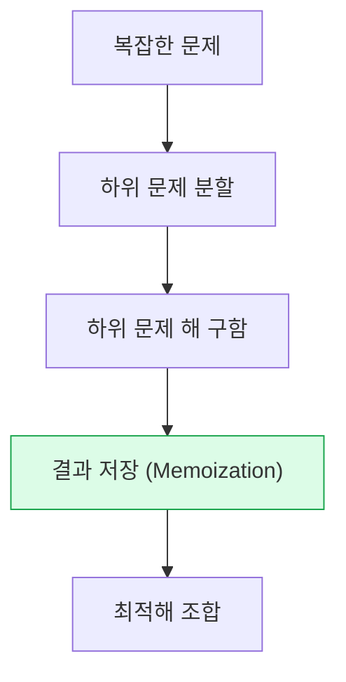
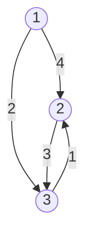

동적 계획법 (Dynamic Programming)
(DP, 메모이제이션, 분할 정복 비교)도  

## 정리 요약
동적 계획법(Dynamic Programming, DP)은 **복잡한 문제를 작은 하위 문제(Subproblem)** 로 나누어 해결한 뒤,  
그 결과를 **저장(Memoization)** 하여 중복 계산을 피하는 알고리즘 설계 기법이다.  
이는 **분할 정복(Divide & Conquer)** 의 확장 개념으로, 최적화 문제(Optimal Problem)에서 주로 사용된다.  
대표적인 예로 **피보나치 수열**, **배낭 문제(Knapsack)**, **최단 경로(Floyd-Warshall)** 등이 있다.

* DP는 알고리즘 문제 풀이뿐만 아니라 **네트워크 최적화**, **자원 스케줄링**, **AI 상태 전이 모델** 등에서도 활용된다.
* 캐시나 메모리 구조를 직접 활용하는 **Memoization** 은 AI/LLM 추론 캐시, 컴파일러 최적화에도 응용된다.
* 실제 프로그래밍 대회에서는 DP 문제의 **점화식 설계 능력**이 핵심이다.
* 메모이제이션과 반복적 접근을 적절히 조합해 성능을 향상시킬 수 있다.


#####  DP와 분할 정복의 차이

| 비교 항목    | 동적 계획법 (DP)       | 분할 정복 (Divide & Conquer) |
| :------- | :---------------- | :----------------------- |
| 하위 문제 중복 | 존재 (중복 계산 방지 필요)  | 없음                       |
| 해결 방식    | 하위 결과를 저장 후 재활용   | 독립적 문제로 나누어 개별 해결        |
| 대표 예시    | 피보나치, 배낭 문제, 플로이드 | 병합 정렬, 퀵 정렬, 이진 탐색       |
| 중점       | 최적화, 최소/최대값 계산    | 분할과 병합을 통한 전체 해결         |

##### 최적화 문제 유형

| 유형                    | 대표 문제             | 설명             |
| :-------------------- | :---------------- | :------------- |
| **최대화(Maximization)** | 배낭 문제, 경로 탐색      | 가능한 해 중 최대값 탐색 |
| **최소화(Minimization)** | 최소 비용 경로, 행렬 곱 최소 | 가능한 해 중 최소값 탐색 |
| **조합 최적화**            | 연속 합, 경로, 스케줄링    | 조합 중 최적의 해를 선택 |


---

## 1. DP의 핵심 개념

| 개념 | 설명 |
|:--|:--|
| **중복 부분 문제 (Overlapping Subproblems)** | 동일한 하위 문제가 반복되어 등장 |
| **최적 부분 구조 (Optimal Substructure)** | 문제의 최적해가 하위 문제의 최적해로부터 구성됨 |
| **메모이제이션 (Memoization)** | 하위 문제의 결과를 저장하여 재사용 |
| **탑다운(Top-Down)** | 재귀 기반, 메모이제이션 활용 |
| **보텀업(Bottom-Up)** | 반복 기반, 테이블(DP Table)로 누적 계산 |

---

## 2. 피보나치 수열 예시

### (1) 재귀적 접근 (비효율적)

```python
def fib_recursive(n):
    if n <= 1:
        return n
    return fib_recursive(n-1) + fib_recursive(n-2)
```

* **시간 복잡도:** O(2ⁿ)
* 동일한 하위 문제(`fib(3)`, `fib(2)` 등)가 여러 번 반복 계산됨

---

### (2) 메모이제이션(Top-Down DP)

```python
memo = {0: 0, 1: 1}
def fib_memo(n):
    if n not in memo:
        memo[n] = fib_memo(n-1) + fib_memo(n-2)
    return memo[n]
```

* **시간 복잡도:** O(n)
* **공간 복잡도:** O(n)
* 중복 호출 방지, 재귀 기반 구조 유지

---

### (3) 보텀업 접근(Bottom-Up DP)

```python
def fib_bottom_up(n):
    dp = [0, 1]
    for i in range(2, n + 1):
        dp.append(dp[i-1] + dp[i-2])
    return dp[n]
```

* **시간 복잡도:** O(n)
* **공간 복잡도:** O(n) (또는 상수 공간 최적화 가능)
* 반복문 기반으로 효율적 실행

---

## 3. DP 설계 과정 (5단계)

1. **문제를 하위 문제로 분할**

   * 큰 문제를 작은 문제로 나눈다.
2. **점화식(Recurrence Relation) 정의**

   * 예: `dp[i] = dp[i-1] + dp[i-2]`
3. **계산 순서 결정 (Top-Down / Bottom-Up)**
4. **메모이제이션 or 테이블 초기화**
5. **최종 결과 도출**

<div style="text-align:center;">



</div>

---

## 4. 예제: 0/1 배낭 문제 (Knapsack Problem)

**문제 정의**

* 무게 제한 `W` 가 있는 배낭에
  여러 물건의 **가치(value)** 와 **무게(weight)** 가 주어졌을 때,
  가치의 합이 최대가 되도록 선택하는 문제.

**점화식**

```
dp[i][w] = max(dp[i-1][w], value[i] + dp[i-1][w - weight[i]])  
(단, weight[i] <= w)
```

```python
def knapsack(weights, values, W):
    n = len(values)
    dp = [[0]*(W+1) for _ in range(n+1)]

    for i in range(1, n+1):
        for w in range(1, W+1):
            if weights[i-1] <= w:
                dp[i][w] = max(dp[i-1][w],
                               values[i-1] + dp[i-1][w-weights[i-1]])
            else:
                dp[i][w] = dp[i-1][w]
    return dp[n][W]
```

| 구분     | 설명                   |
| :----- | :------------------- |
| 시간 복잡도 | O(nW)                |
| 공간 복잡도 | O(nW)                |
| 특징     | 선택 문제(최적화), DP 대표 예제 |

---

## 5. 예제: 최단 경로 (Floyd–Warshall Algorithm)

모든 정점 쌍 간의 최단 거리를 구하는 DP 기반 알고리즘이다.
(다익스트라와 달리 모든 정점 조합을 고려)

```python
INF = float('inf')

def floyd_warshall(graph):
    n = len(graph)
    dist = [row[:] for row in graph]

    for k in range(n):
        for i in range(n):
            for j in range(n):
                if dist[i][j] > dist[i][k] + dist[k][j]:
                    dist[i][j] = dist[i][k] + dist[k][j]
    return dist
```

| 구분     | 설명                                  |
| :----- | :---------------------------------- |
| 시간 복잡도 | O(n³)                               |
| 공간 복잡도 | O(n²)                               |
| 특징     | 모든 쌍 최단 경로(ALL-PAIR SHORTEST PATHS) |
| 활용     | 네트워크 최적화, 교통 경로, 의존성 비용 계산          |


<div style="text-align:center;">



</div>
---


