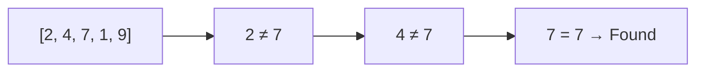
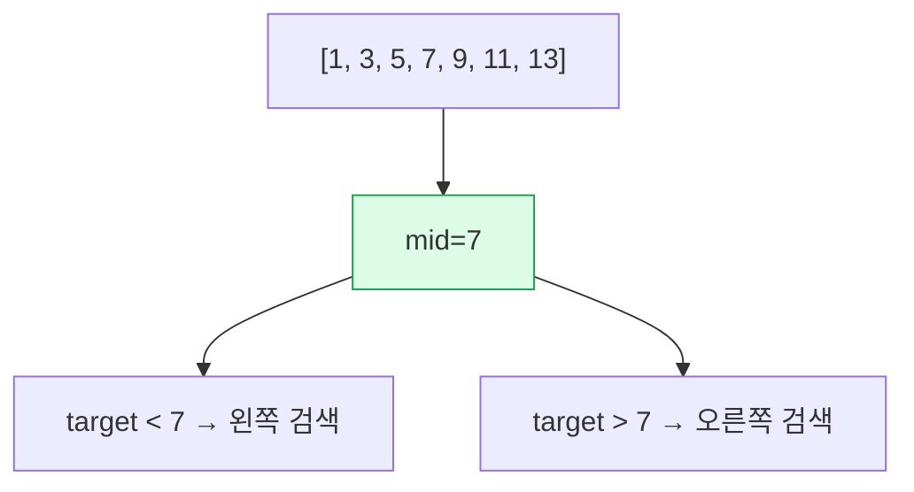
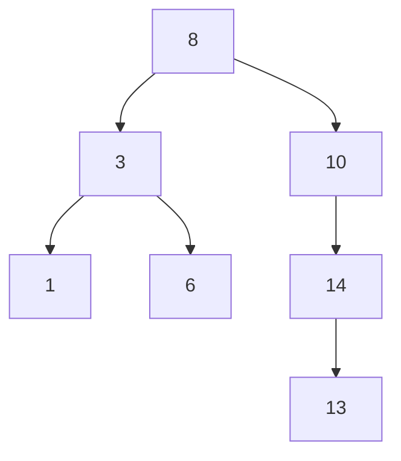

그래프 알고리즘 (Graph Algorithms)
(DFS, BFS, 다익스트라, 위상정렬 등)도  


## 정리 요약

탐색(Searching)은 **데이터 집합 내에서 특정 값을 찾는 과정**을 의미한다.  
탐색 알고리즘은 정렬된 여부, 데이터 구조(배열, 트리, 그래프 등)에 따라 다르게 적용되며,  
프로그램 성능에 직접적인 영향을 미치는 핵심 알고리즘이다.  

이 문서에서는 **선형 탐색(Linear Search)** 과 **이진 탐색(Binary Search)** 을 중심으로  
탐색의 기본 원리, 시간 복잡도, 확장 구조(해시 탐색, 트리 탐색)까지 설명한다.

* 정렬된 배열에서는 **이진 탐색**,
  정렬되지 않은 해시 기반 구조에서는 **해시 탐색**이 일반적이다.
* 데이터베이스 인덱스, 파일시스템, 컴파일러 심볼 테이블 등은
  대부분 트리 또는 해시 기반 탐색으로 구현된다.
* 검색 엔진, 로그 시스템 등 대규모 데이터 환경에서는
  **B+Tree**, **LSM-Tree**, **Trie** 구조로 확장된다.
* Python의 `in`, Java의 `HashMap.containsKey()`, C++의 `set.find()` 등
  언어 수준에서 이미 최적화된 탐색 알고리즘을 제공한다.


| 알고리즘  | 정렬 필요 | 평균 시간 복잡도 | 공간 복잡도 | 특징                 |
| :---- | :---- | :-------- | :----- | :----------------- |
| 선형 탐색 | X     | O(n)      | O(1)   | 단순, 정렬 불필요         |
| 이진 탐색 | O     | O(log n)  | O(1)   | 정렬 필요, 빠름          |
| 해시 탐색 | X     | O(1)      | O(n)   | 매우 빠름, 충돌 관리 필요    |
| 트리 탐색 | O     | O(log n)  | O(n)   | 삽입·삭제 유리, 균형 유지 중요 |

## 참고 자료
* [Wikipedia – Sorting Algorithm](https://en.wikipedia.org/wiki/Sorting_algorithm)
* [Python Timsort Documentation](https://bugs.python.org/file4451/timsort.txt)

---

## 1. 탐색 알고리즘의 분류

| 분류 | 예시 | 특징 |
|:--|:--|:--|
| **순차 탐색 (Sequential)** | 선형 탐색 | 정렬 불필요, 단순 비교 기반 |
| **이분 탐색 (Divide & Conquer)** | 이진 탐색 | 정렬 필요, O(log n) 시간 |
| **해시 탐색 (Hash Search)** | 해시 테이블 | 평균 O(1), 충돌 관리 필요 |
| **트리 탐색 (Tree Search)** | BST, AVL, Red-Black Tree | 구조 기반 탐색 |
| **그래프 탐색 (Graph Search)** | DFS, BFS | 경로 기반 탐색 |

---

## 2. 선형 탐색 (Linear Search)

정렬되지 않은 배열에서도 사용할 수 있는 가장 단순한 탐색 알고리즘이다.  
배열의 처음부터 끝까지 순차적으로 비교하여 원하는 값을 찾는다.

```python
def linear_search(arr, target):
    for i in range(len(arr)):
        if arr[i] == target:
            return i
    return -1
```

| 구분       | 설명                       |
| :------- | :----------------------- |
| 시간 복잡도   | O(n)                     |
| 공간 복잡도   | O(1)                     |
| 정렬 필요 여부 | 불필요                      |
| 특징       | 구현이 간단하지만 대용량 데이터에는 비효율적 |

<div style="text-align:center;">


</div>

> 모든 요소를 순차적으로 확인하므로, 최악의 경우 전체를 탐색해야 한다.

---

## 3. 이진 탐색 (Binary Search)

데이터가 **정렬되어 있는 경우**에만 사용할 수 있는 효율적인 탐색 알고리즘이다.
중앙값을 기준으로 탐색 범위를 절반씩 줄여가며 값을 찾는다.

```python
def binary_search(arr, target):
    low, high = 0, len(arr) - 1
    while low <= high:
        mid = (low + high) // 2
        if arr[mid] == target:
            return mid
        elif arr[mid] < target:
            low = mid + 1
        else:
            high = mid - 1
    return -1
```

| 구분       | 설명                         |
| :------- | :------------------------- |
| 시간 복잡도   | O(log n)                   |
| 공간 복잡도   | O(1) (반복형), O(log n) (재귀형) |
| 정렬 필요 여부 | 필수                         |
| 특징       | 대용량 데이터 탐색에 매우 효율적         |

<div style="text-align:center;">


</div>

> 이진 탐색은 정렬 상태를 유지해야 하므로, 데이터 삽입·삭제가 빈번한 경우에는 부적합하다.

---

## 4. 재귀적 이진 탐색 (Recursive Binary Search)

이진 탐색은 재귀 형태로도 구현할 수 있으며,
코드 구조가 간결해지지만 함수 호출 스택을 사용한다.

```python
def binary_search_recursive(arr, target, low, high):
    if low > high:
        return -1
    mid = (low + high) // 2
    if arr[mid] == target:
        return mid
    elif arr[mid] < target:
        return binary_search_recursive(arr, target, mid + 1, high)
    else:
        return binary_search_recursive(arr, target, low, mid - 1)
```

---

## 5. 해시 탐색 (Hash Search)

**Hash Table** 을 사용하여 평균적으로 O(1)에 가까운 속도로 탐색할 수 있다.
키(key)를 해시 함수(Hash Function)에 넣어 인덱스를 계산하고,
그 위치에서 데이터를 찾는다.

| 항목     | 설명                                     |
| :----- | :------------------------------------- |
| 시간 복잡도 | 평균 O(1), 최악 O(n) (충돌 발생 시)             |
| 공간 복잡도 | O(n)                                   |
| 특징     | 빠르지만 해시 함수 설계와 충돌 처리 필요                |
| 충돌 해결법 | 체이닝(Chaining), 개방 주소법(Open Addressing) |

```python
hash_table = {}
hash_table["apple"] = 100
hash_table["banana"] = 50
print(hash_table.get("apple"))  # 100
```

> Python의 `dict`, Java의 `HashMap`, C++의 `unordered_map` 모두 해시 탐색 기반이다.

---

## 6. 트리 기반 탐색 (Tree Search)

이진 탐색 트리(BST)는 이진 탐색의 원리를 **트리 구조**로 확장한 형태이다.
각 노드는 “왼쪽 < 루트 < 오른쪽” 규칙을 따른다.

<div style="text-align:center;">


</div>

| 구분     | 설명                            |
| :----- | :---------------------------- |
| 시간 복잡도 | O(log n) (균형 유지 시)            |
| 공간 복잡도 | O(n)                          |
| 특징     | 데이터 삽입·삭제에 유리, 균형 트리 유지 필요    |
| 예시     | AVL, Red-Black Tree, B-Tree 등 |

> 데이터베이스 인덱스나 파일시스템의 디렉터리 구조는 대부분 **트리 탐색 기반(B-Tree, B+Tree)** 으로 구현되어 있다.

---

