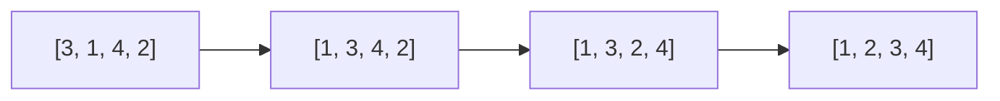
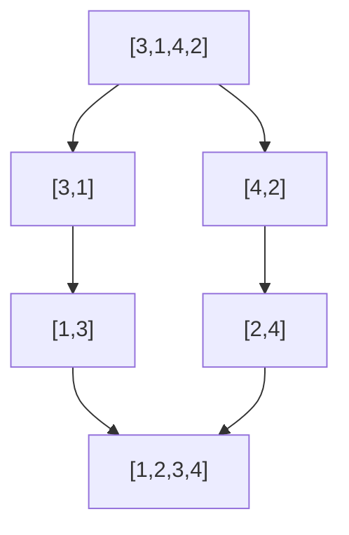

정렬 알고리즘 (Sorting Algorithms)
선형, 이진 탐색


## 정리 요약

정렬(Sorting)은 데이터를 일정한 순서(오름차순 또는 내림차순)로 재배열하는 알고리즘이다.  
정렬은 탐색, 통계, 최적화 등의 기반이 되는 핵심 알고리즘으로, 효율적인 정렬은 프로그램 전체 성능에 큰 영향을 준다.  
이 문서에서는 대표적인 **기본 정렬 알고리즘**(버블, 삽입, 선택, 병합, 퀵)을 중심으로 원리와 복잡도를 설명한다.

* **내장 정렬 함수**: Python(`sorted()`), Java(`Arrays.sort()`), C++(`std::sort()`) 등은 대부분 **하이브리드 정렬**을 사용한다.
* 예: **Timsort** (삽입 + 병합 혼합, 안정적)
* **대용량 데이터**: 외부 메모리 정렬(External Sort), 다중 스레드 정렬(Multithreaded Sort) 적용.
* **정렬 기준**: key function(람다, 비교자)로 사용자 정의 정렬 가능.
* **실무 활용**: 데이터베이스 인덱스 생성, 로그 시간 순서 정렬, 병렬 데이터 처리 등.


## 참고 자료
* [Wikipedia – Sorting Algorithm](https://en.wikipedia.org/wiki/Sorting_algorithm)
* [Python Timsort Documentation](https://bugs.python.org/file4451/timsort.txt)

---

## 1. 정렬 알고리즘의 분류

| 분류 | 예시 | 특징 |
|:--|:--|:--|
| **비교 기반 정렬** | 버블, 삽입, 선택, 병합, 퀵 | 원소 간 크기 비교를 통해 정렬 |
| **비교 비 기반 정렬** | 계수 정렬, 기수 정렬, 버킷 정렬 | 수치적 범위나 분포를 이용, 선형 시간 가능 |
| **제자리(In-place)** | 버블, 삽입, 퀵 | 추가 메모리 거의 사용하지 않음 |
| **안정적(Stable)** | 삽입, 병합 | 동일 키의 원소 순서 유지 |

---

## 2. 버블 정렬 (Bubble Sort)

인접한 두 원소를 비교하여 큰 값을 뒤로 보내는 단순한 정렬 방식이다.

```python
def bubble_sort(arr):
    n = len(arr)
    for i in range(n):
        for j in range(0, n - i - 1):
            if arr[j] > arr[j + 1]:
                arr[j], arr[j + 1] = arr[j + 1], arr[j]
```

| 구분     | 설명                            |
| :----- | :---------------------------- |
| 시간 복잡도 | O(n²)                         |
| 공간 복잡도 | O(1)                          |
| 안정성    | 안정적 (Stable)                  |
| 특징     | 구현이 간단하지만 비효율적. 교육용으로 주로 사용됨. |

<div style="text-align:center;">


</div>

---

## 3. 삽입 정렬 (Insertion Sort)

현재 원소를 이미 정렬된 부분 배열에 **삽입**하는 방식이다.
자료가 거의 정렬된 상태라면 매우 빠르게 동작한다.

```python
def insertion_sort(arr):
    for i in range(1, len(arr)):
        key = arr[i]
        j = i - 1
        while j >= 0 and key < arr[j]:
            arr[j + 1] = arr[j]
            j -= 1
        arr[j + 1] = key
```

| 구분     | 설명                               |
| :----- | :------------------------------- |
| 시간 복잡도 | O(n²) (최악), O(n) (최선, 이미 정렬된 경우) |
| 공간 복잡도 | O(1)                             |
| 안정성    | 안정적                              |
| 특징     | 부분적으로 정렬된 데이터에 매우 효율적            |

---

## 4. 선택 정렬 (Selection Sort)

전체 배열에서 최솟값을 찾아 맨 앞과 교환하는 과정을 반복한다.

```python
def selection_sort(arr):
    for i in range(len(arr)):
        min_idx = i
        for j in range(i+1, len(arr)):
            if arr[j] < arr[min_idx]:
                min_idx = j
        arr[i], arr[min_idx] = arr[min_idx], arr[i]
```

| 구분     | 설명                     |
| :----- | :--------------------- |
| 시간 복잡도 | O(n²)                  |
| 공간 복잡도 | O(1)                   |
| 안정성    | 불안정(Unstable)          |
| 특징     | 교환 횟수가 적지만 전체 탐색 비용이 큼 |

---

## 5. 병합 정렬 (Merge Sort)

배열을 **분할(Divide)** 한 뒤 정렬된 상태로 **병합(Merge)** 하는 **분할 정복(Divide and Conquer)** 알고리즘이다.

```python
def merge_sort(arr):
    if len(arr) > 1:
        mid = len(arr) // 2
        L = arr[:mid]
        R = arr[mid:]
        merge_sort(L)
        merge_sort(R)

        i = j = k = 0
        while i < len(L) and j < len(R):
            if L[i] < R[j]:
                arr[k] = L[i]; i += 1
            else:
                arr[k] = R[j]; j += 1
            k += 1
        arr[k:] = L[i:] + R[j:]
```

| 구분     | 설명                      |
| :----- | :---------------------- |
| 시간 복잡도 | O(n log n)              |
| 공간 복잡도 | O(n)                    |
| 안정성    | 안정적                     |
| 특징     | 데이터 크기와 관계없이 일정한 성능을 보장 |

<div style="text-align:center;">


</div>

---

## 6. 퀵 정렬 (Quick Sort)

**기준값(Pivot)** 을 기준으로 작은 값은 왼쪽, 큰 값은 오른쪽으로 분할한 뒤
각 부분을 재귀적으로 정렬한다. 평균적으로 가장 빠른 정렬 알고리즘 중 하나이다.

```python
def quick_sort(arr):
    if len(arr) <= 1:
        return arr
    pivot = arr[len(arr)//2]
    left = [x for x in arr if x < pivot]
    mid  = [x for x in arr if x == pivot]
    right = [x for x in arr if x > pivot]
    return quick_sort(left) + mid + quick_sort(right)
```

| 구분     | 설명                                       |
| :----- | :--------------------------------------- |
| 시간 복잡도 | 평균 O(n log n), 최악 O(n²)                  |
| 공간 복잡도 | O(log n) (재귀 스택)                         |
| 안정성    | 불안정(Unstable)                            |
| 특징     | 평균적으로 매우 빠르며, 실제 라이브러리 정렬의 기반 알고리즘으로 사용됨 |

---

## 7. 정렬 알고리즘 비교 요약

| 알고리즘  | 평균 시간 복잡도  | 공간 복잡도   | 안정성 | 특징                 |
| :---- | :--------- | :------- | :-- | :----------------- |
| 버블 정렬 | O(n²)      | O(1)     | 안정적 | 단순하지만 비효율적         |
| 삽입 정렬 | O(n²)      | O(1)     | 안정적 | 거의 정렬된 데이터에 효율적    |
| 선택 정렬 | O(n²)      | O(1)     | 불안정 | 교환 횟수 적지만 느림       |
| 병합 정렬 | O(n log n) | O(n)     | 안정적 | 안정적이지만 메모리 사용 많음   |
| 퀵 정렬  | O(n log n) | O(log n) | 불안정 | 평균 성능 우수, 실무 적용 많음 |

---

