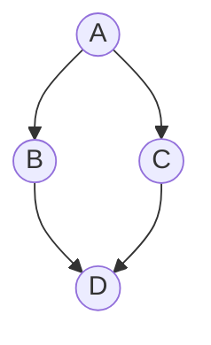
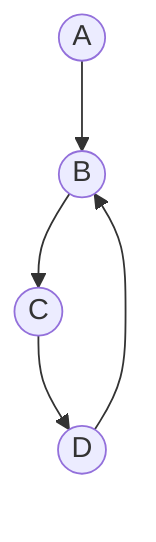
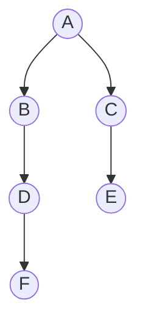
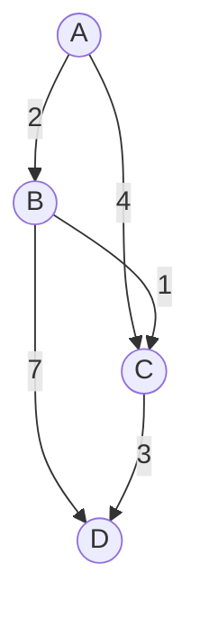
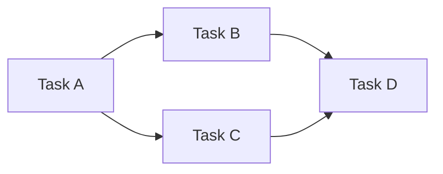

정렬 알고리즘 (Sorting Algorithms)
버블, 삽입, 병합, 퀵


## 정리 요약

그래프 알고리즘은 **정점(Vertex)** 과 **간선(Edge)** 으로 구성된 구조에서  
경로 탐색, 연결성, 최단 거리, 위상 정렬 등의 문제를 해결하기 위한 알고리즘이다.  
그래프는 현실 세계의 관계(네트워크, 도로, 의존성, 소셜 관계 등)를 표현하는 핵심 자료구조로,  
**DFS(깊이 우선 탐색)**, **BFS(너비 우선 탐색)**, **다익스트라(Dijkstra)** 등이 대표적인 알고리즘이다.

* **DFS/BFS** 는 알고리즘의 기초로, 트리·그래프·백트래킹 문제의 기본이다.
* **Dijkstra** 는 실제 지도, GPS, 네트워크 라우팅 프로토콜(OSPF)에서 사용된다.
* **위상 정렬** 은 빌드 시스템(Make, Bazel), 데이터 파이프라인 의존성 관리 등에서 사용된다.
* 대규모 그래프 분석(예: SNS, 추천 시스템)은 Spark GraphX, Neo4j 등 그래프 데이터베이스에서
  병렬 그래프 탐색 알고리즘으로 확장된다.

| 알고리즘                 | 구조     | 주요 목적         | 시간 복잡도     | 대표 사용 사례        |
| :------------------- | :----- | :------------ | :--------- | :-------------- |
| **DFS**              | 스택/재귀  | 깊이 우선 탐색      | O(V + E)   | 백트래킹, 사이클 탐지    |
| **BFS**              | 큐      | 최단 거리(무가중)    | O(V + E)   | 경로 탐색, 트리 탐색    |
| **Dijkstra**         | 우선순위 큐 | 가중치 기반 최단 경로  | O(E log V) | 지도, 네트워크 라우팅    |
| **Topological Sort** | 큐      | 순서 결정, 의존성 해석 | O(V + E)   | 작업 스케줄링, 빌드 시스템 |

## 참고 자료
* [Wikipedia – Sorting Algorithm](https://en.wikipedia.org/wiki/Sorting_algorithm)
* [Python Timsort Documentation](https://bugs.python.org/file4451/timsort.txt)

---

## 1. 그래프의 기본 개념

| 용어 | 설명 |
|:--|:--|
| **정점(Vertex)** | 데이터(노드)를 의미 |
| **간선(Edge)** | 두 정점을 연결하는 관계 |
| **방향 그래프(Directed Graph)** | 간선에 방향이 있는 그래프 |
| **무방향 그래프(Undirected Graph)** | 양방향으로 연결된 그래프 |
| **가중 그래프(Weighted Graph)** | 간선마다 비용(가중치)이 있는 그래프 |
| **인접 리스트(Adjacency List)** | 각 노드가 연결된 이웃 노드 목록 |
| **인접 행렬(Adjacency Matrix)** | 2차원 배열로 연결 관계 표현 |




---

## 2. 깊이 우선 탐색 (DFS: Depth-First Search)

DFS는 한 경로를 끝까지 탐색한 뒤, **백트래킹(Backtracking)** 하여 다른 경로를 탐색하는 방식이다.
스택(Stack) 또는 재귀(Recursion)를 이용하여 구현할 수 있다.

```python
def dfs(graph, start, visited=None):
    if visited is None:
        visited = set()
    visited.add(start)
    print(start, end=" ")
    for neighbor in graph[start]:
        if neighbor not in visited:
            dfs(graph, neighbor, visited)
```

| 구분     | 설명                           |
| :----- | :--------------------------- |
| 자료구조   | 스택(Stack) / 재귀               |
| 시간 복잡도 | O(V + E)                     |
| 공간 복잡도 | O(V)                         |
| 특징     | 깊이 우선 탐색, 경로 탐색/사이클 탐지에 유용   |
| 대표 활용  | 미로 탐색, 백트래킹, 위상 정렬, 연결 요소 분석 |




> DFS는 순환 그래프 탐색 시 방문 여부(`visited`) 체크를 반드시 해야 한다.

---

## 3. 너비 우선 탐색 (BFS: Breadth-First Search)

BFS는 시작 노드에서 가까운 노드부터 탐색하는 알고리즘이다.
큐(Queue)를 이용하여 레벨 단위로 탐색한다.

```python
from collections import deque

def bfs(graph, start):
    visited = set([start])
    queue = deque([start])
    while queue:
        node = queue.popleft()
        print(node, end=" ")
        for neighbor in graph[node]:
            if neighbor not in visited:
                visited.add(neighbor)
                queue.append(neighbor)
```

| 구분     | 설명                              |
| :----- | :------------------------------ |
| 자료구조   | 큐(Queue)                        |
| 시간 복잡도 | O(V + E)                        |
| 공간 복잡도 | O(V)                            |
| 특징     | 가까운 노드부터 탐색, 최단 거리 탐색에 유용       |
| 대표 활용  | 최단 거리(무가중 그래프), 경로 탐색, 트리 레벨 탐색 |





> BFS는 “가장 먼저 방문된 경로가 최단 거리”라는 성질을 가진다.

---

## 4. 다익스트라 알고리즘 (Dijkstra’s Shortest Path)

가중치가 있는 그래프에서 한 정점으로부터 모든 정점까지의 **최단 거리**를 구하는 알고리즘이다.
우선순위 큐(최소 힙)를 이용하여, 가장 비용이 낮은 정점부터 탐색한다.

```python
import heapq

def dijkstra(graph, start):
    distances = {node: float('inf') for node in graph}
    distances[start] = 0
    queue = [(0, start)]

    while queue:
        current_dist, current_node = heapq.heappop(queue)
        if current_dist > distances[current_node]:
            continue
        for neighbor, weight in graph[current_node].items():
            distance = current_dist + weight
            if distance < distances[neighbor]:
                distances[neighbor] = distance
                heapq.heappush(queue, (distance, neighbor))
    return distances
```

| 구분     | 설명                          |
| :----- | :-------------------------- |
| 자료구조   | 우선순위 큐(Heap)                |
| 시간 복잡도 | O(E log V)                  |
| 공간 복잡도 | O(V)                        |
| 특징     | 양의 가중치 그래프에서 최단 경로 계산       |
| 대표 활용  | 네트워크 라우팅, 지도/경로 탐색, 그래프 최적화 |





> 음수 가중치가 있는 그래프에서는 **벨만-포드(Bellman-Ford)** 알고리즘을 사용해야 한다.

---

## 5. 위상 정렬 (Topological Sorting)

**방향성 비순환 그래프(DAG)** 에서 **작업 순서** 또는 **의존 관계**를 정하는 알고리즘이다.
진입 차수가 0인 노드부터 차례대로 큐에 넣어 순서를 결정한다.

```python
from collections import deque

def topological_sort(graph):
    in_degree = {node: 0 for node in graph}
    for node in graph:
        for neighbor in graph[node]:
            in_degree[neighbor] += 1

    queue = deque([n for n in graph if in_degree[n] == 0])
    result = []
    while queue:
        node = queue.popleft()
        result.append(node)
        for neighbor in graph[node]:
            in_degree[neighbor] -= 1
            if in_degree[neighbor] == 0:
                queue.append(neighbor)
    return result
```

| 구분     | 설명                         |
| :----- | :------------------------- |
| 조건     | 순환(Cycle)이 없는 방향 그래프(DAG)  |
| 시간 복잡도 | O(V + E)                   |
| 공간 복잡도 | O(V)                       |
| 특징     | 순서 결정 문제에 사용               |
| 대표 활용  | 작업 스케줄링, 빌드 순서, 컴파일 의존성 분석 |



