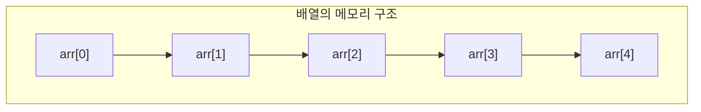
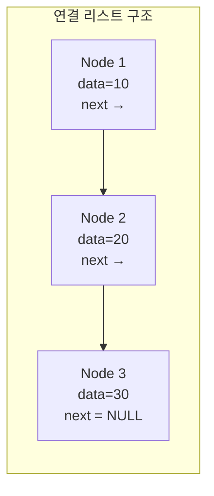
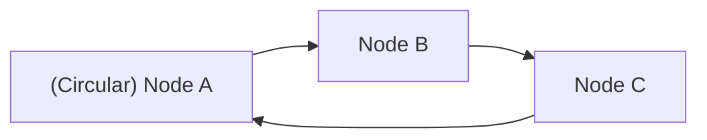

#### 요약

* 배열은 **빠른 접근**이 장점이며, 고정 크기 데이터에 적합하다.
* 연결 리스트는 **빠른 삽입과 삭제**가 장점이며, 동적 데이터에 적합하다.
* 두 구조 모두 다른 자료구조(Stack, Queue, Tree)의 기반이 된다.

##### 참고 자료

* [GeeksforGeeks – Array vs Linked List](https://www.geeksforgeeks.org/array-vs-linked-list/)
* [Wikipedia – Linked List](https://en.wikipedia.org/wiki/Linked_list)


# 배열(Array)과 연결 리스트(Linked List)

## 1️ 개요
배열과 연결 리스트는 데이터를 순서대로 저장하는 가장 기본적인 자료구조이다.  
두 구조 모두 여러 데이터를 하나의 묶음으로 관리하지만,  
메모리에 저장되는 방식과 접근 속도에서 큰 차이를 가진다.

---

## 2️ 배열 (Array)

배열은 같은 자료형의 데이터를 **연속된 메모리 공간**에 저장하는 구조이다.  
각 요소는 인덱스(index)를 통해 직접 접근할 수 있으며,  
이로 인해 접근 속도가 매우 빠르다.



### 특징

* 메모리 공간이 연속적으로 할당된다.
* 인덱스를 사용하여 O(1) 시간에 접근 가능하다.
* 삽입과 삭제는 비효율적이다. (중간 요소를 이동해야 함)
* 크기가 고정되어 있으며, 선언 시 크기를 지정해야 한다.

```c
// C 언어 예시
int arr[5] = {1, 2, 3, 4, 5};
printf("%d", arr[2]);  // 3 출력
```

### 시간 복잡도

| 연산 | 시간 복잡도 | 설명            |
| -- | ------ | ------------- |
| 접근 | O(1)   | 인덱스로 즉시 접근 가능 |
| 탐색 | O(n)   | 모든 요소를 순회해야 함 |
| 삽입 | O(n)   | 요소 이동 필요      |
| 삭제 | O(n)   | 요소 이동 필요      |

---

## 3️ 연결 리스트 (Linked List)

연결 리스트는 노드(Node)들이 포인터를 통해 서로 연결된 구조이다.
각 노드는 데이터 필드와 다음 노드를 가리키는 링크 필드(포인터)를 가진다.



### 특징

* 메모리 공간이 **비연속적**으로 할당된다.
* 포인터를 이용해 다음 노드의 주소를 저장한다.
* 삽입과 삭제는 O(1)에 가능하지만, 특정 위치 접근은 O(n)이 걸린다.
* 메모리 오버헤드가 존재한다 (포인터 저장 공간).

```c
// C 언어 예시
struct Node {
    int data;
    struct Node* next;
};

struct Node a = {10, NULL};
struct Node b = {20, NULL};
a.next = &b;
printf("%d", a.next->data);  // 20 출력
```

### 시간 복잡도

| 연산 | 시간 복잡도 | 설명            |
| -- | ------ | ------------- |
| 접근 | O(n)   | 순차적으로 탐색해야 함  |
| 탐색 | O(n)   | 첫 노드부터 순회     |
| 삽입 | O(1)   | 포인터 연결 변경     |
| 삭제 | O(1)   | 이전 노드 포인터만 수정 |

---

## 4️ 배열과 연결 리스트의 비교

| 항목           | 배열 (Array)  | 연결 리스트 (Linked List) |
| ------------ | ----------- | -------------------- |
| **메모리 구조**   | 연속적         | 비연속적                 |
| **크기 변경**    | 불가능 (고정 크기) | 가능 (동적 할당)           |
| **접근 속도**    | 빠름 (O(1))   | 느림 (O(n))            |
| **삽입/삭제 속도** | 느림 (O(n))   | 빠름 (O(1))            |
| **추가 메모리**   | 없음          | 포인터 저장 공간 필요         |
| **캐시 효율성**   | 높음          | 낮음                   |
| **구현 복잡도**   | 단순          | 비교적 복잡               |

---

## 5️ 연결 리스트의 변형 구조

| 종류                                   | 구조                     | 설명           |
| ------------------------------------ | ---------------------- | ------------ |
| **단일 연결 리스트 (Singly Linked List)**   | 각 노드가 다음 노드만 가리킴       | 기본 구조        |
| **이중 연결 리스트 (Doubly Linked List)**   | 각 노드가 이전·다음 노드를 모두 가리킴 | 양방향 탐색 가능    |
| **원형 연결 리스트 (Circular Linked List)** | 마지막 노드가 첫 노드를 가리킴      | 끝과 처음 연결된 형태 |



---

## 6️ 메모리 관리와 활용

* 배열은 컴파일 시 메모리가 정적으로 할당된다.
  → 고정된 크기 때문에 **고정된 데이터 구조**에 적합하다.
* 연결 리스트는 실행 중 동적으로 메모리를 할당한다.
  → 데이터 크기가 가변적인 상황에서 유용하다.

예를 들어, 실시간으로 데이터가 추가되는 큐나 스택 구조에서는
연결 리스트가 더 유연하게 동작한다.

---


