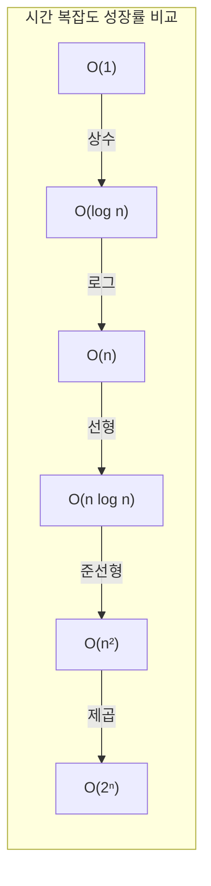
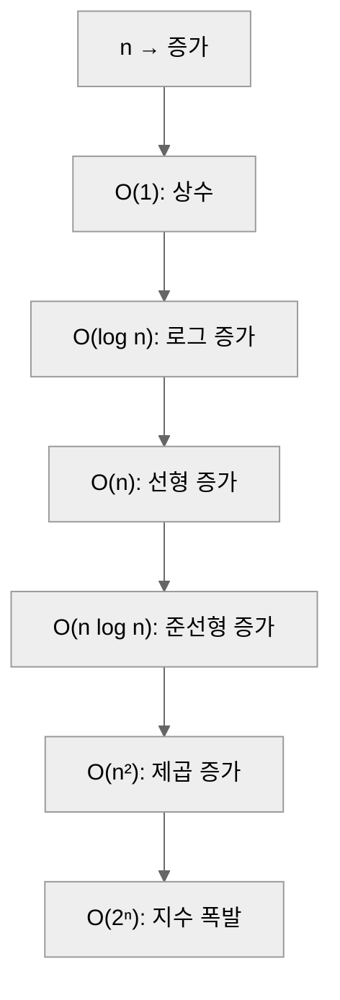

(시간·공간 복잡도, Big-O 표, 예시 코드)  
Complexity Analysis (시간·공간 복잡도)

#### 정리
복잡도(Complexity) 분석은 알고리즘이 문제를 해결하는 데 필요한  
**시간(Time)** 과 **공간(Space)** 자원을 정량적으로 평가하는 방법이다.  
이는 코드의 효율성과 확장성을 판단하기 위한 기본 척도이며,  
데이터 구조 선택과 알고리즘 설계의 핵심 지표로 사용된다.

* 복잡도는 알고리즘의 효율성을 수학적으로 표현한 척도이다.
* 시간 복잡도는 실행 시간, 공간 복잡도는 메모리 사용량을 측정한다.
* Big-O는 최악의 경우, Ω는 최선의 경우, Θ는 평균적인 경우를 나타낸다.
* 효율적인 알고리즘 설계는 **성장률이 낮은 복잡도(O(1), O(log n), O(n))** 를 지향한다.
* 복잡도 분석은 문제 해결의 “속도와 비용”을 동시에 최적화하는 핵심 도구이다.


#### 참고 자료
- [GeeksforGeeks – Time Complexity](https://www.geeksforgeeks.org/understanding-time-complexity-simple-examples/)  
- [Wikipedia – Big O notation](https://en.wikipedia.org/wiki/Big_O_notation)

---

## 1️⃣ 복잡도 표기법의 개념

복잡도는 입력 크기 \( n \) 이 커질 때, 알고리즘의 실행 시간이나 메모리 사용량이  
어떻게 증가하는지를 수학적으로 표현한다.

| 표기 | 의미 | 설명 |
|------|------|------|
| **O (Big-O)** | 최악의 경우 (Upper Bound) | 알고리즘이 가장 오래 걸리는 상황 |
| **Ω (Big-Omega)** | 최선의 경우 (Lower Bound) | 가장 빠른 경우의 하한선 |
| **Θ (Theta)** | 평균적 경우 (Tight Bound) | 상·하한이 일치할 때의 평균적 성장률 |

예를 들어, 특정 알고리즘의 수행 시간이  
최악에는 O(n²), 최선에는 Ω(n), 평균에는 Θ(n log n)일 수 있다.

---

## 2️⃣ 시간 복잡도 (Time Complexity)

시간 복잡도는 입력 크기 \( n \) 에 따라 실행 시간이 증가하는 비율을 나타낸다.  
이는 알고리즘의 효율성을 판단하는 가장 일반적인 기준이다.




### 대표적인 복잡도 수준

| 복잡도            | 명칭      | 예시 알고리즘                    |
| -------------- | ------- | -------------------------- |
| **O(1)**       | 상수 시간   | 스택 push, 배열 인덱스 접근         |
| **O(log n)**   | 로그 시간   | 이진 탐색(Binary Search)       |
| **O(n)**       | 선형 시간   | 배열 순회, 선형 탐색               |
| **O(n log n)** | 준선형 시간  | 병합 정렬(Merge Sort), 퀵 정렬 평균 |
| **O(n²)**      | 제곱 시간   | 버블 정렬, 삽입 정렬               |
| **O(2ⁿ)**      | 지수 시간   | 부분집합 탐색, 재귀 백트래킹           |
| **O(n!)**      | 팩토리얼 시간 | 순열 생성, 완전 탐색               |

---

## 3️⃣ 공간 복잡도 (Space Complexity)

공간 복잡도는 알고리즘이 실행되는 동안 사용하는 메모리의 총량을 의미한다.
입력 데이터 크기와 별개로, 추가로 사용하는 보조 공간(auxiliary space)을 고려한다.

| 구분                         | 예시              | 공간 복잡도 |
| -------------------------- | --------------- | ------ |
| **고정 공간 (Fixed Space)**    | 상수 변수, 포인터 등    | O(1)   |
| **가변 공간 (Variable Space)** | 재귀 호출 스택, 동적 배열 | O(n)   |
| **2차원 데이터 구조**             | 행렬, 그래프 인접 행렬   | O(n²)  |

예를 들어,

* 피보나치 재귀 알고리즘은 깊이만큼의 스택 공간 → **O(n)**
* 반복문 기반 피보나치는 상수 공간만 사용 → **O(1)**

---

## 4️⃣ 복잡도 계산 예시

```python
# 예시: 배열에서 최댓값 찾기
def find_max(arr):
    max_val = arr[0]
    for i in range(1, len(arr)):  # n-1번 반복
        if arr[i] > max_val:
            max_val = arr[i]
    return max_val
```

* 루프가 입력 크기 n에 비례해 실행 → **O(n)**
* 추가 메모리 사용이 없음 → **O(1)** 공간 복잡도

---

## 5️⃣ 시간 복잡도 시각화

아래 그래프는 입력 크기(n)가 증가할 때 복잡도별 실행 시간의 상대적 증가율을 보여준다.

<div style="text-align:center;"> 



</div>

> 입력이 조금만 커져도, O(n²) 이상 복잡도를 가진 알고리즘은 실행 시간이 급격히 늘어난다.
> 따라서 알고리즘의 효율성을 평가할 때는 **성장률 차이**가 중요하다.

---

## 6️⃣ 평균·최악 복잡도 비교

| 알고리즘              | 평균 복잡도     | 최악 복잡도     | 비고             |
| ----------------- | ---------- | ---------- | -------------- |
| **Binary Search** | O(log n)   | O(log n)   | 항상 일정          |
| **Quick Sort**    | O(n log n) | O(n²)      | 피벗 불균형 시 악화    |
| **Merge Sort**    | O(n log n) | O(n log n) | 안정적            |
| **Hash Table**    | O(1)       | O(n)       | 충돌이 많을 때       |
| **DFS/BFS**       | O(V + E)   | O(V + E)   | 그래프 구조에 따라 달라짐 |

---

## 7️⃣ 빅오 계산 요령

복잡도 계산 시, 다음 규칙을 기억하면 된다.

1. **상수는 버린다**
   O(2n) → O(n), O(5) → O(1)
2. **가장 빠르게 증가하는 항만 남긴다**
   O(n² + n) → O(n²)
3. **중첩 루프는 곱한다**

   ```
   for i in n:
       for j in n:
           ...
   → O(n × n) = O(n²)
   ```
4. **순차 실행은 더한다**

   ```
   f()  # O(n)
   g()  # O(log n)
   → O(n + log n) ≈ O(n)
   ```

---

