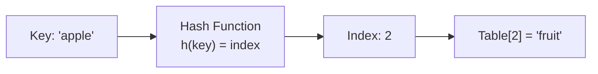
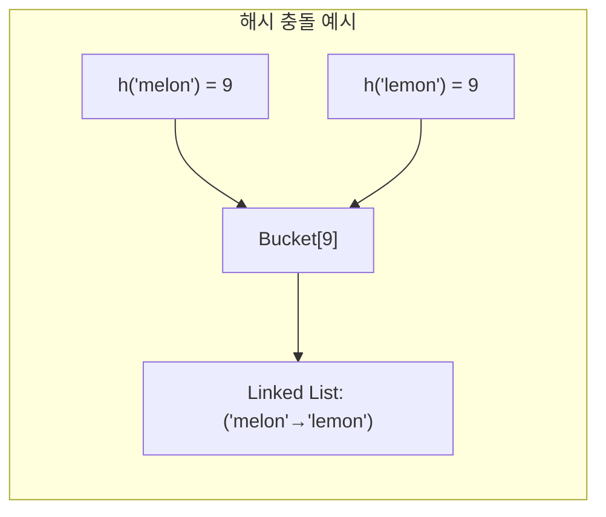
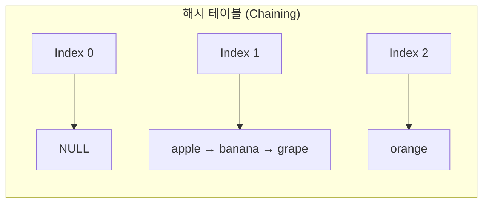
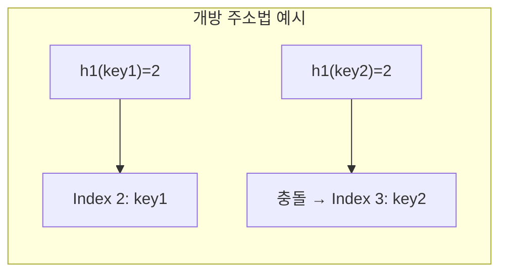

해시 구조, 충돌 처리 방식, 시간 복잡도, 해시 함수 설계

####  정리 요약
해시 테이블(Hash Table)은 **키(key)** 와 **값(value)** 을 한 쌍으로 저장하는 자료구조로,  
빠른 검색과 삽입, 삭제가 가능하다.  
일반적인 평균 연산 시간 복잡도는 O(1)로, 배열보다 효율적일 수 있다.  
해시 함수(hash function)를 통해 키를 특정 인덱스로 변환하여 데이터를 저장하며,  
충돌(collision) 상황에서는 별도의 처리 기법이 필요하다.

* 해시 테이블은 키-값 쌍 데이터를 평균 O(1)에 접근할 수 있는 자료구조이다.
* 충돌은 불가피하며, 체이닝 또는 개방 주소법으로 해결한다.
* 효율적인 해시 함수 설계와 적절한 적재율 유지가 핵심이다.
* Python의 `dict`, Java의 `HashMap`, C++의 `unordered_map` 모두 해시 테이블 기반으로 구현되어 있다.

#####  참고 자료
- [GeeksforGeeks – Hash Table in Data Structure](https://www.geeksforgeeks.org/hashing-data-structure/)  
- [Wikipedia – Hash Table](https://en.wikipedia.org/wiki/Hash_table)

---

## 1️ 개념

해시 테이블은 데이터를 빠르게 찾기 위해 **해시 함수(Hash Function)** 를 사용한다.  
해시 함수는 키를 입력받아, 고정된 크기의 배열 인덱스로 변환한다.



* 키(key): 데이터의 고유 식별자
* 값(value): 저장하고자 하는 실제 데이터
* 해시 함수(hash function): 키를 인덱스로 변환하는 함수
* 버킷(bucket): 실제 데이터가 저장되는 배열의 각 칸

---

## 2️ 해시 함수 (Hash Function)

좋은 해시 함수는 다음 특성을 가져야 한다.

| 특성                      | 설명                        |
| ----------------------- | ------------------------- |
| **균등 분포 (Uniformity)**  | 키들이 전체 테이블에 고르게 분포되어야 함   |
| **결정성 (Deterministic)** | 같은 키는 항상 같은 해시값을 반환해야 함   |
| **빠른 계산 (Efficiency)**  | 해시 연산은 상수 시간 내에 계산 가능해야 함 |

예시:

```
h(key) = key % table_size

```

단순하지만 충돌이 많을 수 있다.
문자열의 경우 아스키 코드 합이나 다항식 해시(Polynomial Hash)가 자주 사용된다.

---

## 3️ 충돌 (Collision)과 해결 방법

다른 키가 동일한 해시 인덱스로 계산될 때 충돌이 발생한다.
이를 해결하기 위한 대표적인 방법은 **체이닝(Chaining)** 과 **개방 주소법(Open Addressing)** 이다.

---


#### 3.1 충돌의 원인

해시 테이블은 보통 고정된 크기의 버킷 배열을 사용한다.
하지만 가능한 키의 조합은 이론적으로 무한대에 가깝기 때문에,
서로 다른 키라도 해시 함수 결과값이 같을 수 있다.
이 현상을 **해시 충돌(Hash Collision)** 이라고 한다.

예를 들어 다음과 같은 단순 해시 함수를 생각해보자.

```text
h(key) = (ASCII 합계) % 10
```

* `"apple"` → 97+112+112+108+101 = **530 → 0**
* `"peach"` → 112+101+97+99+104 = **513 → 3**
* `"melon"` → 109+101+108+111+110 = **539 → 9**
* `"lemon"` → 108+101+109+111+110 = **539 → 9** ⟵ 동일 인덱스(충돌 발생)

즉, `"melon"`과 `"lemon"`은 서로 다른 키지만 같은 인덱스(9)에 매핑되어 충돌한다.
충돌이 많아질수록 탐색·삽입·삭제 속도가 느려지고, 최악의 경우 O(n)까지 떨어질 수 있다.

#### 3.2 충돌을 완화하기 위한 접근

충돌은 완전히 없앨 수는 없지만, **좋은 해시 함수 설계**와 **충돌 처리 기법**으로 그 영향을 줄일 수 있다.

1. **균등 분포 해시 함수 설계**
   키 값이 특정 패턴에 편중되지 않도록,
   해시 함수를 무작위성(randomness)이 높게 설계한다.
   예를 들어 문자열 키에 대해 다항식 해시(Polynomial Rolling Hash)를 자주 사용한다.

   ```
   h(s) = (s[0]*p^0 + s[1]*p^1 + ... + s[n-1]*p^(n-1)) mod M
   ```

   * `p`: 소수(예: 31, 53)
   * `M`: 큰 소수 (예: 1e9+9)

2. **테이블 크기 최적화**
   버킷 개수를 2의 거듭제곱이 아닌 **소수(prime number)** 로 설정하면 충돌이 줄어든다.
   (예: 1000보다 997, 4096보다 4099 같은 크기가 더 좋다.)

3. **적재율 (Load Factor)** 관리
   데이터 수가 전체 버킷 수에 비해 많아지면 충돌 확률이 급격히 증가한다.
   일반적으로 α(적재율)가 **0.7 이하**일 때가 가장 효율적이며,
   초과하면 리해싱(Rehashing)을 수행해 테이블을 확장한다.

#### 3.3 충돌 해결 기법 요약

| 방식                           | 원리                          | 장점          | 단점               |
| ---------------------------- | --------------------------- | ----------- | ---------------- |
| **체이닝 (Chaining)**           | 하나의 인덱스에 여러 노드를 연결 리스트로 저장  | 간단하고 확장성 높음 | 포인터 메모리 오버헤드     |
| **개방 주소법 (Open Addressing)** | 충돌 시 테이블 내 다른 빈 슬롯 탐색       | 메모리 효율적     | 삭제·클러스터링 복잡      |
| **리해싱 (Rehashing)**          | 테이블 크기 증가 후, 새로운 해시 함수로 재배치 | 충돌 감소       | 비용이 크고 일시적 성능 저하 |
| **이중 해싱 (Double Hashing)**   | 다른 해시 함수를 한 번 더 적용해 이동 폭 계산 | 충돌 분산 효과 높음 | 계산 복잡            |

#### 3.4 충돌 발생 예시 (시각화)




### 3.5 체이닝 (Chaining)

각 버킷이 **연결 리스트(Linked List)** 형태로 여러 데이터를 저장하는 방식이다.



| 장점                    | 단점          |
| --------------------- | ----------- |
| 충돌 처리가 간단함            | 포인터 오버헤드 발생 |
| 테이블 크기보다 많은 데이터 저장 가능 | 캐시 효율 낮음    |

---

### 3.6 개방 주소법 (Open Addressing)

충돌이 발생하면 테이블 내의 **다른 빈 버킷을 찾아** 데이터를 저장하는 방식이다.




## 4️ 시간 복잡도

| 연산             | 평균   | 최악   | 설명           |
| -------------- | ---- | ---- | ------------ |
| **검색(Search)** | O(1) | O(n) | 충돌이 많을 경우 최악 |
| **삽입(Insert)** | O(1) | O(n) | 해시 리사이징 필요 시 |
| **삭제(Delete)** | O(1) | O(n) | 충돌 또는 재해시 영향 |

> 평균적으로는 O(1)이지만, 해시 함수의 품질과 테이블의 **적재율(Load Factor)** 에 따라 달라진다.

---

## 5️ 적재율 (Load Factor)

적재율(Load Factor, α)은 테이블의 **데이터 개수(n)** 와 **버킷 개수(m)** 의 비율로 정의된다.

```
α = n / m
```

* α가 너무 높으면 충돌이 자주 발생한다.
* 일반적으로 α ≤ 0.7 정도로 유지하면 효율적이다.
* α가 기준을 초과하면 **리해싱(Rehashing)** 을 수행해 테이블 크기를 늘린다.

---

## 6️ 실제 구현 예시

### Python (Dictionary 기반)

```python
# Python의 dict는 내부적으로 해시 테이블 기반
hash_table = {}
hash_table["apple"] = 3
hash_table["banana"] = 5

print(hash_table["apple"])  # 3
```

### C (체이닝 예시)

```c
#define SIZE 10
struct Node {
    char* key;
    int value;
    struct Node* next;
};

struct Node* table[SIZE];

int hash(char* key) {
    int sum = 0;
    for (int i = 0; key[i]; i++) sum += key[i];
    return sum % SIZE;
}
```

---

## 7️ 트레이드오프 요약

| 항목                     | 장점                | 단점                 |
| ---------------------- | ----------------- | ------------------ |
| **Hash Table**         | 매우 빠른 접근, 평균 O(1) | 충돌 관리 필요, 해시 함수 의존 |
| **Chaining 방식**        | 구현 단순, 확장성 높음     | 추가 메모리 필요          |
| **Open Addressing 방식** | 메모리 효율 높음         | 삭제 및 클러스터링 복잡      |

---


