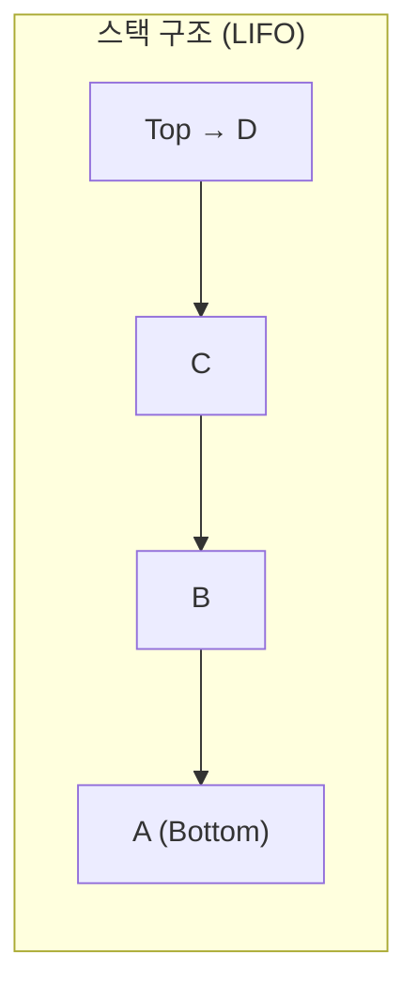
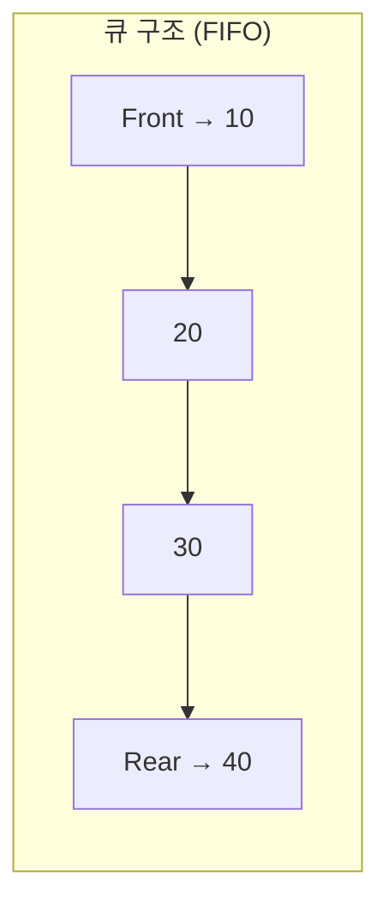
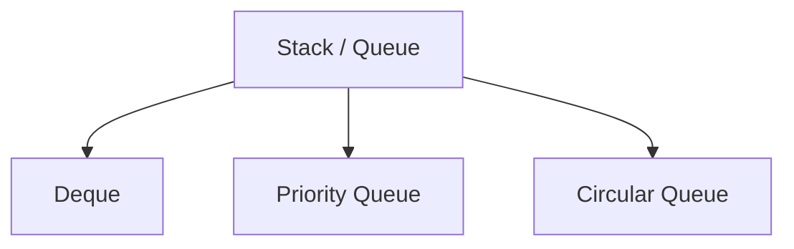

(LIFO/FIFO 구조와 실사용 예시 포함)  


#### 정리 요약
Stack과 Queue는 선형 자료구조(linear data structure)로,  
데이터를 순서대로 저장하고 꺼내는 규칙이 명확히 정의된 구조이다.  
Stack은 **후입선출(LIFO)**, Queue는 **선입선출(FIFO)** 원리를 따른다.  
두 구조 모두 배열(Array) 또는 연결 리스트(Linked List)로 구현할 수 있으며,  
다양한 알고리즘과 시스템 구조(예: 함수 호출 스택, 작업 대기열)에서 핵심적으로 사용된다.

* **Stack** → 나중에 들어온 데이터가 먼저 나간다 (LIFO).
* **Queue** → 먼저 들어온 데이터가 먼저 나간다 (FIFO).
* 두 구조 모두 자료 흐름의 순서를 제어하는 핵심 개념이다.
* Stack은 재귀, 되돌리기, 계산기 등에 사용되고,
  Queue는 스케줄링, 탐색, 이벤트 처리 등에 사용된다.

---

#### 참고 자료
- [GeeksforGeeks – Stack vs Queue](https://www.geeksforgeeks.org/difference-between-stack-and-queue-data-structure/)  
- [Wikipedia – Stack (abstract data type)](https://en.wikipedia.org/wiki/Stack_(abstract_data_type))  
- [Wikipedia – Queue (abstract data type)](https://en.wikipedia.org/wiki/Queue_(abstract_data_type))


## 1️ Stack (스택)

Stack은 데이터를 쌓아 올리는 형태의 자료구조다.  
마지막에 들어온 데이터가 가장 먼저 나가는 **후입선출(LIFO, Last In First Out)** 방식으로 동작한다.



### 주요 연산

| 연산            | 설명                   | 시간 복잡도 |
| ------------- | -------------------- | ------ |
| **push(x)**   | 데이터를 스택의 맨 위에 추가     | O(1)   |
| **pop()**     | 스택의 맨 위 데이터를 제거      | O(1)   |
| **peek()**    | 맨 위 데이터 확인 (삭제하지 않음) | O(1)   |
| **isEmpty()** | 스택이 비어 있는지 확인        | O(1)   |

### C 언어 예시

```c
#define MAX 100
int stack[MAX];
int top = -1;

void push(int x) {
    if (top < MAX - 1)
        stack[++top] = x;
}

int pop() {
    if (top >= 0)
        return stack[top--];
    return -1;
}
```

### 사용 예시

* 함수 호출 관리 (Call Stack)
* 브라우저 방문 기록 (뒤로가기)
* 괄호 짝 검사, DFS(깊이 우선 탐색)

---

## 2️ Queue (큐)

Queue는 데이터를 줄 세운 형태로 관리하는 자료구조다.
먼저 들어온 데이터가 먼저 나가는 **선입선출(FIFO, First In First Out)** 방식으로 동작한다.



### 주요 연산

| 연산             | 설명                   | 시간 복잡도 |
| -------------- | -------------------- | ------ |
| **enqueue(x)** | 데이터를 큐의 뒤쪽(Rear)에 추가 | O(1)   |
| **dequeue()**  | 큐의 앞쪽(Front)에서 제거    | O(1)   |
| **front()**    | 가장 앞의 데이터 확인         | O(1)   |
| **isEmpty()**  | 큐가 비어 있는지 확인         | O(1)   |

### Python 예시

```python
from collections import deque

q = deque()
q.append(10)   # enqueue
q.append(20)
print(q.popleft())  # dequeue → 10
```

### 사용 예시

* 운영체제의 작업 스케줄링 (Ready Queue)
* 네트워크 패킷 전송
* BFS(너비 우선 탐색)

---

## 3️ Stack vs Queue 비교

| 항목            | Stack        | Queue       |
| ------------- | ------------ | ----------- |
| **데이터 처리 순서** | 후입선출 (LIFO)  | 선입선출 (FIFO) |
| **삽입 위치**     | Top          | Rear        |
| **삭제 위치**     | Top          | Front       |
| **구현 방식**     | 배열 / 연결 리스트  | 배열 / 연결 리스트 |
| **대표 활용 예**   | 함수 호출, 괄호 검사 | 대기열, BFS 탐색 |

---

## 4️ 응용 구조

Stack과 Queue는 더 복잡한 자료구조의 기반이 된다.

| 응용 구조                          | 기반    | 설명                 |
| ------------------------------ | ----- | ------------------ |
| **Deque (Double-ended Queue)** | Queue | 양쪽에서 삽입/삭제 가능      |
| **Priority Queue**             | Queue | 우선순위가 높은 데이터 먼저 처리 |
| **Circular Queue**             | Queue | 배열의 처음과 끝을 연결한 큐   |
| **Recursive Stack**            | Stack | 함수 호출 및 복귀 관리      |



