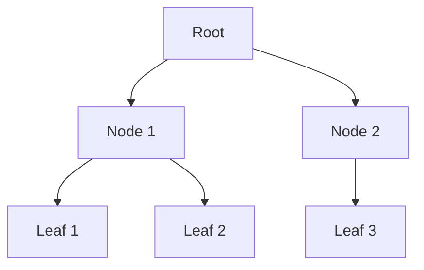
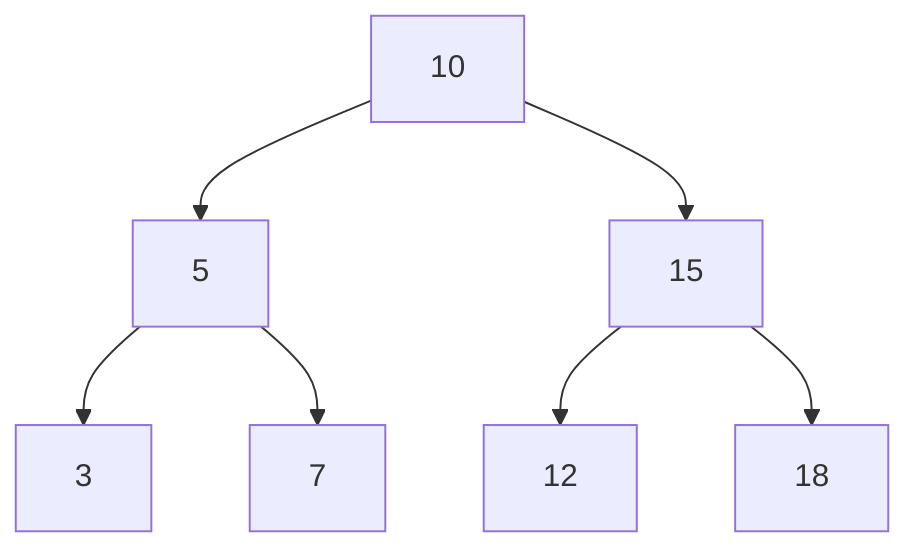
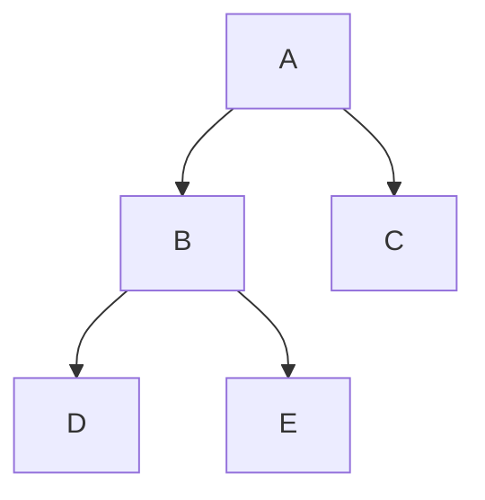
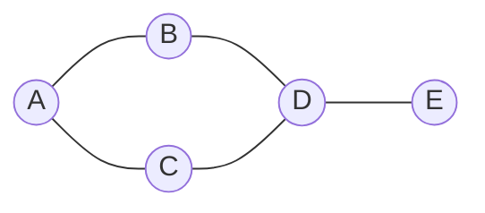
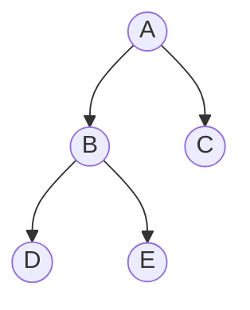

(트리 구조, 이진 탐색 트리, 그래프 순회 DFS/BFS 포함) 

#### 정리 요약
Tree와 Graph는 **비선형 자료구조(Non-linear Data Structure)** 로,  
계층적 관계나 복잡한 연결 관계를 표현할 때 사용된다.  
트리는 부모-자식 관계가 있는 계층 구조를 나타내며,  
그래프는 노드 간의 연결(간선, Edge)을 통해 관계를 표현한다.  
트리는 그래프의 한 특수한 형태이며, 모든 노드가 정확히 하나의 경로로 연결되어 있다.

* 트리는 그래프의 한 형태로, 계층적 관계를 표현한다.
* 그래프는 복잡한 연결 관계를 표현하며, DFS와 BFS로 탐색한다.
* 트리의 탐색 순서는 Preorder, Inorder, Postorder 세 가지로 구분된다.
* 그래프는 인접 행렬과 인접 리스트로 표현할 수 있으며,
  네트워크, 경로 탐색, 추천 알고리즘 등 다양한 분야에서 사용된다.


#### 참고 자료
- [GeeksforGeeks – Difference between Tree and Graph](https://www.geeksforgeeks.org/difference-between-tree-and-graph-data-structure/)  
- [Wikipedia – Tree (data structure)](https://en.wikipedia.org/wiki/Tree_(data_structure))  
- [Wikipedia – Graph (abstract data type)](https://en.wikipedia.org/wiki/Graph_(abstract_data_type))

---

## 1️⃣ 트리(Tree)

트리는 **계층적(hierarchical)** 구조를 가진 비선형 자료구조이다.  
각 노드는 하나의 부모(parent)와 0개 이상의 자식(children)을 가진다.



### 용어 정리

| 용어                 | 설명                   |
| ------------------ | -------------------- |
| **Root (루트)**      | 트리의 최상단 노드           |
| **Parent (부모)**    | 다른 노드를 포함하는 상위 노드    |
| **Child (자식)**     | 부모 노드에 속한 하위 노드      |
| **Leaf (리프)**      | 자식이 없는 말단 노드         |
| **Depth (깊이)**     | 루트에서 특정 노드까지의 거리     |
| **Height (높이)**    | 트리의 최대 깊이            |
| **Subtree (서브트리)** | 하나의 노드를 루트로 하는 부분 트리 |

---

## 2️⃣ 이진 트리 (Binary Tree)

이진 트리는 각 노드가 최대 두 개의 자식을 가지는 트리이다.
왼쪽 자식과 오른쪽 자식으로 구분된다.



### 트리의 종류

| 종류                                 | 설명                         |
| ---------------------------------- | -------------------------- |
| **Full Binary Tree**               | 모든 노드가 0개 또는 2개의 자식을 가짐    |
| **Complete Binary Tree**           | 마지막 레벨을 제외하고 모든 레벨이 채워진 트리 |
| **Binary Search Tree (BST)**       | 왼쪽 < 부모 < 오른쪽 규칙을 따르는 트리   |
| **Balanced Tree (AVL, Red-Black)** | 높이 균형을 유지하는 트리 구조          |

---

## 3️⃣ 트리 순회 (Tree Traversal)

트리를 탐색하는 대표적인 세 가지 방법이 있다.



| 순회 방식              | 순서                  | 예시 결과         |
| ------------------ | ------------------- | ------------- |
| **Preorder (전위)**  | Root → Left → Right | A, B, D, E, C |
| **Inorder (중위)**   | Left → Root → Right | D, B, E, A, C |
| **Postorder (후위)** | Left → Right → Root | D, E, B, C, A |

### Python 예시

```python
class Node:
    def __init__(self, data):
        self.data = data
        self.left = self.right = None

def inorder(node):
    if node:
        inorder(node.left)
        print(node.data, end=" ")
        inorder(node.right)
```

---

## 4️⃣ 그래프(Graph)

그래프는 **정점(Vertex)** 과 **간선(Edge)** 으로 구성된 자료구조이다.
정점 간의 연결 관계를 표현할 수 있어, 네트워크나 경로 탐색에 널리 사용된다.



### 그래프의 형태

| 분류 기준   | 종류                                       | 설명                     |
| ------- | ---------------------------------------- | ---------------------- |
| **방향성** | 방향 그래프(Directed), 무방향 그래프(Undirected)    | 간선의 방향 존재 여부           |
| **가중치** | 가중 그래프(Weighted), 비가중 그래프(Unweighted)    | 간선의 비용 존재 여부           |
| **연결성** | 연결 그래프(Connected), 비연결 그래프(Disconnected) | 모든 정점 간 연결 여부          |
| **순환성** | 순환(Cyclic), 비순환(Acyclic)                 | 경로 중 순환 여부 (A → B → A) |

---

## 5️⃣ 그래프 표현 방식

| 표현 방식                        | 설명               | 장점         | 단점         |
| ---------------------------- | ---------------- | ---------- | ---------- |
| **인접 행렬 (Adjacency Matrix)** | NxN 크기의 2차원 배열   | 간선 탐색 O(1) | 메모리 사용량 많음 |
| **인접 리스트 (Adjacency List)**  | 각 정점에 연결된 리스트 저장 | 메모리 효율적    | 탐색 시 순회 필요 |

### 인접 리스트 예시

```python
graph = {
    "A": ["B", "C"],
    "B": ["A", "D"],
    "C": ["A", "D"],
    "D": ["B", "C", "E"],
    "E": ["D"]
}
```

---

## 6️⃣ 그래프 탐색 알고리즘

### DFS (Depth-First Search, 깊이 우선 탐색)

루트 노드에서 시작해 최대한 깊이 내려간 뒤, 더 이상 갈 곳이 없으면 되돌아오는 방식이다.



```python
def dfs(node, visited=set()):
    if node not in visited:
        visited.add(node)
        for neighbor in graph[node]:
            dfs(neighbor, visited)
```

### BFS (Breadth-First Search, 너비 우선 탐색)

루트에서 시작하여 인접한 노드를 먼저 탐색하고, 그 다음 레벨로 확장한다.

```python
from collections import deque

def bfs(start):
    visited = set([start])
    q = deque([start])
    while q:
        node = q.popleft()
        for neighbor in graph[node]:
            if neighbor not in visited:
                visited.add(neighbor)
                q.append(neighbor)
```

---

## 7️⃣ 트리 vs 그래프 비교

| 항목           | 트리 (Tree)     | 그래프 (Graph)      |
| ------------ | ------------- | ---------------- |
| **구조 형태**    | 계층적           | 네트워크형            |
| **루트 존재 여부** | 루트 존재         | 루트 개념 없음         |
| **순환 여부**    | 비순환 (Acyclic) | 순환 가능            |
| **경로 수**     | 유일한 경로 존재     | 여러 경로 가능         |
| **대표 예시**    | 폴더 구조, 조직도    | SNS, 네트워크, 지도 탐색 |

---


