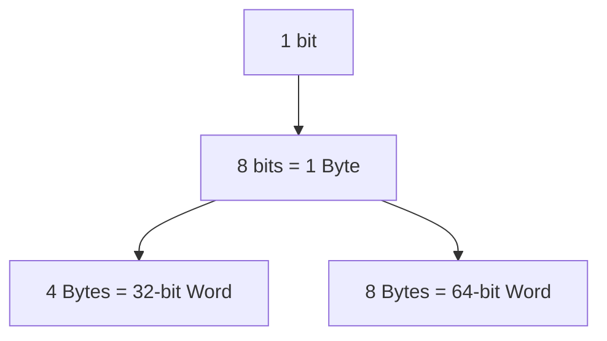
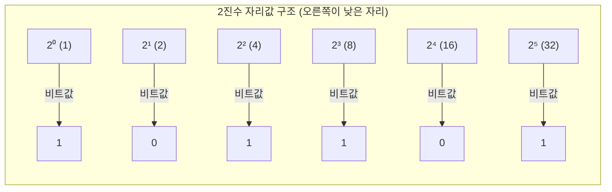

#### 요약  
- 비트는 0 또는 1의 상태, 바이트는 보통 8비트의 묶음.  
- 컴퓨터는 2진수 체계로 데이터를 표현하고 처리하며, 사람이 이해하기 쉬운 형태로 10진수, 16진수가 사용됨.  
- 컴퓨터 내부 구조 및 소프트웨어 동작 방식은 바로 이러한 수 체계 위에 놓여 있음.

| 항목              | 핵심 요약                         |
| --------------- | ----------------------------- |
| **Bit**         | 컴퓨터의 가장 작은 데이터 단위 (0 또는 1)    |
| **Byte**        | 8비트 묶음, 문자 1개 저장 가능           |
| **Binary**      | 컴퓨터가 이해하는 기본 언어               |
| **Hexadecimal** | 2진수를 사람이 보기 쉽게 표현한 16진법       |
| **변환**          | 2진수 ↔ 10진수 ↔ 16진수 계산 공식 숙지 필요 |

#### 실무적 의미

| 영역           | 예시                                | 설명              |
| ------------ | --------------------------------- | --------------- |
| **메모리 주소**   | 64비트 시스템 → 2⁶⁴ 메모리 공간 가능          | 비트 수 = 주소 표현 범위 |
| **네트워크 서브넷** | 255.255.255.0 = /24 → 2⁸ = 256 IP | 2진수 마스크 기반 계산   |
| **파일 크기**    | 1 KB = 1024 B = 2¹⁰ B             | 2의 거듭제곱 기준 표현   |
| **그래픽 컬러**   | 24-bit Color = 2²⁴ 색상             | 각 RGB 8비트 조합    |

##### 비트 → 바이트 → 워드 확장 관계



#####  2진수의 자리값(가중치) 구조

> 예시 101101₂ 의 각 자리별 가중치 합 = 45₁₀

####  참고자료  
- [Bits and Bytes – W3Schools](https://www.w3schools.com/programming/prog_bits_and_bytes.php) 
---


# 비트와 바이트, 2진수·16진수 표현

## 개요  
컴퓨터 내부에서는 **비트(bit)** 단위로 데이터를 표현하고 처리합니다.  
여기서 비트 = 0 또는 1 이며, 여러 비트를 묶어 **바이트(byte)** 등의 단위로 사용합니다.  
2진수, 16진수 등은 사람이 이해하기 쉬운 형태로 이러한 비트 데이터를 표현하는 **수 체계(number system)** 입니다.

---

## 1. 비트 (bit)와 바이트 (byte)  
- 비트(bit)는 컴퓨터에서 표현 가능한 최소 단위로, 일반적으로 0 또는 1 두 가지 상태입니다. 
- 바이트(byte)는 보통 8비트(bit)로 구성되며, 하나의 바이트로 0부터 255 범위의 숫자 혹은 하나의 문자(예: ASCII) 등을 표현할 수 있습니다. 
- 예컨대 `10001011₂` (2진수) 는 하나의 바이트로 해석될 수 있으며, 이 값은 139 또는 -117 등 여러 의미로 사용될 수 있습니다. 

---

## 2. 진수 체계 (Number Systems)  
### 2.1 10진수 (Decimal)  
사람이 일상적으로 사용하는 수 체계로, 0~9까지 열 가지 숫자를 사용하며 자리값은 10의 거듭제곱으로 증가합니다.

### 2.2 2진수 (Binary)  
컴퓨터는 전기 신호(켜짐 vs 꺼짐)로 데이터를 표현하기 때문에, 두 가지 상태(0,1)를 이용한 **기수 2(radix 2)** 체계를 사용합니다. 
각 자리(왼쪽에서 오른쪽)에는 2⁰, 2¹, 2² … 등으로 가중치가 주어지고, 비트가 1일 경우 해당 가중치를 합산해 값을 구합니다.

예:

```
100101₂ = (1 × 2⁵) + (0 × 2⁴) + (0 × 2³) + (1 × 2²) + (0 × 2¹) + (1 × 2⁰)
= 32 + 0 + 0 + 4 + 0 + 1
= 37₁₀
```

| 진법 | 기수(radix) | 사용 숫자 | 예시 |
|------|-------------|------------|------|
| **2진수** | 2 | 0, 1 | 101101₂ |
| **8진수** | 8 | 0 ~ 7 | 55₈ |
| **10진수** | 10 | 0 ~ 9 | 45₁₀ |
| **16진수** | 16 | 0 ~ 9, A ~ F | 2D₁₆ |


### 2.3 16진수 (Hexadecimal)  
기수 16(radix 16)을 사용하는 체계로, 0~9 숫자와 A(10)~F(15) 문자를 사용합니다.  
4비트(bit)가 하나의 16진수 자리로 변환 가능하므로, 2진수 ↔ 16진수 간 표현이 매우 편리합니다. 
예: `1111011011₂` → `3DB₁₆` (그룹화된 4비트 단위로 계산) 

---

## 3. 컴퓨터 구조 관점에서의 의미  
- 프로그램은 궁극적으로 기계가 이해하는 0과 1의 조합으로 변환되어 실행됩니다. 
- 메모리, 저장장치, 네트워크 등 컴퓨터 내부의 많은 시스템이 **비트 수준(bit-level)** 으로 데이터를 표현하고 처리합니다.  
- 따라서 컴퓨터 과학(CS) 학습에서는 자료가 어떻게 “저장되어”, 어떻게 “표현”되고, 어떻게 “처리되는가”를 이해하는 것이 매우 중요합니다.

---


## 4. 변환 계산 예제

### 🔹 ① 2진수 → 10진수
```

101101₂ = (1×2⁵) + (0×2⁴) + (1×2³) + (1×2²) + (0×2¹) + (1×2⁰)
= 32 + 0 + 8 + 4 + 0 + 1
= 45₁₀

````

### 🔹 ② 10진수 → 2진수  
10진수 45를 2로 나눈 나머지를 역순으로 읽습니다.

| 나눗셈 | 몫 | 나머지 |
|--------|----|--------|
| 45 ÷ 2 | 22 | **1** |
| 22 ÷ 2 | 11 | **0** |
| 11 ÷ 2 | 5  | **1** |
| 5 ÷ 2  | 2  | **1** |
| 2 ÷ 2  | 1  | **0** |
| 1 ÷ 2  | 0  | **1** |

👉 역순으로 읽으면 **101101₂**

### 🔹 ③ 2진수 ↔ 16진수 변환  
4비트씩 묶어서 1 개의 16진수로 표현합니다.

| 2진수 (4 bit) | 16진수 |
|----------------|---------|
| 0000 | 0 |
| 0001 | 1 |
| 0010 | 2 |
| 0011 | 3 |
| 0100 | 4 |
| 0101 | 5 |
| 0110 | 6 |
| 0111 | 7 |
| 1000 | 8 |
| 1001 | 9 |
| 1010 | A |
| 1011 | B |
| 1100 | C |
| 1101 | D |
| 1110 | E |
| 1111 | F |

예) `101101₂ → 0010 1101₂ → 2D₁₆`