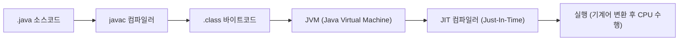

##### 장단점 요약

| 분류           | 장점                                   | 단점                         |
| ------------ | ------------------------------------ | -------------------------- |
| **컴파일러 언어**  | - 실행 속도 빠름<br>- 코드 보안성 높음<br>- 배포 용이 | - 빌드 시간 필요<br>- 플랫폼 종속성    |
| **인터프리터 언어** | - 디버깅 편리<br>- 빠른 개발 사이클<br>- 이식성 높음  | - 실행 속도 느림<br>- 런타임 의존성 필요 |

##### 정리

| 항목    | 컴파일러                 | 인터프리터            |
| ----- | -------------------- | ---------------- |
| 변환 시점 | 실행 전                 | 실행 중             |
| 실행 파일 | 있음                   | 없음               |
| 속도    | 빠름                   | 느림               |
| 오류 처리 | 한 번에                 | 즉시               |
| 대표 언어 | C, C++, Rust         | Python, JS, Ruby |
| 중간 형태 | Java (JVM), C# (CLR) | -                |


##### 참고 자료

* [컴파일러와 인터프리터의 차이 – GeeksforGeeks](https://www.geeksforgeeks.org/difference-between-compiler-and-interpreter/)
* [CS50 Harvard – Compilation Lecture Notes](https://cs50.harvard.edu/x/2024/notes/2/)
* [W3Schools – Python Interpreter](https://www.w3schools.com/python/python_intro.asp)
* [Wikipedia – Compiler](https://en.wikipedia.org/wiki/Compiler)
* [Wikipedia – Interpreter (computing)](https://en.wikipedia.org/wiki/Interpreter_%28computing%29)

---

# 컴파일러(Compiler) vs 인터프리터(Interpreter)
## 1️ 개요
소스 코드를 실행하기 위해서는 사람이 읽을 수 있는 **고급 언어(High-Level Language)** 를  
컴퓨터가 이해할 수 있는 **기계어(Machine Code)** 로 변환해야 합니다.  
이 변환을 담당하는 프로그램이 **컴파일러(Compiler)** 와 **인터프리터(Interpreter)** 입니다.

#####  비교 다이어그램


    
---

## 2️ 주요 차이점 요약

| 구분 | 컴파일러 (Compiler) | 인터프리터 (Interpreter) |
|------|---------------------|---------------------------|
| **실행 방식** | 전체 소스를 한 번에 기계어로 변환 후 실행 | 한 줄씩 읽어가며 즉시 실행 |
| **출력 결과** | 실행 가능한 바이너리 파일 생성 (.exe, .out 등) | 별도 실행 파일 없음 |
| **속도** | ✅ 빠름 (사전 변환 후 실행) | ⚠️ 느림 (매번 해석 필요) |
| **디버깅** | 오류 위치를 전체 컴파일 후 확인 | 즉시 오류 위치 확인 가능 |
| **메모리 사용량** | 더 많음 (기계어 코드 저장) | 상대적으로 적음 |
| **대표 언어** | C, C++, Rust, Go, Swift | Python, JavaScript, PHP, Ruby |
| **실행 환경** | 독립 실행 (OS 레벨) | 런타임(Interpreter) 필요 |
| **빌드 단계** | 컴파일 → 링크 → 실행 | 인터프리트 → 실행 |

---

## 3️ 작동 흐름 시각화

<div style="width:90%; margin:auto;">


</div>

<div style="width:90%; margin:auto;">


</div>


> 컴파일 언어는 “**미리 번역 후 실행**”,
> 인터프리터 언어는 “**실시간 번역하며 실행**” 구조입니다.

---

## 4️실행 과정 비교 예시

### 🔸 C 언어 (Compiler)

```c
// hello.c
#include <stdio.h>
int main() {
    printf("Hello, World!\n");
    return 0;
}
```

**실행 과정**

```bash
gcc hello.c -o hello     # 컴파일
./hello                  # 실행
```

➡️ `hello.c` → `hello`(기계어 바이너리) → OS 실행
**C는 컴파일 시 모든 문법 오류를 한 번에 검출**

---

###  Python (Interpreter)

```python
# hello.py
print("Hello, World!")
```

**실행 과정**

```bash
python hello.py
```

➡️ Python 인터프리터가 한 줄씩 읽고 즉시 실행
**오류가 있으면 해당 줄에서 즉시 중단**

---

## 5️ 중간 형태: 하이브리드 방식

일부 언어는 컴파일과 인터프리트의 장점을 결합합니다.

| 언어                | 방식                                      | 설명           |
| ----------------- | --------------------------------------- | ------------ |
| **Java**          | 소스 → 바이트코드(.class) → JVM이 인터프리트         | 플랫폼 독립성 확보   |
| **C#**            | 소스 → IL(Intermediate Language) → CLR 실행 | JIT 컴파일      |
| **Python (PyPy)** | 내부적으로 JIT 사용                            | 런타임 시 부분 컴파일 |

### 🔸 Java 실행 구조 예시


