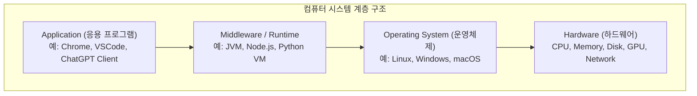
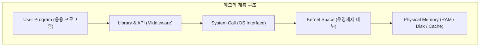
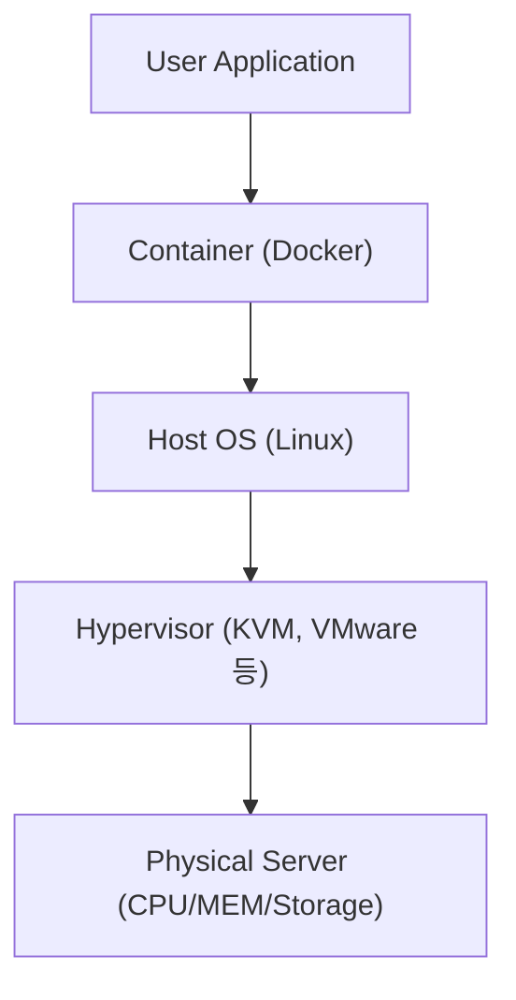

#### 정리

컴퓨터 시스템의 계층 구조는 복잡한 하드웨어를 단순화해
사용자가 이해하고 활용하기 쉽게 만드는 추상화의 결과다.
운영체제는 하드웨어 자원을 관리하고 응용 프로그램이 이를 효율적으로 사용할 수 있도록 돕는다.
미들웨어는 특정 언어 또는 서비스 실행 환경을 제공하며,
응용 프로그램은 최종적으로 사용자의 요구를 처리하는 역할을 한다.

---

#### 참고 자료

* [CS50 Lecture Notes – Computer Systems](https://cs50.harvard.edu/x/2024/notes/1/)
* [Wikipedia – Computer Architecture](https://en.wikipedia.org/wiki/Computer_architecture)

---

# 컴퓨터 계층 구조 (Computer Layers)

## 1️ 개요
컴퓨터는 여러 단계로 구성된 계층적 시스템이다.  
하드웨어(Hardware)부터 응용 프로그램(Application)까지 각 계층은 바로 아래 계층의 기능을 추상화하여 더 단순하고 편리한 환경을 제공한다.  
하드웨어는 실제 연산과 저장을 수행하고, 운영체제는 이 자원을 효율적으로 관리한다.  
그 위에서 응용 프로그램은 운영체제가 제공하는 인터페이스를 이용해 사용자의 요구를 처리한다.

---

## 2️ 전체 구조
컴퓨터의 전체 구조는 일반적으로 다음과 같은 네 계층으로 구성된다.  
하드웨어 → 운영체제 → 미들웨어/런타임 → 응용 프로그램 순으로 상위 계층으로 올라간다.

각 계층은 하위 계층을 기반으로 동작하며, 하위 계층의 복잡한 세부 구현을 상위 계층에서 쉽게 사용할 수 있도록 감춘다.
이러한 추상화 덕분에 개발자는 하드웨어 세부 사항을 신경 쓰지 않고 소프트웨어를 작성할 수 있다.

---

## 3️ 계층별 역할

하드웨어 계층은 실제 물리적인 연산을 수행한다. CPU는 연산을 담당하고, 메모리는 데이터를 임시 저장하며, 디스크는 영구 저장소로 사용된다.
운영체제는 하드웨어 자원을 효율적으로 관리하고, 프로세스·메모리·파일·입출력 장치를 제어한다.
미들웨어나 런타임 계층은 프로그래밍 언어 또는 플랫폼에 맞게 실행 환경을 제공한다. 예를 들어 Java는 JVM 위에서, JavaScript는 Node.js 위에서 실행된다.
가장 상위의 응용 프로그램 계층은 사용자가 직접 사용하는 프로그램으로, 하위 계층의 자원을 활용해 기능을 수행한다.

---

## 4️ 실제 동작 예시

예를 들어 사용자가 Python 프로그램을 실행할 때의 과정을 단계별로 보면 다음과 같다.

사용자가 명령어를 입력하면 Python 인터프리터가 코드를 해석하고,
운영체제를 통해 CPU와 메모리 같은 자원을 요청한다.
운영체제는 해당 명령을 하드웨어에 전달하고, 결과를 다시 인터프리터에 돌려준다.
이러한 과정을 거쳐 최종 출력이 사용자에게 표시된다.

---

## 5️ 운영체제의 중간 역할

운영체제는 하드웨어와 응용 프로그램 사이에서 핵심적인 중간 역할을 한다.
프로세스를 관리해 CPU를 효율적으로 분배하고, 메모리를 가상화하여 여러 프로그램이 동시에 실행되도록 한다.
파일 시스템을 통해 데이터를 구조화해 저장하며, 장치 드라이버를 통해 다양한 하드웨어를 제어한다.
또한 보안과 권한을 관리하여 시스템 전체의 안정성을 유지한다.

---

## 6️ 메모리 추상화 예시

메모리 관리 관점에서도 계층적 구조는 존재한다.
응용 프로그램은 직접 하드웨어 메모리에 접근하지 않고, 운영체제가 제공하는 추상화된 인터페이스(API)를 통해 접근한다.

이 구조 덕분에 각 프로그램은 자신만의 메모리 공간을 가지며, 다른 프로그램과 충돌하지 않는다.

---

## 7️ 현대적인 확장 계층

최근의 컴퓨팅 환경에서는 가상화, 컨테이너, 클라우드 같은 확장 계층이 추가로 존재한다.
하드웨어 위에서 가상화 계층이 여러 가상 시스템을 만들고,
그 위에서 컨테이너 기술이 애플리케이션을 격리된 환경에서 실행한다.
클라우드는 이런 인프라를 서비스 형태로 제공하여 사용자가 직접 하드웨어를 다루지 않아도 된다.

---

