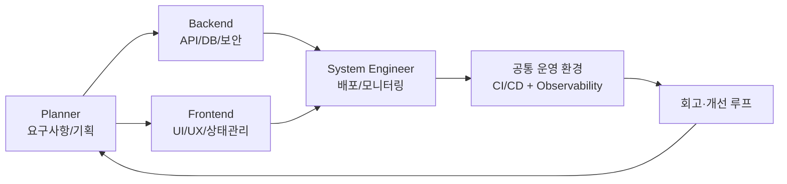

#### 요약
- 본 문서는 **Frontend / Backend / System Engineer / Planner** 등 모든 포지션이  
  하나의 통합된 협업 체계 아래에서 일관된 방식으로 일하기 위한 기준을 제시한다.  
- 기술적 규칙, 프로세스, 커뮤니케이션, 품질관리, 보안정책까지 **End-to-End 협업 표준서** 역할을 한다.  
- 목표: “**하나의 팀, 하나의 언어, 하나의 프로세스**”

| 항목 | 내용                          |
| -- | --------------------------- |
| 목적 | 역할 간 협업 표준화 및 투명성 확보        |
| 철학 | Trust & Documentation First |
| 구조 | FE/BE/SE/Planner 공통체계       |
| 목표 | 지속 가능한 협업문화 구축              |

---

#### 1. 협업 문서 목적

| 목적 | 설명 |
|------|------|
| 표준화 | 모든 역할(FE/BE/SE/Planner)이 같은 절차와 형식을 따름 |
| 투명성 | 의사결정, 변경, 승인 절차를 문서로 기록 |
| 품질 확보 | 테스트·보안·릴리즈 기준 통일 |
| 지속 가능성 | 조직 내 신규 인원이 빠르게 적응 가능 |

> **결과보다 과정(Process)을 설계한다.**  
> 협업 품질은 시스템이 아니라 문화로부터 만들어진다.

---

#### 2. 협업 구조 개요

**핵심 흐름**

1. Planner → FE/BE : 요구사항(PRD) 전달 및 명세 공유
2. FE/BE : Mock 기반 병렬 개발 및 API 계약 문서화
3. SE : CI/CD 자동화 및 배포 환경 제공
4. QA/PO : 테스트 및 품질 승인
5. All : 회고 및 개선 → 다시 PRD 반영

---

#### 3. 협업 문서 전체 구성

| 구분                                   | 설명                           | 주요 문서                                                         |
| ------------------------------------ | ---------------------------- | ------------------------------------------------------------- |
| **01-common-rules**                  | 전 포지션 공통 규칙 (SLA, RFC, 보안 등) | `working-agreements`, `roles-and-raci`, `testing-and-quality` |
| **02-frontend-collaboration**        | FE 개발 협업 (PR, API, UI 테스트)   | `fe-branch-and-pr`, `fe-api-integration`                      |
| **03-backend-collaboration**         | BE 개발 협업 (CI/CD, DB, 보안, 성능) | `be-api-contract-and-versioning`, `be-hpa`                    |
| **04-system-engineer-collaboration** | SE 운영 협업 (환경, 모니터링, 장애대응)    | `se-ci-cd-pipeline`, `se-incident-and-oncall`                 |

> 각 문서는 독립적으로 읽을 수 있으면서도, 상위 구조에서는 일관된 협업 체계를 공유한다.

---

#### 4. 협업 철학 (Team Principles)

| 원칙                      | 설명                           |
| ----------------------- | ---------------------------- |
| **Transparency**        | 모든 결정은 공개된 기록으로 남긴다.         |
| **Ownership**           | 문제를 발견한 사람이 해결의 시작점이 된다.     |
| **Iteration**           | 완벽보다 빠른 개선을 우선한다.            |
| **Respect**             | 각 역할의 전문성을 인정하고, 의사결정을 신뢰한다. |
| **Documentation First** | 말보다 기록, 회의보다 명세가 우선이다.       |

> “협업은 동의(consent)보다 신뢰(trust) 위에서 동작한다.”

---

#### 5. 협업 성숙도 모델 (Maturity Model)

| 단계      | 정의     | 특징                      |
| ------- | ------ | ----------------------- |
| Level 1 | 비공식 협업 | 문서 없음, 구두 중심            |
| Level 2 | 정의됨    | 프로세스 문서화 시작             |
| Level 3 | 관리됨    | 지표(SLA, Velocity) 기반 운영 |
| Level 4 | 예측됨    | 자동화 + 피드백 루프 정착         |
| Level 5 | 최적화됨   | 데이터 기반 개선, 혁신 주도        |

---

#### 6. 문서 활용 가이드

* 모든 문서는 **GitBook / Notion / Confluence** 호환 형식(Markdown)
* 버전 관리는 Git을 통해 수행 (`v1.0.0`, `v1.1.0` 등)
* 신규 항목 추가 시:

  1. `issue` 생성 →
  2. `RFC` 제출 →
  3. 승인 후 병합(MR)

---
