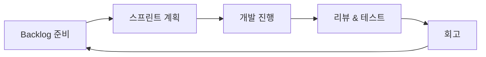

#### 요약
- 협업 프로세스의 핵심은 “빠른 피드백과 반복 개선”에 있다.  
- 본 문서는 Agile 원칙과 스프린트 단위의 협업 리듬을 설명한다.  
- 목표: **명확한 목표 → 단기 실행 → 피드백 반영 → 지속 개선**의 순환 구조 정착.

| 항목    | 설명                  |
| ----- | ------------------- |
| 목표    | 사용자 가치 중심 반복 개선     |
| 스프린트  | 2주 주기, 명확한 목표 + 회고  |
| 백로그   | 주기적 정리 및 우선순위 명확화   |
| 성공 지표 | Sprint 목표 달성률 ≥ 80% |

---

#### 1. Agile 기본 원칙

| 원칙 | 설명 |
|------|------|
| 고객 중심 | 문서보다 실제 사용자 가치 전달 우선 |
| 변화 수용 | 계획보다 적응이 중요, 변화를 두려워하지 않음 |
| 협업 강조 | 역할보다 팀 전체 성과를 우선 |
| 반복 개선 | 작은 단위로 자주 점검하고 개선 |

> Agile은 ‘빠르게 일하자’가 아니라 ‘가치를 빠르게 검증하자’는 접근이다.

---

#### 2. 스프린트 구조

| 단계                   | 기간         | 산출물                         |
| -------------------- | ---------- | --------------------------- |
| Sprint Planning      | 0.5일       | Sprint Goal, Task Breakdown |
| Daily Scrum          | 매일 15분     | Progress, Blockers          |
| Sprint Review        | 스프린트 마지막 날 | Demo, 피드백                   |
| Sprint Retrospective | 다음날        | 개선안, 팀 액션 리스트               |

---

#### 3. 백로그 관리 (Backlog Management)

* **우선순위 기준:** 사용자 가치(Impact) × 난이도(Effort)
* **표준 컬럼 구성:**
  `Backlog → To Do → In Progress → Review → Done`
* **정기 Grooming:** 주 1회, Planner + BE + FE 참석 필수

---

#### 4. Velocity 관리

| 항목              | 설명                 | 기준          |
| --------------- | ------------------ | ----------- |
| Story Point(SP) | 작업 복잡도 측정 단위       | 1~13 범위     |
| 평균 Velocity     | 최근 3회 스프린트 SP 합 평균 | 예측 기반 일정 관리 |
| 목표 Velocity     | 일정 계산 기준치          | ±15% 변동 허용  |

---
