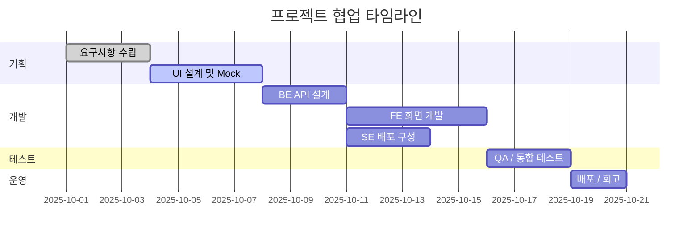

#### 요약
- 각 포지션(FE, BE, SE, Planner)이 협업 과정에서 **어떤 단계에 언제 참여하는가**를 명확히 정의  
- 프로젝트 초기 기획 → 배포 → 회고까지 **End-to-End 역할 책임 체계** 정립  
- 불필요한 중복/누락을 제거하고 **프로세스 자동화 기반 협업 모델** 수립

| 포지션     | 핵심 역할         | 협업 초점         |
| ------- | ------------- | ------------- |
| Planner | 방향성과 요구사항     | 품질 중심 기획      |
| FE      | 사용자 경험 구현     | Mock 기반 병렬 개발 |
| BE      | 비즈니스 로직 / API | 성능 및 확장성      |
| SE      | 안정적 배포 / 운영   | 자동화, 모니터링, 보안 |

---

#### 1. 전체 협업 타임라인

---

#### 2. 포지션별 협업 책임

| 단계      | Planner     | Frontend    | Backend         | System Engineer     |
| ------- | ----------- | ----------- | --------------- | ------------------- |
| 요구사항 정의 | 주도 (PRD 작성) | 참여 (UI 피드백) | 참여 (API 영향 분석)  | 참조                  |
| 설계      | 승인 (Flow)   | Mock 구조 정의  | API 스펙 설계       | CI/CD 구조 기획         |
| 개발      | 피드백         | 화면·상태관리 구현  | 비즈니스 로직 / DB 연동 | 인프라 배포 / 시크릿 구성     |
| 테스트     | 승인          | UI 테스트      | 통합 테스트          | 모니터링·로그 검증          |
| 릴리즈     | 승인 / 공지     | 빌드 검증       | DB 마이그레이션 검증    | ArgoCD / Jenkins 실행 |
| 회고      | KPI 점검      | UI 개선 제안    | API 성능 개선       | 배포 효율성 분석           |

---

#### 3. 협업 시 주의사항

* **중복 대응 금지:** 한 항목의 담당자가 명확해야 함 (e.g., 성능 테스트는 BE, 인프라 부하는 SE)
* **의존성 조율:** FE와 BE는 API Contract 확정 전 독립 Mock 환경 필수
* **커뮤니케이션 라인:** Planner → BE → FE 순으로 단일 경로 유지
* **문서화:** 모든 변경 사항은 Git 기반 Issue로 기록

---

#### 4. 협업 효율성 지표 (Metrics)

| 항목          | 정의              | 목표    |
| ----------- | --------------- | ----- |
| 평균 PR 대기 시간 | PR 생성 ~ 승인까지 시간 | < 8시간 |
| 배포 오류율      | 배포 중 실패 횟수      | 0%    |
| SLA 준수율     | SLA 항목 중 충족 비율  | ≥ 95% |
| 회고 개선 실행율   | 회고 후 개선안 이행 비율  | ≥ 80% |

---

