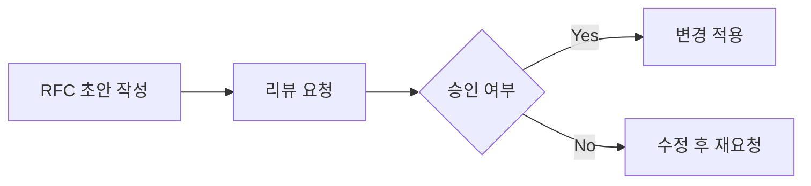

#### 요약
- 모든 변경과 의사결정은 **Issue** 또는 **RFC(Request for Comment)** 로 문서화한다.  
- RFC는 새로운 정책·아키텍처·중대한 변경을 논의하기 위한 공식 채널이다.  
- 목적: **비공식 결정 방지 / 변경 추적 / 기술 기록 관리**

| 항목    | 내용                   |
| ----- | -------------------- |
| Issue | 모든 업무는 Issue 기반으로 시작 |
| RFC   | 정책/설계 변경의 공식 승인 절차   |
| ADR   | 기술적 의사결정의 역사 기록      |
| 원칙    | 문서 없는 변경은 존재하지 않는다   |

---

#### 1. Issue 관리 절차

| 단계 | 설명 | 담당 |
|------|------|------|
| 생성 | 이슈 등록 (Template 사용) | 작성자 |
| 분류 | Bug / Feature / Task / RFC | PM / Planner |
| 진행 | 담당자 지정 후 진행 | Owner |
| 검토 | 리뷰 및 피드백 | Reviewer |
| 종료 | 완료 및 회고 기록 | Reporter |

> 모든 이슈는 제목 규칙 `[type] 요약문` 형태로 작성한다.  
> e.g., `[feature] 사용자 로그인 API`

---

#### 2. RFC 작성 기준

| 항목 | 설명 |
|------|------|
| 제목 | 변경 또는 제안의 간결한 요약 |
| 배경 | 왜 필요한가? (문제 정의) |
| 제안 내용 | 해결방안, 설계안 |
| 영향도 | 시스템, 팀, 일정 영향 |
| 승인 절차 | 리뷰어 → Maintainer 승인 |

---

#### 3. ADR(Architecture Decision Record)

* 중요한 시스템 결정은 ADR로 기록.
* 각 ADR 문서는 다음 필드 포함:

  * Context / Decision / Consequences
* ADR은 “왜 이렇게 설계했는가”를 추적하기 위한 공식 로그이다.

---
