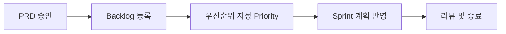

#### 요약
- 기획자는 협업의 출발점이다.  
- 본 문서는 기획자 역할을 요구사항 수집, 백로그 관리, KPI 설계로 구체화한다.  
- 목표: **명확한 문서화 + 측정 가능한 목표 설정 + 효율적 커뮤니케이션**

| 항목   | 내용                |
| ---- | ----------------- |
| 요구사항 | 명확한 PRD와 수용 기준    |
| 백로그  | 지속적 정리와 우선순위 관리   |
| KPI  | 제품 가치 중심의 측정 지표   |
| 협업   | 문서 중심 + 변경 최소화 원칙 |

---

#### 1. 요구사항 수집 (Requirement Gathering)

| 단계 | 설명 | 산출물 |
|------|------|--------|
| 조사 | 사용자 인터뷰, 경쟁 분석 | Insight Report |
| 정의 | 기능 / 비기능 요구사항 구분 | PRD (Product Requirement Doc) |
| 검토 | 기술팀 피드백 반영 | Revised PRD |
| 승인 | PO 승인 후 개발 시작 | Backlog 생성 |

- PRD는 **하나의 진실(Single Source of Truth)** 로 관리해야 함.  
- 요구사항은 명확한 수용 기준(Acceptance Criteria)을 반드시 포함해야 함.

---

#### 2. 백로그 관리 (Backlog Management)

| 컬럼          | 의미         |
| ----------- | ---------- |
| Backlog     | 승인된 요구사항   |
| To Do       | 구현 예정      |
| In Progress | 개발 중       |
| Review      | 테스트 및 검증 중 |
| Done        | 완료 및 배포 완료 |

---

#### 3. KPI 및 성과 측정

| KPI 항목    | 정의             | 측정 기준   |
| --------- | -------------- | ------- |
| 기능 출시율    | 계획 대비 실제 완료율   | ≥ 90%   |
| 사용자 활성 비율 | 기능 사용률         | App Log |
| 요구사항 변경률  | Sprint 중 변경 비율 | ≤ 10%   |
| 결함율       | QA 결함 수 / 총 이슈 | ≤ 5%    |

> KPI는 “팀의 효율”이 아닌 “제품의 가치”를 측정해야 한다.

---

#### 4. 협업 가이드

* 개발자와의 대화는 **결과가 아닌 목적 중심**
* 문서화된 요구사항만 승인 가능
* 우선순위 변경은 Sprint 단위로만 가능
* 의사결정 근거(Why)는 항상 기록

---
