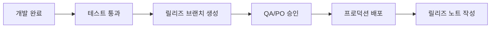

#### 요약
- 배포는 ‘기능 추가’가 아니라 ‘품질 제공’이다.  
- 본 문서는 릴리즈 버전 관리, 변경 승인 절차, 롤백 전략을 정의한다.  
- 목표: **안정성, 가시성, 추적성** 확보.

| 항목    | 설명                    |
| ----- | --------------------- |
| 버전 관리 | SemVer 기반, Git 태그 필수  |
| 승인 절차 | Major는 2단계 승인         |
| 롤백    | 자동화 스크립트 + Postmortem |
| 문서화   | 릴리즈 노트 = 제품 히스토리      |

---

#### 1. 버전 관리 정책

| 구분 | 규칙 | 예시 |
|------|------|------|
| Major | 비호환 변경 | 2.0.0 |
| Minor | 기능 추가 | 1.3.0 |
| Patch | 버그 수정 | 1.3.2 |

> 모든 배포는 Git 태그 기반(`vX.Y.Z`)으로 관리한다.

---

#### 2. 릴리즈 절차

| 단계     | 담당         | 산출물       |
| ------ | ---------- | --------- |
| 개발 완료  | FE/BE      | 코드        |
| 테스트 검증 | QA         | Report    |
| 승인     | PO/Planner | 승인 기록     |
| 배포     | SE         | Log / Tag |
| 회고     | All        | 개선안       |

---

#### 3. 변경 승인 (Change Control)

| 구분        | 승인자          | 조건        |
| --------- | ------------ | --------- |
| Minor     | PO           | 테스트 통과    |
| Major     | PO + Planner | 릴리즈 문서 필요 |
| 긴급 Hotfix | SE + BE      | 장애 보고서 작성 |

---

#### 4. 롤백 절차

1. 배포 실패 감지 (Alert)
2. 이전 이미지 Tag 복원 (`rollback:vX.Y.Z`)
3. 장애 원인 분석 후 Postmortem 등록

---
