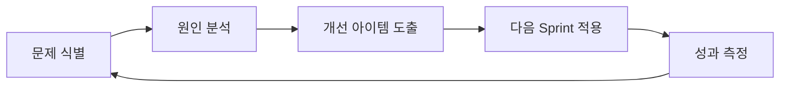

#### 요약
- 지속 가능한 협업의 핵심은 “학습하는 팀”이다.  
- 본 문서는 회고(정성)와 성숙도 평가(정량)를 결합한 개선 프로세스를 정의한다.  
- 목표: **회고 → 개선 → 적용 → 재평가**의 주기적 성장 루프를 정착시키는 것.

| 항목     | 내용                     |
| ------ | ---------------------- |
| 회고 목표  | 지속적 개선과 팀 학습           |
| 성숙도 모델 | Level 1~5 체계적 평가       |
| 실행 원칙  | 개선안은 반드시 실행 → 재평가      |
| 조직 문화  | 실패를 비난하지 않고 학습 기회로 삼는다 |

---

#### 1. 회고(Reflection) 기본 절차

| 단계 | 설명 | 도구 |
|------|------|------|
| 준비 | 데이터 수집 (SLA, 버그율, 리뷰 속도 등) | Jira, GitLab |
| 공유 | 팀 전체 회의에서 성과·문제 논의 | Notion, Miro |
| 분석 | 원인 식별 (5 Whys) | Whiteboard |
| 개선 | 액션 아이템 도출 | Retrospective Doc |
| 실행 | 다음 Sprint에 반영 | Sprint Planning |

---

#### 2. 회고 템플릿 예시

| 구분       | 질문                      | 기록 예시           |
| -------- | ----------------------- | --------------- |
| 👍 잘된 점  | 이번 Sprint에서 무엇이 효과적이었나? | API Mock 병렬 개발  |
| 👎 아쉬운 점 | 개선이 필요한 부분은?            | FE-BE 통합 테스트 지연 |
| 💡 개선안   | 다음 Sprint에 실천할 것은?      | CI 테스트 병렬화 적용   |

---

#### 3. 팀 성숙도 평가 (Maturity Model)

| 단계      | 정의                | 특징            | 행동            |
| ------- | ----------------- | ------------- | ------------- |
| Level 1 | 초기 (Ad-hoc)       | 프로세스 없음       | 개인 역량 중심      |
| Level 2 | 정의됨 (Defined)     | 문서 기반 프로세스 도입 | 규칙 준수 시작      |
| Level 3 | 관리됨 (Managed)     | 측정 가능한 지표 존재  | SLA 관리, 회고 운영 |
| Level 4 | 예측됨 (Predictable) | 데이터 기반 개선     | Velocity 분석   |
| Level 5 | 최적화됨 (Optimized)  | 자동화 + 학습 조직   | 실험 및 혁신 중심    |

---

#### 4. 개선 결과 추적

* 개선 항목은 **다음 Sprint Backlog**에 반드시 포함.
* 각 회고마다 “이전 개선안 이행률” 점검.
* Notion 또는 Wiki에 누적 기록 (문서화 필수).

---
