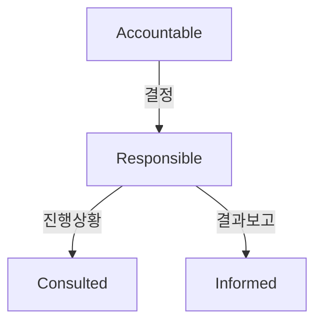

#### 요약
- 협업의 명확성을 확보하기 위해 각 역할의 **책임·결정·참여 수준(RACI)** 을 정의  
- FE, BE, SE, Planner, QA, PO 간 **책임 중복을 제거**하고 협업 의사결정 속도를 향상  
- 모든 업무는 “누가 승인하고, 누가 실행하며, 누가 참조받는가”를 기준으로 설계됨

---

#### 1. RACI 모델 개요

| 구분 | 설명 |
|------|------|
| **R (Responsible)** | 실제 수행 책임자 |
| **A (Accountable)** | 최종 승인자 / 의사결정자 |
| **C (Consulted)** | 자문 / 협의 대상 |
| **I (Informed)** | 결과만 통보 받는 이해관계자 |

---

#### 2. 역할별 책임 매트릭스

| 주요 프로세스  | Planner | FE | BE | SE | QA | PO |
| -------- | ------- | -- | -- | -- | -- | -- |
| 요구사항 정의  | R       | C  | C  | I  | I  | A  |
| UI 설계    | A       | R  | C  | I  | C  | I  |
| API 계약   | C       | C  | R  | C  | I  | I  |
| DB 설계    | I       | I  | R  | C  | I  | I  |
| 배포 파이프라인 | I       | C  | C  | R  | I  | A  |
| 테스트      | C       | C  | C  | I  | R  | I  |
| 릴리즈 승인   | C       | I  | I  | A  | C  | R  |

> 하나의 업무 항목에는 반드시 1개의 **A (결정자)** 만 존재해야 한다.

---

#### 3. 역할 정의 요약

| 역할              | 주요 책임                    | 대표 산출물                   |
| --------------- | ------------------------ | ------------------------ |
| Planner         | 요구사항 명세, KPI, 스프린트 목표    | Backlog, PRD             |
| Frontend        | UI/UX 구현, API 연동, 성능 최적화 | 화면 코드, Storybook         |
| Backend         | API/DB 설계, 보안 및 성능       | API Spec, ERD            |
| System Engineer | CI/CD, 인프라, 모니터링         | Pipeline YAML, Dashboard |
| QA              | 테스트 계획 및 품질 보증           | QA Report, Testcases     |
| PO              | 전략 및 우선순위 결정             | Roadmap, Release Notes   |

---

#### 4. 역할 간 협업 룰

1. **Planner → FE/BE**:

   * 모든 요구사항은 명세화(PRD, Acceptance Criteria) 후 전달
2. **FE ↔ BE**:

   * API Spec 문서 기반 Mock 협의 → BE 개발 완료 전 프론트 병렬 진행
3. **BE ↔ SE**:

   * 배포 환경 변수, 로그 정책, DB 백업 주기 공유
4. **QA → All**:

   * 결함 공유 시 Root Cause와 개선 Task 분리
5. **PO ↔ Planner**:

   * KPI 및 제품 목표 정렬 (Quarterly Review)

---
