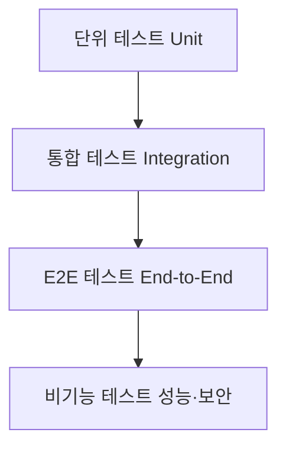

#### 요약
- 서비스의 품질은 코드보다 **테스트 문화**에서 나온다.  
- 본 문서는 통합 테스트 전략, 품질 측정 지표, 자동화 기준을 정의한다.  
- 목표: **버그 제로, 품질 보증, 지속 가능한 배포 파이프라인**

| 항목     | 설명                                        |
| ------ | ----------------------------------------- |
| 테스트 계층 | Unit → Integration → E2E → Non-functional |
| 자동화 기준 | 모든 Merge 시 CI 자동 실행                       |
| 품질 보증  | 커버리지 + SLA 기반                             |
| 성숙도    | Test Coverage ≥ 80%, 자동화율 ≥ 90%           |

---

#### 1. 테스트 피라미드 모델

| 계층                     | 설명             | 담당         |
| ---------------------- | -------------- | ---------- |
| Unit                   | 개별 함수, 모듈 테스트  | 개발자(FE/BE) |
| Integration            | API, DB 연동 테스트 | BE         |
| E2E                    | 실제 UI 흐름 검증    | QA / FE    |
| Performance & Security | 부하, 침투, 취약점    | SE / QA    |

---

#### 2. 품질 관리 절차

| 단계       | 목적        | 도구                    |
| -------- | --------- | --------------------- |
| 코드 리뷰    | 품질/보안 검증  | GitLab / PR Review    |
| 자동 테스트   | 기능 이상 탐지  | Jest / Pytest / JUnit |
| CI 파이프라인 | 테스트 자동 실행 | GitLab CI / Jenkins   |
| 품질 리포트   | 결과 시각화    | SonarQube / Allure    |

---

#### 3. 품질 지표 (Quality Metrics)

| 항목        | 목표          | 기준             |
| --------- | ----------- | -------------- |
| 코드 커버리지   | ≥ 80%       | Unit Test 결과   |
| 버그 재발률    | ≤ 5%        | QA Retest      |
| PR 리뷰 커버율 | 100%        | Reviewer 2명 이상 |
| SLA 성능 기준 | p95 ≤ 200ms | JMeter 기준      |

---

#### 4. 테스트 환경 관리

* 테스트는 **프로덕션과 동일한 환경 변수 구성** 유지
* DB는 테스트 전용 인스턴스 사용 (`*_test`)
* 통합 테스트 시 Mock 데이터는 버전 관리

---
