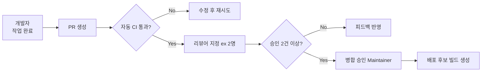

팀 기본 규칙 (SLA, 커뮤니케이션, 리뷰 원칙)

#### 요약
- 모든 포지션(FE, BE, SE, Planner)이 공통으로 따라야 하는 협업 기본 규칙 정의  
- 커뮤니케이션·SLA·리뷰·문서화 등 협업 품질을 보장하는 최소 기준 제시  
- 핵심 목표: **명확한 역할·신속한 피드백·지속 가능한 협업 리듬 유지**

| 항목     | 내용                 |
| ------ | ------------------ |
| SLA    | 품질 유지 위한 최소 대응 기준  |
| 커뮤니케이션 | 비동기·문서화 중심         |
| 코드 리뷰  | 승인 최소 2인, 자기 병합 금지 |
| 회고     | SLA+품질 기반 정량적 점검   |

###### 핵심 요약

| 포인트     | 설명                                      |
| ------- | --------------------------------------- |
| RACI 원칙 | 1 업무당 1명만 최종 의사결정자                      |
| 중복 제거   | FE/BE/SE 간 역할 명확화                       |
| 책임 구조   | Planner: 방향 / BE: 로직 / SE: 안정성 / QA: 품질 |
| 운영 원칙   | 의사결정-실행-공유 전 과정 문서화 필수                  |
---

#### 1. 협업 SLA (Service Level Agreement)

| 구분 | 기준 | 설명 |
|------|------|------|
| 이슈 응답 | 2시간 이내 | 업무시간 내 신규 이슈 등록 시 최초 피드백 |
| 코드 리뷰 | 1영업일 이내 | Merge Request 요청 후 승인/피드백 완료 |
| 테스트 승인 | 배포 24시간 전 | QA 또는 Planner 승인 필요 |
| 장애 대응 | 15분 이내 | 모니터링 알림 후 담당자 즉시 대응 |

> SLA는 ‘속도’보다 **지속 가능한 품질 유지**를 위한 기준이다.  
> 팀은 매 회고 시 SLA 준수율을 점검하고 개선 계획을 수립한다.

---

#### 2. 커뮤니케이션 규칙 (Communication Protocol)

- **공식 채널**  
  - 공지/회의: Slack `#notice`, Notion 공지  
  - 기술 논의: Git Issue / PR Thread  
  - 긴급 대응: 전화 + Slack `#alert`  
- **기본 원칙**  
  1. 비동기 우선 (Slack → Issue → PR 순)  
  2. 모든 의사결정은 기록으로 남긴다.  
  3. 대화는 사람 아닌 ‘문제 해결’ 중심으로 진행한다.  

---

#### 3. 코드 리뷰 및 승인 프로세스

* PR 제목 규칙: `[feat|fix|chore] #[이슈번호] - 요약`
* 리뷰 기준:

  * 코드 일관성 및 보안성
  * 테스트 포함 여부 (Unit, Integration)
  * 로깅 및 예외처리 정책 준수 여부
* 자기 PR 자기 병합 금지 (2인 이상 승인 필요)

---

#### 4. 회고 및 개선 (Retrospective)

* 주기: 2주 또는 스프린트 종료 후
* 항목: SLA, 커뮤니케이션, 코드 품질, 성과 지표
* 산출물: 개선 액션 리스트 (다음 스프린트 반영)

| 회고 항목 | 목표              | 예시             |
| ----- | --------------- | -------------- |
| SLA   | 응답율 95% 이상      | Issue 대응 로그 분석 |
| 리뷰 품질 | 평균 승인 대기 < 8h   | PR 통계 리포트      |
| 개선 실천 | 전원 1건 이상 개선안 제출 | Notion 기록      |

---
