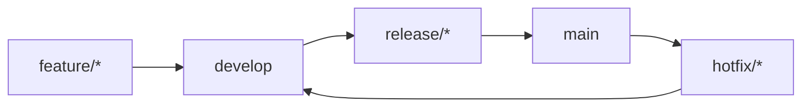

#### 요약
- FE 협업의 핵심은 **일관된 브랜치 전략과 명확한 PR 프로세스**다.  
- 본 문서는 브랜치 네이밍, PR 작성, 리뷰 규칙을 표준화한다.  
- 목표: 충돌 최소화, 품질 일관성, 리뷰 효율 극대화.

| 항목     | 내용                                     |
| ------ | -------------------------------------- |
| 브랜치 전략 | main/develop/feature/release/hotfix 체계 |
| PR 규칙  | 제목·설명·리뷰어 명시                           |
| 리뷰 기준  | UI 품질 + 코드 일관성 + 성능                    |
| 승인 원칙  | 2인 이상 승인 + CI 통과 필수                    |

---

#### 1. 브랜치 전략

| 브랜치 유형 | 목적 | 예시 |
|--------------|------|------|
| main | 운영 환경, 승인된 코드 | `main` |
| develop | 공통 개발 통합 | `develop` |
| feature | 기능 개발 | `feature/login-ui` |
| hotfix | 긴급 수정 | `hotfix/button-alignment` |
| release | 배포 후보 | `release/v1.3.0` |

> 모든 feature 브랜치는 이슈 번호와 함께 생성 (`feature/ISSUE-123-login-ui`)

---

#### 2. PR 작성 규칙

| 항목    | 규칙                                  |     |       |                            |
| ----- | ----------------------------------- | --- | ----- | -------------------------- |
| 제목    | `[feat                              | fix | chore | refactor] #{이슈번호} - 변경 요약` |
| 설명    | 변경 이유, 주요 수정점, 테스트 방법               |     |       |                            |
| 리뷰어   | 최소 1명 (FE Lead 또는 BE 연계 시 BE 1명 포함) |     |       |                            |
| 커밋 단위 | 1 PR = 1 목적 (기능/버그/리팩토링 분리)         |     |       |                            |

---

#### 3. 코드 리뷰 원칙

* **리뷰 대상**

  * UI/UX 일관성
  * State 관리 / API 연동 구조
  * Lint & Type 오류 여부
  * 성능 영향도 및 렌더링 최적화
* **승인 기준**

  * CI 통과 후 2인 이상 승인 시 병합 가능
* **자기 병합 금지**

---

#### 4. 리뷰 피드백 관리

| 단계 | 설명                            |
| -- | ----------------------------- |
| 1  | Reviewer가 Comment 작성          |
| 2  | Author가 “Resolved” 또는 수정 후 커밋 |
| 3  | Reviewer가 Close               |
| 4  | Approved 후 병합                 |

---
