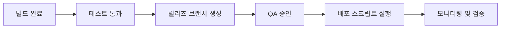

#### 요약
- 안정적인 배포는 품질의 마지막 단계다.  
- 본 문서는 FE 배포 절차, 검증 항목, 사후 점검 리스트를 제공한다.  
- 목표: **안정적 릴리즈 / 사용자 영향 최소화 / 롤백 즉시성 확보**

| 항목    | 내용                               |
| ----- | -------------------------------- |
| 배포 절차 | 빌드 → 테스트 → 승인 → 배포 → 검증          |
| 체크리스트 | env, 버전, API, 로그                 |
| 검증 기준 | 응답 200 / 로딩 2s / Lighthouse ≥ 90 |
| 롤백    | 스크립트 + 캐시 무효화                    |

---

#### 1. 배포 절차

| 단계  | 설명                 | 담당    |
| --- | ------------------ | ----- |
| 빌드  | `npm run build` 실행 | FE    |
| 테스트 | CI 자동 수행           | QA    |
| 승인  | PO / Planner 승인    | PO    |
| 배포  | ArgoCD / Jenkins   | SE    |
| 검증  | Lighthouse, E2E 확인 | FE/QA |

---

#### 2. 배포 전 체크리스트

| 항목             | 기준                   |
| -------------- | -------------------- |
| `.env` 환경변수 검증 | 누락/오타 없음             |
| 빌드 로그          | 에러 0건                |
| API 엔드포인트      | STAGE/PROD 정확히 지정    |
| 버전 태그          | SemVer 형식 (`vX.Y.Z`) |
| 소스맵            | 외부 노출 차단 설정          |

---

#### 3. 배포 후 검증

| 검증 항목         | 기준      |
| ------------- | ------- |
| API 정상 응답     | 200 OK  |
| 주요 UI 렌더링     | 로딩 < 2s |
| 에러 로그         | 콘솔 0건   |
| Lighthouse 점수 | ≥ 90    |

---

#### 4. 롤백 절차

* 배포 실패 시 `previous-deploy.sh` 스크립트 자동 실행
* CDN 캐시 강제 무효화
* 버전 태그 롤백 (`rollback:vX.Y.Z`)

---
