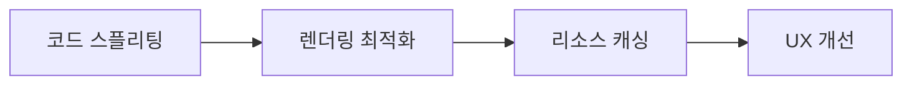

#### 요약
- FE의 성능과 보안은 사용자 신뢰에 직결된다.  
- 본 문서는 빌드 최적화, 렌더링 개선, CSP(보안정책) 적용 방안을 정의한다.  
- 목표: **첫 렌더 ≤ 2s / 점수 Lighthouse 90+ / 보안 점검 통과**

| 항목  | 내용                          |
| --- | --------------------------- |
| 성능  | 코드 스플리팅, 캐싱, 이미지 최적화        |
| 렌더링 | Virtualization, Suspense 활용 |
| 보안  | CSP, XSS 필터링, HTTPS 필수      |
| 품질  | Lighthouse ≥ 90 점 유지        |

---

#### 1. 성능 최적화 전략

| 구분 | 방법 | 도구 |
|------|------|------|
| 번들링 | 코드 스플리팅 / Lazy Loading | Webpack / Vite |
| 이미지 | WebP 변환, Responsive 이미지 | Next/Image |
| 캐싱 | HTTP Cache-Control | Nginx, CDN |
| 렌더링 | Suspense / Memo / Virtualized List | React.memo / React Query |

---

#### 2. Lighthouse 지표 기준

| 항목             | 목표   |
| -------------- | ---- |
| Performance    | ≥ 90 |
| Accessibility  | ≥ 90 |
| Best Practices | ≥ 90 |
| SEO            | ≥ 90 |

> CI에서 Lighthouse CI 자동 측정 결과를 Slack으로 전송한다.

---

#### 3. 보안 설정

| 항목                           | 설정                            | 설명         |
| ---------------------------- | ----------------------------- | ---------- |
| CSP(Content Security Policy) | script-src 'self' https:      | 외부 스크립트 차단 |
| XSS 방지                       | DOMPurify / innerHTML 금지      | 사용자 입력 필터링 |
| 쿠키                           | `SameSite=Strict`, `HttpOnly` | 세션 탈취 방지   |
| HTTPS                        | TLS 1.3 이상                    | 전송 구간 암호화  |

---

