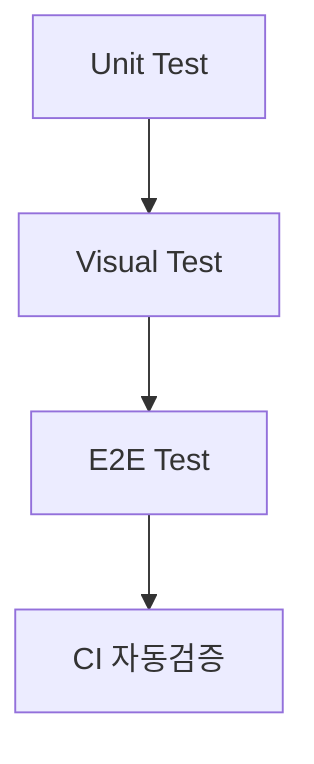

#### 요약
- UI 품질은 기능과 동일한 중요성을 가진다.  
- 본 문서는 Storybook, E2E, 브라우저 호환성 검증 절차를 표준화한다.  
- 목표: **UI 일관성 + 사용자 경험 안정성** 확보.

| 항목        | 내용                      |
| --------- | ----------------------- |
| 테스트 구조    | Unit → Visual → E2E 3단계 |
| Storybook | 모든 컴포넌트 Story 포함        |
| E2E       | 자동화된 사용자 시나리오           |
| 호환성       | 주요 브라우저 4종 보장           |


---

#### 1. 테스트 계층 구조

| 구분 | 목적 | 도구 |
|------|------|------|
| Unit | 컴포넌트 단위 테스트 | Jest + React Testing Library |
| Visual | UI Snapshot 테스트 | Storybook + Chromatic |
| E2E | 사용자 시나리오 테스트 | Playwright / Cypress |



---

#### 2. Storybook 구성

* 모든 컴포넌트는 Storybook Story 포함 필수
* Props/State 변경 케이스 3개 이상
* 자동 문서화(`docsPage`) 활성화

```tsx
export default {
  title: 'Components/Button',
  component: Button,
}
export const Primary = () => <Button type="primary">확인</Button>
```

---

#### 3. E2E 테스트 규칙

| 항목    | 설명                          |
| ----- | --------------------------- |
| 시나리오  | 핵심 유저 플로우 (로그인 → 탐색 → 로그아웃) |
| 환경    | 테스트용 API 서버 (`STAGE`)       |
| 실행    | CI 파이프라인에서 병렬 수행            |
| 실패 처리 | Screenshot 저장 + Slack 알림    |

---

#### 4. 브라우저 호환성

| 브라우저    | 지원 버전  |
| ------- | ------ |
| Chrome  | 최신 2버전 |
| Edge    | 최신 2버전 |
| Safari  | 15 이상  |
| Firefox | ESR 이상 |

---
