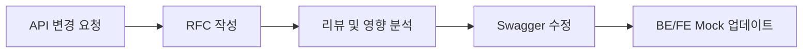

#### 요약
- API는 팀 간의 “계약서”이다.  
- 본 문서는 OpenAPI 기반의 스펙 관리, 버전 정책, Mock 협업 구조를 정의한다.  
- 목표: **스펙 일관성, 하위 호환성, 테스트 가능한 계약 체계**


| 항목      | 내용                    |
| ------- | --------------------- |
| 문서화     | OpenAPI 기반 자동 문서      |
| 버전 관리   | URL/Header 병행         |
| 변경 절차   | RFC 승인 후 수정           |
| Mock 협업 | Swagger → Mock 자동 동기화 |
---

#### 1. API 문서화 기준

| 항목 | 도구 / 규칙 |
|------|--------------|
| 문서 포맷 | OpenAPI 3.0 / Swagger |
| 문서 생성 | SpringDoc / FastAPI Docs / Nest Swagger |
| 저장 위치 | `/docs/openapi.yaml` |
| Mock 테스트 | Swagger → JSON Mock 자동 생성 |

```yaml
paths:
  /users:
    get:
      summary: "사용자 목록 조회"
      responses:
        '200':
          description: "OK"
```

---

#### 2. 버전 관리 정책

| 정책         | 설명          | 예시                        |
| ---------- | ----------- | ------------------------- |
| URL 버전     | URI 내 명시    | `/api/v1/users`           |
| Header 버전  | 요청 헤더로 지정   | `X-API-Version: 2`        |
| Deprecated | 구버전은 3개월 유지 | `/api/v1/*` → `/api/v2/*` |

> 새 버전 릴리즈 시 반드시 `CHANGELOG.md` 업데이트.

---

#### 3. API 변경 프로세스 (RFC 기반)



---

#### 4. Mock 협업 구조

* FE는 Swagger → JSON Mock → Mock Server(MSW/json-server)
* BE는 Stub Controller 기반 Mock 응답 제공
* 변경 시 FE/BE 모두 동일 스키마 기준으로 테스트

---

