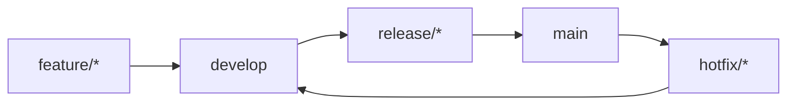

#### 요약
- 백엔드 협업의 품질은 **일관된 브랜치 정책**과 **자동화된 CI 프로세스**에서 시작된다.  
- 본 문서는 백엔드 브랜치 네이밍 규칙, Merge 정책, CI 구성 기준을 정의한다.  
- 목표: **안정적 빌드, 자동 테스트, 일관된 배포 흐름 유지**

| 항목       | 내용                              |
| -------- | ------------------------------- |
| 브랜치      | main/develop/feature/release 구조 |
| CI 파이프라인 | Build → Test → Package → Deploy |
| Merge 규칙 | 2인 승인 + CI 통과 필수                |
| 자동화      | GitLab→Harbor→ArgoCD 연동         |

---

#### 1. 브랜치 전략

| 브랜치 | 목적 | 예시 |
|---------|------|------|
| main | 운영 배포용 | `main` |
| develop | 통합 개발용 | `develop` |
| feature | 기능 단위 개발 | `feature/add-login-api` |
| fix | 버그 수정 | `fix/invalid-jwt` |
| release | 배포 후보 | `release/v1.4.0` |



---

#### 2. CI 파이프라인 구성

| 단계      | 설명                         | 예시 도구                         |
| ------- | -------------------------- | ----------------------------- |
| Build   | 코드 빌드 및 종속성 설치             | Gradle / Maven / Poetry / npm |
| Test    | Unit & Integration Test 실행 | JUnit / Pytest                |
| Lint    | 정적 코드 검사                   | SonarQube / ESLint            |
| Package | Docker 이미지 빌드              | Dockerfile                    |
| Deploy  | 이미지 푸시 및 배포 트리거            | GitLab CI → Harbor → ArgoCD   |

```yaml
stages:
  - build
  - test
  - package
  - deploy

build:
  stage: build
  script:
    - ./gradlew clean build -x test
test:
  stage: test
  script:
    - ./gradlew test
```

---

#### 3. Merge 규칙

* `develop → release` 시 모든 테스트 통과 필수
* `release → main` 병합 시 Tag 자동 생성 (`vX.Y.Z`)
* PR 리뷰 2인 이상 승인 시 병합 가능
* CI 실패 시 병합 차단 (Protected Branch)

---

