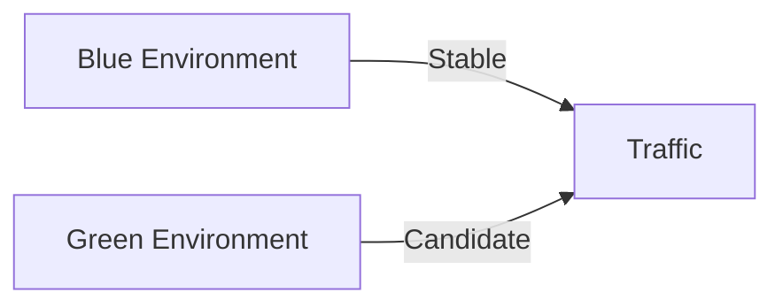

#### 요약
- 백엔드 배포의 목표는 “다운타임 0”이다.  
- 본 문서는 릴리즈 절차, 롤백 전략, Canary/Blue-Green 배포 구조를 정의한다.  
- 목표: **안정적 전환 + 즉시 복구 + 추적 가능한 이력**

| 항목    | 내용                            |
| ----- | ----------------------------- |
| 배포 방식 | Rolling / Blue-Green / Canary |
| 롤백    | 이미지 복원 + DB Revert            |
| 추적    | CI/CD 로그 + ArgoCD History     |
| 품질    | 무중단 배포 + 자동 복구 보장             |

---

#### 1. 릴리즈 절차

| 단계 | 설명 |
|------|------|
| Build | 이미지 생성 및 태깅 (`vX.Y.Z`) |
| Test | 자동 테스트 수행 |
| Deploy | Staging → Production 순차 반영 |
| Verify | 헬스체크 및 트래픽 검증 |
| Announce | 릴리즈 노트 공유 |

---

#### 2. 배포 방식

| 방식 | 설명 |
|------|------|
| Rolling Update | Pod 교체형, 무중단 업데이트 |
| Blue-Green | 두 환경 병렬 운영 후 전환 |
| Canary | 일부 트래픽만 신규 버전으로 분배 |

---

#### 3. 롤백 절차

| 조건              | 조치                           |
| --------------- | ---------------------------- |
| 헬스체크 실패         | 이전 이미지 재배포                   |
| 에러율 > 2%        | Canary 중단 및 Rollback         |
| DB Migration 실패 | 이전 스키마 복원 + Migration Revert |

> 모든 배포 로그는 GitLab Job Log + ArgoCD History로 추적 가능.

---

#### 4. Postmortem 프로세스

1. 장애 감지 및 즉시 Rollback
2. Root Cause 분석 (Logs / Metrics / Trace)
3. 영향 범위 식별 및 보고서 작성
4. 재발 방지 액션 등록

---
