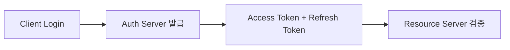

#### 요약
- 백엔드는 시스템 보안의 최전선이다.  
- 본 문서는 인증·인가, 암호화, 로그 정책을 표준화한다.  
- 목표: **안전한 접근 제어 + 감사 가능한 로깅 + 최소한의 권한**

| 항목  | 내용                       |
| --- | ------------------------ |
| 인증  | JWT + OAuth2 병행          |
| 인가  | RBAC/ABAC 기반             |
| 암호화 | bcrypt + Vault 기반 Secret |
| 로깅  | 민감정보 비포함, 감사로그 분리        |

---

#### 1. 인증(Authentication)

| 방식 | 설명 |
|------|------|
| JWT | 토큰 기반 인증 (Access + Refresh) |
| OAuth2 | 외부 인증 연동 (Google, GitHub 등) |
| Session | 내부 관리용 세션 인증 (관리자 콘솔 등) |



---

#### 2. 인가(Authorization)

| 방식                                   | 설명            |
| ------------------------------------ | ------------- |
| RBAC(Role-Based Access Control)      | 역할 기반 접근 제한   |
| ABAC(Attribute-Based Access Control) | 속성 기반 정책      |
| Scope 기반                             | API 단위 세분화 권한 |

```yaml
role: admin
scopes:
  - user.read
  - user.write
```

---

#### 3. 암호화 및 시크릿 관리

| 항목       | 방식                           |
| -------- | ---------------------------- |
| 비밀번호     | bcrypt / Argon2              |
| API Key  | Vault / Secret Manager 관리    |
| DB 연결 정보 | `.env` 분리                    |
| 토큰 저장    | Secure Cookie 또는 Header-only |

---

#### 4. 로깅 정책

| 항목   | 원칙                           |
| ---- | ---------------------------- |
| 민감정보 | 마스킹 또는 비로그                   |
| 접근로그 | 모든 인증 시도 기록                  |
| 에러로그 | Stacktrace + Request Context |
| 감사로그 | 관리자 행동 별도 저장                 |

---
