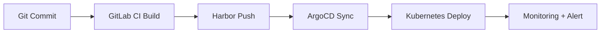

#### 요약
- SE의 핵심 역할은 **지속적 통합(Integration)** 과 **지속적 배포(Delivery)** 의 안정적 운영이다.  
- 본 문서는 CI/CD 설계, GitLab–Harbor–ArgoCD 통합 구조를 표준화한다.  
- 목표: **완전 자동화된 배포 파이프라인 / 무중단 운영 / 롤백 즉시성 확보**

| 항목       | 내용                       |
| -------- | ------------------------ |
| CI/CD 구성 | GitLab → Harbor → ArgoCD |
| 승인 체계    | Stage별 자동화 + 수동 승인       |
| 롤백       | ArgoCD Revision 기반       |
| 모니터링     | Grafana + Slack 연동       |


---

#### 1. CI/CD 파이프라인 구조



| 단계     | 설명                 | 도구                    |
| ------ | ------------------ | --------------------- |
| CI     | 코드 빌드, 테스트, 이미지 생성 | GitLab Runner         |
| 이미지 저장 | 빌드된 Docker 이미지 저장  | Harbor                |
| CD     | 선언적 배포             | ArgoCD                |
| 모니터링   | 상태 추적 및 알림         | Grafana, Alertmanager |

---

#### 2. GitLab CI 구성 예시

```yaml
stages:
  - build
  - test
  - deploy

build:
  script:
    - docker build -t $CI_REGISTRY_IMAGE:$CI_COMMIT_SHA .
    - docker push $CI_REGISTRY_IMAGE:$CI_COMMIT_SHA

deploy:
  script:
    - kubectl apply -f k8s/deployment.yaml
```

---

#### 3. 배포 정책

| 항목    | 정책                          |
| ----- | --------------------------- |
| 승인    | PO/SE 승인 후 자동 배포            |
| 환경 구분 | dev → stage → prod 순서       |
| 롤백    | ArgoCD Previous Revision 복원 |
| 로그    | 모든 Job Log 90일 보관           |

---

#### 4. 장애 대응 절차

1. CI/CD 실패 감지
2. Slack 알림 → 담당자 확인
3. 원인 파악 (빌드 실패 / 이미지 오류 / 권한 문제)
4. Fix 브랜치 생성 후 재시도

---

