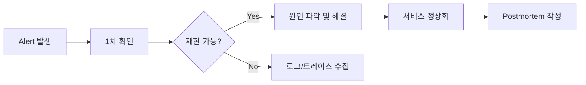

#### 요약
- 장애는 피할 수 없지만, **대응은 시스템화할 수 있다.**  
- 본 문서는 장애 대응 절차, 온콜 체계, 포스트모템 작성 기준을 정의한다.  
- 목표: **탐지 → 대응 → 복구 → 회고** 자동 루프 완성.

| 항목 | 내용                            |
| -- | ----------------------------- |
| 탐지 | Logs + Metrics + Health Probe |
| 대응 | 3단계 온콜 체계                     |
| 회복 | 롤백 / Redeploy / ScaleOut      |
| 회고 | Postmortem + Action Item 관리   |
---

#### 1. 장애 탐지 (Detection)

| 소스 | 도구 | 알림 방식 |
|------|------|-----------|
| 애플리케이션 로그 | Loki | Slack `#alert` |
| 메트릭 임계값 | Prometheus | Alertmanager |
| 헬스체크 실패 | ArgoCD / Liveness Probe | PagerDuty |
| 외부 모니터링 | UptimeRobot / StatusCake | 이메일 |

---

#### 2. 온콜 체계 (On-Call)

| 역할 | 설명 |
|------|------|
| 1차 | 근무 시간 내 담당자 (SE/BE) |
| 2차 | 팀 리더 / SRE |
| 3차 | PO / 경영진 보고 |

- 주 단위 로테이션 (1주 = 1 담당자)  
- 비상 연락망: 전화 + Slack DM  
- 근무 외 시간에는 PagerDuty SMS 발송  

---

#### 3. 장애 대응 프로세스

---

#### 4. 포스트모템(Postmortem)

| 항목           | 설명                   |
| ------------ | -------------------- |
| Incident ID  | 자동 생성 (YYYYMMDD-XXX) |
| Impact       | 사용자/서비스 영향           |
| Root Cause   | 근본 원인                |
| Timeline     | 발생~복구까지 시점별 정리       |
| Action Items | 재발 방지 계획             |

---

