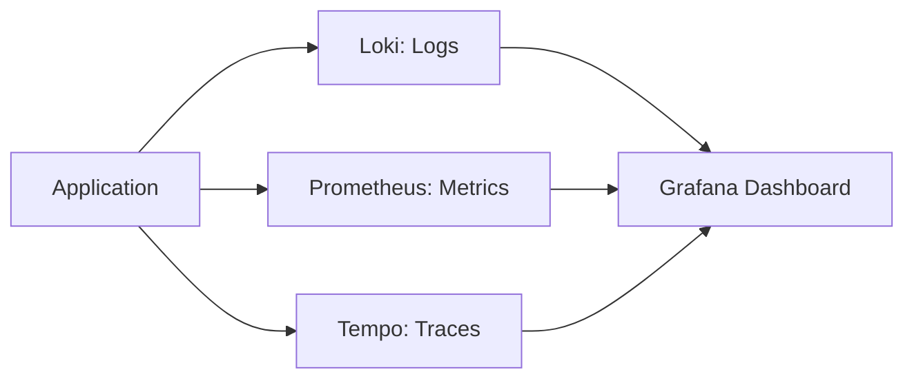

#### 요약
- 운영 효율의 핵심은 “보이는 시스템”이다.  
- 본 문서는 Logging, Metrics, Tracing의 구성 원칙과 표준 스택을 정의한다.  
- 목표: **이슈 원인 5분 이내 파악 / 장애 MTTR ≤ 15분**

| 항목   | 내용                                  |
| ---- | ----------------------------------- |
| 구성요소 | Logging + Metrics + Tracing         |
| 목표   | MTTR ≤ 15분, 장애 재현성 확보               |
| 스택   | Prometheus + Loki + Tempo + Grafana |
| 정책   | 로그 JSON, 수명 주기 관리                   |

---

#### 1. Observability 3요소

| 구성 | 목적 | 대표 도구 |
|------|------|-----------|
| Logging | 이벤트 기록 | Loki, Elasticsearch |
| Metrics | 수치 기반 지표 | Prometheus, Grafana |
| Tracing | 호출 추적 | Tempo, Jaeger |

---

#### 2. 로깅 정책

| 항목    | 기준                               |
| ----- | -------------------------------- |
| 로그 레벨 | `ERROR`, `WARN`, `INFO`, `DEBUG` |
| 포맷    | JSON 기반 구조화 로그                   |
| 수집 방식 | Loki / Filebeat / Fluentd        |
| 보존 기간 | 90일 (장애 로그 180일)                 |

---

#### 3. 메트릭 수집 기준

| 항목     | 설명                           |
| ------ | ---------------------------- |
| 리소스    | CPU, Memory, Disk, Network   |
| 애플리케이션 | RPS, Error Rate, Latency     |
| 사용자    | Active User, Response Count  |
| 커스텀    | KPI 연동 가능 (Grafana Variable) |

---

#### 4. 트레이싱 구성

* OpenTelemetry 기반 추적 ID 삽입
* API Gateway → Service → DB → External API 전체 Path 추적
* Trace ID: `X-Request-ID` 헤더 기반

---

