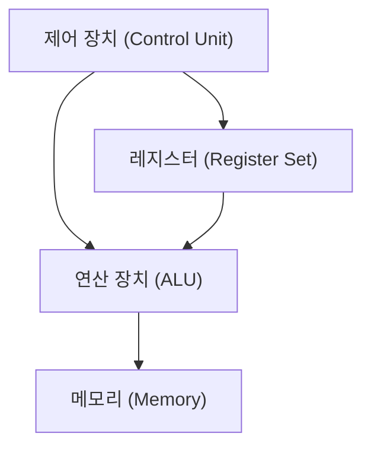
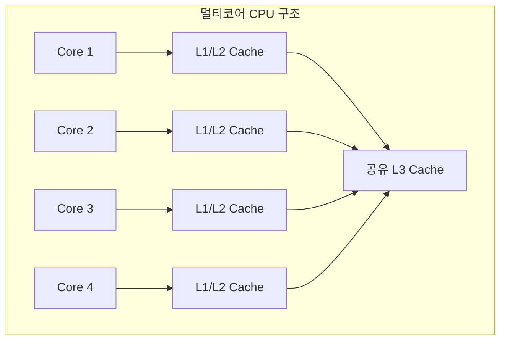

CPU 핵심 구성요소(제어장치·연산장치·레지스터), 명령어 처리 과정, 파이프라인 구조, 코어·클록·캐시 개념

#### 정리

CPU는 제어 장치, 연산 장치, 레지스터로 구성되어 있으며
명령어를 인출(Fetch), 해석(Decode), 실행(Execute)하는 사이클로 동작한다.
현대의 CPU는 파이프라인, 분기 예측, 멀티코어, 캐시 메모리 등 다양한 기술을 통해
병렬성과 성능을 극대화한다.
이러한 구조를 이해하는 것은 시스템 성능 최적화와 병렬 프로그래밍을 이해하는 데 중요한 기초가 된다.

---

#### 참고 자료

* [CS50 Lecture – Computer Architecture](https://cs50.harvard.edu/x/2024/notes/2/)
---

# CPU 구조 (CPU Structure)

## 1️ 개요
CPU(Central Processing Unit)는 컴퓨터의 핵심 부품으로,  
모든 연산과 제어의 중심 역할을 수행한다.  
사용자가 작성한 프로그램의 명령어를 해석하고, 연산을 수행하며,  
필요한 데이터를 메모리에서 가져오거나 다시 저장한다.

CPU는 일반적으로 **제어 장치(Control Unit)**, **연산 장치(ALU, Arithmetic Logic Unit)**,  
그리고 **레지스터(Register)** 세 부분으로 구성된다.

---

## 2️ CPU의 기본 구성 요소

* **제어 장치(Control Unit)**
  프로그램의 명령어를 해석하고, CPU 내부의 각 구성 요소가 어떤 동작을 수행해야 하는지 지시한다.
  명령어를 순차적으로 불러오며(Instruction Fetch), 실행 흐름을 제어한다.

* **연산 장치(ALU, Arithmetic Logic Unit)**
  실제 계산이 이루어지는 부분이다.
  덧셈, 뺄셈 같은 산술 연산뿐 아니라 AND, OR, NOT, 비교 연산 같은 논리 연산도 수행한다.

* **레지스터(Register)**
  CPU 내부의 초고속 임시 저장소로, 연산에 필요한 데이터나 주소를 저장한다.
  일반적으로 CPU는 수십 개의 레지스터를 가지고 있으며, 명령어 수행 속도를 높이기 위해 사용된다.

---

## 3️ 명령어 처리 과정

CPU는 기본적으로 **명령어 사이클(Instruction Cycle)** 을 반복하며 프로그램을 실행한다.
이 과정은 다음과 같은 세 단계로 나뉜다.

1. **Fetch (인출)**
   제어 장치는 프로그램 카운터(PC)에 저장된 주소를 통해 메모리에서 명령어를 읽어온다.
2. **Decode (해석)**
   읽어온 명령어를 해석하여 어떤 연산을 수행할지 결정한다.
3. **Execute (실행)**
   ALU가 명령어에 따라 연산을 수행하고, 그 결과를 레지스터나 메모리에 저장한다.

이 과정은 CPU 클록(clock)의 속도에 맞춰 초당 수십억 번 반복된다.

---

## 4️ 레지스터의 종류

CPU 내부의 레지스터는 역할에 따라 다음과 같이 구분된다.

| 구분                                | 이름                  | 역할 |
| --------------------------------- | ------------------- | -- |
| **PC (Program Counter)**          | 다음에 실행할 명령어의 주소를 저장 |    |
| **IR (Instruction Register)**     | 현재 실행 중인 명령어 저장     |    |
| **ACC (Accumulator)**             | 연산 결과를 일시 저장        |    |
| **MAR (Memory Address Register)** | 접근할 메모리 주소 저장       |    |
| **MBR (Memory Buffer Register)**  | 메모리로부터 읽거나 쓸 데이터 저장 |    |
| **General Registers**             | 일반 계산 및 변수 저장에 사용   |    |

---

## 5️ 클록과 명령어 처리 속도

CPU는 클록(clock)이라는 일정한 주기 신호에 따라 동작한다.
클록 주파수(Hz)가 높을수록 초당 더 많은 명령어를 처리할 수 있다.

예를 들어, 3GHz CPU는 1초에 약 30억 번의 클록 주기를 수행한다.
하지만 클록 속도만으로 성능을 단정할 수는 없다.
명령어 효율, 파이프라인 구조, 캐시 크기 등도 함께 고려되어야 한다.

---

## 6️ 파이프라인 구조

CPU는 여러 명령어를 **파이프라인(Pipeline)** 형태로 동시에 처리한다.
각 명령어의 실행 단계를 분리하여 병렬로 수행함으로써 처리 효율을 높인다.

```mermaid
gantt
    title 명령어 파이프라인 예시
    dateFormat  X
    axisFormat  none
    section 명령어 처리 단계
    Fetch(명령1): done, 0, 1
    Decode(명령1): done, 1, 2
    Execute(명령1): done, 2, 3
    Fetch(명령2): done, 1, 2
    Decode(명령2): done, 2, 3
    Execute(명령2): done, 3, 4
```

파이프라인을 사용하면 CPU가 한 번에 여러 명령어를 처리할 수 있지만,
분기(branch)나 데이터 의존성 문제가 발생할 경우 지연(stall)이 생길 수 있다.
이 문제를 해결하기 위해 **분기 예측(Branch Prediction)** 과 **명령어 재정렬(Out-of-Order Execution)** 기술이 사용된다.

---

## 7️ 캐시(Cache)와 메모리 계층

CPU와 메모리의 속도 차이를 줄이기 위해 **캐시 메모리(Cache Memory)** 가 사용된다.
캐시는 자주 사용하는 데이터를 저장해 CPU가 빠르게 접근할 수 있도록 한다.

| 계층                | 명칭        | 접근 속도 | 크기             |
| ----------------- | --------- | ----- | -------------- |
| L1 Cache          | CPU 코어 내부 | 매우 빠름 | 작음 (수십 KB)     |
| L2 Cache          | 코어별 또는 공유 | 빠름    | 중간 (수백 KB~수MB) |
| L3 Cache          | CPU 전체 공유 | 보통    | 큼 (수MB~수십MB)   |
| Main Memory (RAM) | 외부 메모리    | 느림    | 수GB            |
| Disk / SSD        | 보조 저장장치   | 매우 느림 | 매우 큼           |

---

## 8️ 멀티코어와 병렬 처리

현대 CPU는 여러 개의 코어(Core)를 가지고 있다.
각 코어는 독립적으로 명령어를 처리할 수 있으며,
멀티코어 CPU는 여러 프로그램이나 스레드를 동시에 실행할 수 있다.

멀티코어 구조는 멀티스레딩, 병렬 연산, GPU와의 연동을 통해 전체 처리량을 높인다.
운영체제는 각 코어에 작업을 분배하며 효율적으로 스케줄링한다.

---
