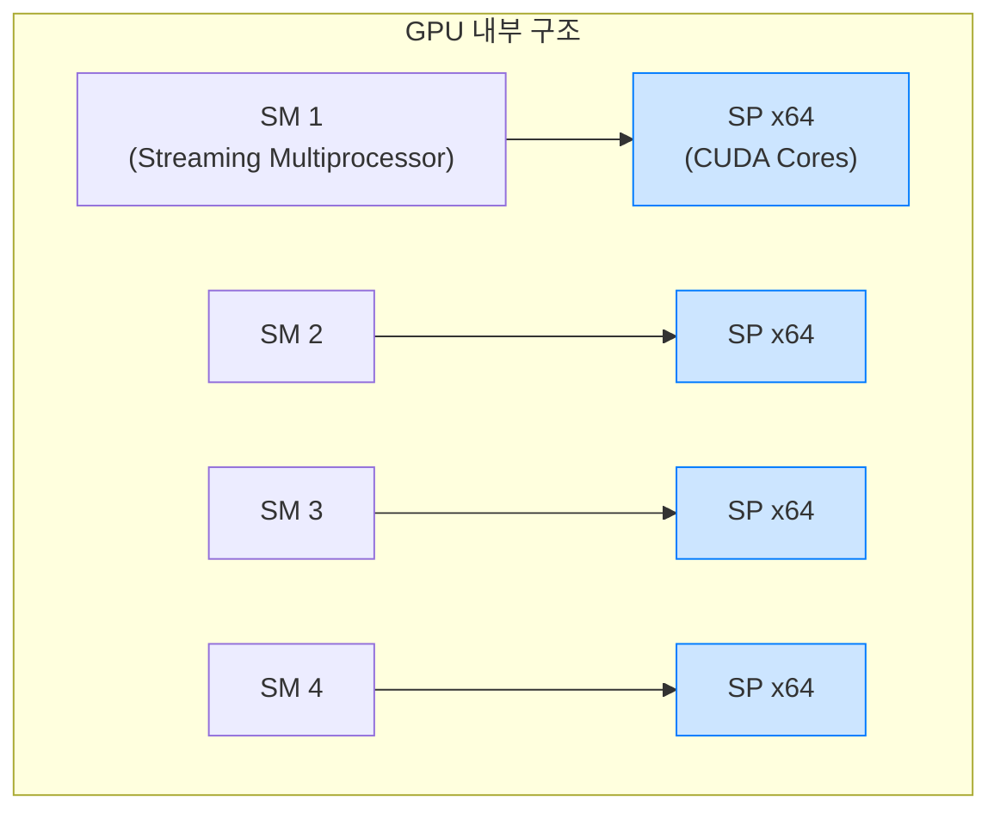
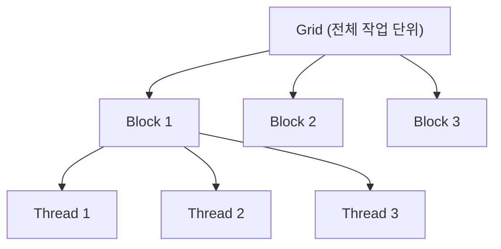
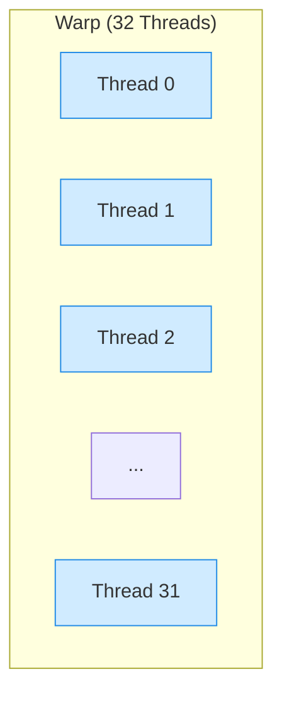
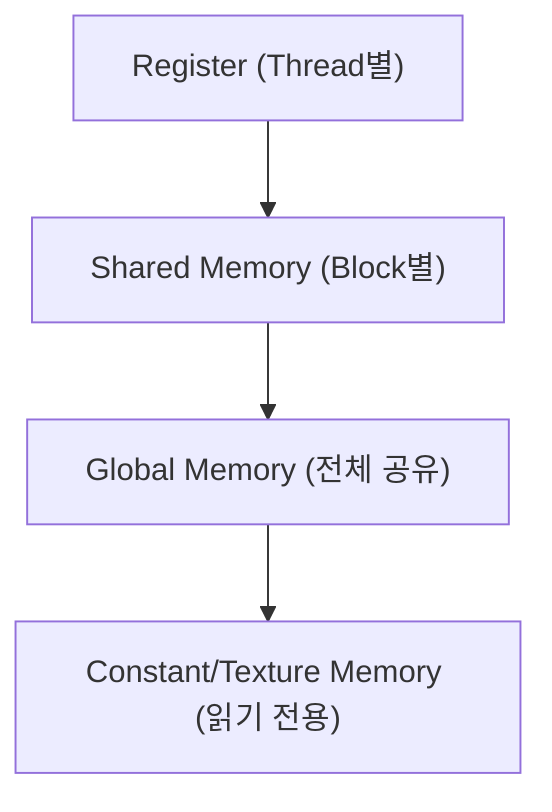
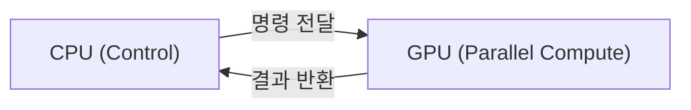

(GPU의 병렬 처리 구조 및 CPU와의 차이)  
GPU의 병렬 처리 구조를 CPU와 비교하며 설명
CUDA 구조, SIMD/SM 구조, CPU vs GPU 비교 표

#### 정리

* GPU는 대규모 병렬 연산을 위한 아키텍처로 설계되었다.
* 수천 개의 스레드를 동시에 실행하며, SIMT 구조를 따른다.
* CUDA는 Grid → Block → Thread 계층으로 구성되어 있다.
* GPU의 성능은 스레드 구성, 메모리 접근 패턴, 워프 효율에 따라 크게 달라진다.
* CPU와 GPU는 서로 보완적인 역할을 하며, 현대 시스템은 이 둘을 결합해 높은 처리 성능을 낸다.
  
##### 참고 자료

* [CS50 Lecture – GPU & Parallelism](https://cs50.harvard.edu/x/2024/notes/8/)
* [GeeksforGeeks – CPU vs GPU Architecture](https://www.geeksforgeeks.org/difference-between-cpu-and-gpu/)
* [Wikipedia – General-Purpose Computing on GPUs (GPGPU)](https://en.wikipedia.org/wiki/General-purpose_computing_on_graphics_processing_units)

---

# GPU와 병렬 연산 구조 (GPU Parallelism)

## 1️ 개요
GPU(Graphics Processing Unit)는 원래 그래픽 연산을 가속하기 위해 만들어졌지만,  
지금은 범용 병렬 연산(General-Purpose Computing on GPU, GPGPU)에서도 핵심 역할을 맡고 있다.  
수천 개의 연산 코어를 동시에 동작시켜,  
대량의 데이터를 병렬로 처리할 수 있는 구조를 가지고 있다.

---

## 2️ CPU와 GPU의 기본 차이

CPU와 GPU는 모두 연산 장치이지만, 설계 목적이 다르다.  
CPU는 복잡한 제어와 다양한 명령을 빠르게 처리하는 데 초점이 맞춰져 있고,  
GPU는 단순한 연산을 매우 많이 동시에 수행하는 데 최적화되어 있다.

| 구분 | CPU | GPU |
|------|-----|------|
| **주요 목적** | 일반 연산, 제어 중심 | 대규모 병렬 연산, 데이터 처리 |
| **코어 수** | 적음 (4~32개 수준) | 많음 (수천 개 수준) |
| **클록 속도** | 높음 (3~5GHz) | 낮음 (1~2GHz) |
| **명령 구조** | 복잡한 명령어 집합 (CISC, RISC) | 단순한 명령 반복 구조 |
| **스케줄링** | 명령 단위 제어 중심 | 스레드 단위 병렬 실행 중심 |
| **적합 작업** | OS, 제어 로직, 분기 많은 코드 | 행렬 계산, 딥러닝, 그래픽 처리 |

---

## 3️ GPU의 내부 구조

GPU는 수백~수천 개의 **스트리밍 프로세서(Streaming Processor, SP)** 로 구성되어 있으며,  
이들은 **SM(Streaming Multiprocessor)** 단위로 묶여 있다.  
각 SM은 수십 개의 스레드를 동시에 실행하며,  
이 스레드들은 동일한 명령어를 다른 데이터에 적용하는 **SIMD (Single Instruction, Multiple Data)** 구조를 따른다.



GPU는 수많은 연산 유닛을 병렬로 동작시키기 때문에,
단일 스레드의 속도는 CPU보다 느리지만 전체 처리량은 훨씬 크다.

---

## 4️ CUDA 병렬 구조 (NVIDIA 기준)

NVIDIA의 GPU는 **CUDA (Compute Unified Device Architecture)** 라는 병렬 프로그래밍 모델을 사용한다.
CUDA는 작업을 **Grid → Block → Thread** 구조로 나누어 실행한다.



* **Grid**: 전체 실행 단위, Block들의 집합
* **Block**: 여러 스레드를 포함한 그룹 (공유 메모리 사용 가능)
* **Thread**: 가장 작은 실행 단위, 실제 연산 수행자

이 구조 덕분에 GPU는 수천 개의 스레드를 동시에 스케줄링하며,
각 스레드는 독립적으로 데이터를 처리할 수 있다.

---

## 5️ 워프(Warp)와 SIMT 구조

CUDA에서 스레드는 **워프(Warp)** 단위로 스케줄링된다.
한 워프는 일반적으로 32개의 스레드로 구성되어,
동일한 명령어를 동시에 실행한다.



이 구조를 **SIMT (Single Instruction, Multiple Threads)** 라고 한다.
즉, 같은 명령어를 여러 데이터에 동시에 적용하지만,
각 스레드는 독립적인 레지스터와 데이터 공간을 가진다.

---

## 6️ GPU 메모리 계층

GPU 내부에도 여러 수준의 메모리가 존재한다.
CPU처럼 계층적 구조를 가지며, 데이터 접근 속도는 아래로 갈수록 느려진다.

| 계층                            | 설명                  | 용도             |
| ----------------------------- | ------------------- | -------------- |
| **레지스터(Register)**            | 각 스레드 전용 고속 메모리     | 연산용 임시 저장      |
| **공유 메모리(Shared Memory)**     | 같은 Block 내 스레드 간 공유 | 데이터 재사용        |
| **글로벌 메모리(Global Memory)**    | 모든 스레드 접근 가능, 속도 느림 | 주요 데이터 저장      |
| **상수(Constant)/텍스처(Texture)** | 읽기 전용 캐시 메모리        | 상수값 또는 그래픽 데이터 |



GPU 최적화에서는 메모리 접근 패턴을 효율적으로 구성하는 것이 핵심이다.

---

## 7️ GPU 병렬 연산 예시

행렬 곱셈(matrix multiplication)을 예로 들면,
CPU는 반복문을 통해 하나씩 계산하지만 GPU는 각 원소를 독립 스레드로 처리한다.

**CPU 방식**

```c
for (i = 0; i < N; i++)
  for (j = 0; j < N; j++)
    C[i][j] = A[i][j] * B[i][j];
```

**GPU (CUDA) 방식**

```cuda
__global__ void matrixMul(float *A, float *B, float *C, int N) {
    int i = blockIdx.y * blockDim.y + threadIdx.y;
    int j = blockIdx.x * blockDim.x + threadIdx.x;
    if (i < N && j < N)
        C[i * N + j] = A[i * N + j] * B[i * N + j];
}
```

이 예시에서 각 `(i, j)` 계산은 GPU의 서로 다른 스레드에서 동시에 수행된다.
즉, GPU는 동일한 명령을 여러 데이터에 동시에 적용하는 **데이터 병렬 처리(Data Parallelism)** 의 대표적인 예이다.

---

## 8️ CPU와 GPU의 협업 구조

현대 시스템에서는 CPU와 GPU가 함께 동작한다.
CPU는 작업을 분할하고, GPU는 병렬 연산을 수행한 뒤 결과를 다시 CPU로 전달한다.



CPU는 논리·제어 중심의 연산에 강하고,
GPU는 대량의 수치 계산(행렬, 벡터, 그래픽 렌더링 등)에 강하다.
이 두 장치를 결합하면 고성능 컴퓨팅(HPC)과 딥러닝 추론에 최적화된 구조가 된다.

---

