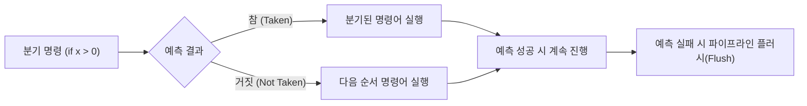
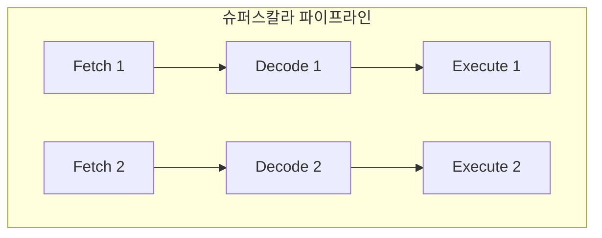

(명령어 파이프라인 구조와 분기 예측, 슈퍼스칼라)  
이건 CPU 성능 향상을 설명하는 마지막 핵심 부분

#### 정리

* 파이프라인은 명령어 단계를 겹쳐 실행하여 처리량을 높인다.
* 데이터, 제어, 구조적 위험은 파이프라인 효율을 저하시킬 수 있다.
* 분기 예측과 슈퍼스칼라 구조는 이러한 한계를 보완한다.
* 현대 CPU는 Out-of-Order, Speculative Execution 등을 결합해
  파이프라인 병렬성을 극대화한다.

##### 참고 자료

* [CS50 Lecture – CPU Pipelines](https://cs50.harvard.edu/x/2024/notes/5/)
* [GeeksforGeeks – Instruction Pipelining](https://www.geeksforgeeks.org/instruction-pipelining-in-computer-architecture/)
* [Wikipedia – Instruction pipeline](https://en.wikipedia.org/wiki/Instruction_pipeline)

---

# 명령어 파이프라인 (Instruction Pipeline)

## 1️ 개요
CPU는 프로그램의 명령어를 하나씩 순차적으로 처리하지만,  
이 방식으로는 클록 속도에 비해 처리 효율이 낮아진다.  
이를 개선하기 위해 여러 명령어의 실행 단계를 겹쳐 수행하는 **파이프라인(Pipelining)** 기법이 사용된다.  
파이프라인은 공장에서 여러 작업이 동시에 진행되는 생산 라인과 유사한 개념이다.

---

## 2️ 명령어 처리 단계

일반적인 RISC(Reduced Instruction Set Computer) 기반 CPU는  
명령어를 다음 다섯 단계로 나누어 처리한다.

| 단계 | 이름 | 설명 |
|------|------|------|
| **IF** | Instruction Fetch | 명령어를 메모리에서 읽어온다. |
| **ID** | Instruction Decode | 명령어를 해석하고 필요한 레지스터를 식별한다. |
| **EX** | Execute | 연산 장치(ALU)가 실제 연산을 수행한다. |
| **MEM** | Memory Access | 메모리에 접근해 데이터를 읽거나 쓴다. |
| **WB** | Write Back | 연산 결과를 레지스터에 기록한다. |

---

## 3️ 파이프라인의 동작 원리

파이프라인에서는 여러 명령어가 동시에 서로 다른 단계에 존재한다.  
즉, 하나의 명령어가 실행 단계(EX)에 있을 때,  
다음 명령어는 이미 해석(ID) 중이며, 그 다음 명령어는 메모리에서 인출(Fetch) 중이다.

```mermaid
gantt
    title 명령어 파이프라인 실행 예시
    dateFormat X
    axisFormat none
    section 명령어 단계
    IF(명령1): done, 0, 1
    ID(명령1): done, 1, 2
    EX(명령1): done, 2, 3
    MEM(명령1): done, 3, 4
    WB(명령1): done, 4, 5
    IF(명령2): done, 1, 2
    ID(명령2): done, 2, 3
    EX(명령2): done, 3, 4
    MEM(명령2): done, 4, 5
    WB(명령2): done, 5, 6
    IF(명령3): done, 2, 3
    ID(명령3): done, 3, 4
    EX(명령3): done, 4, 5
```

이 구조 덕분에 CPU는 한 번에 여러 명령어를 병렬로 처리할 수 있으며,
전체 처리량(Throughput)이 크게 향상된다.

---

## 4️ 파이프라인의 한계: Hazard

파이프라인 구조에서는 여러 명령어가 동시에 실행되기 때문에
명령 간의 의존성이나 제어 흐름 문제로 인해 충돌(Hazard)이 발생할 수 있다.

| 구분                             | 이름                       | 설명                                | 예시 |
| ------------------------------ | ------------------------ | --------------------------------- | -- |
| **데이터 위험 (Data Hazard)**       | 앞 명령의 결과가 다음 명령에 필요할 때   | `ADD R1,R2,R3` 다음에 `SUB R4,R1,R5` |    |
| **제어 위험 (Control Hazard)**     | 분기(branch) 명령으로 흐름이 바뀔 때 | `IF condition GOTO label`         |    |
| **구조적 위험 (Structural Hazard)** | 하드웨어 자원을 동시에 사용하려고 할 때   | ALU나 Memory Access가 겹치는 경우        |    |

CPU는 이러한 문제를 해결하기 위해 **버블(bubble)** 또는 **스톨(stall)** 을 삽입하거나,
명령어 순서를 재배치(Out-of-Order Execution)한다.

---

## 5️ 분기 예측 (Branch Prediction)

분기 명령이 발생하면 CPU는 다음에 어떤 명령어를 가져와야 할지 알 수 없다.
이를 해결하기 위해 **분기 예측기(Branch Predictor)** 가 도입되었다.
CPU는 분기 결과를 미리 예측하고, 그에 따라 파이프라인을 계속 진행시킨다.

분기 예측이 성공하면 성능이 유지되지만,
예측이 틀리면 파이프라인을 초기화해야 하므로 오히려 성능이 떨어질 수 있다.
현대 CPU는 2-bit predictor, global history table, neural predictor 등
정교한 알고리즘으로 예측 정확도를 95% 이상까지 끌어올린다.

---

## 6️ 슈퍼스칼라 (Superscalar) 구조

슈퍼스칼라 CPU는 파이프라인 단계를 여러 개 병렬로 두어
한 클록 사이클에 여러 명령어를 동시에 실행할 수 있도록 설계된다.

예를 들어, 듀얼 슈퍼스칼라 CPU는 한 번에 두 개의 명령어를 실행할 수 있다.
현대 CPU는 보통 4~8개의 실행 유닛을 가지고 있으며,
이를 통해 **ILP (Instruction-Level Parallelism)** 을 극대화한다.

---

## 7️ 파이프라인 성능 계산

파이프라인의 성능은 **처리율(Throughput)** 과 **지연시간(Latency)** 으로 분석된다.

* **비파이프라인 처리 시간:**
  `T_total = N × k × t`
  (N: 명령어 수, k: 단계 수, t: 각 단계 시간)

* **파이프라인 처리 시간:**
  `T_total = (k + N - 1) × t`

예를 들어 5단계 파이프라인에서 10개의 명령어를 처리하면,
비파이프라인은 `10 × 5t = 50t`, 파이프라인은 `14t` 만에 처리할 수 있다.
이론적으로 약 3.5배의 성능 향상이 가능하다.

---

## 8️ 현대 CPU의 고급 기술

현대 CPU는 단순 파이프라인을 넘어서 다음과 같은 기술들을 결합한다.

| 기술                         | 설명                      |
| -------------------------- | ----------------------- |
| **Out-of-Order Execution** | 명령어 순서를 바꿔서 병목 제거       |
| **Speculative Execution**  | 분기 예측을 기반으로 명령어를 미리 실행  |
| **Hyper-Threading (SMT)**  | 하나의 코어에서 여러 스레드 실행      |
| **Vector/SIMD 명령어**        | 하나의 명령어로 여러 데이터를 동시에 처리 |

이러한 기술들이 결합되어, 단일 코어에서도 수십 개의 명령어가 동시에 처리될 수 있다.

---

